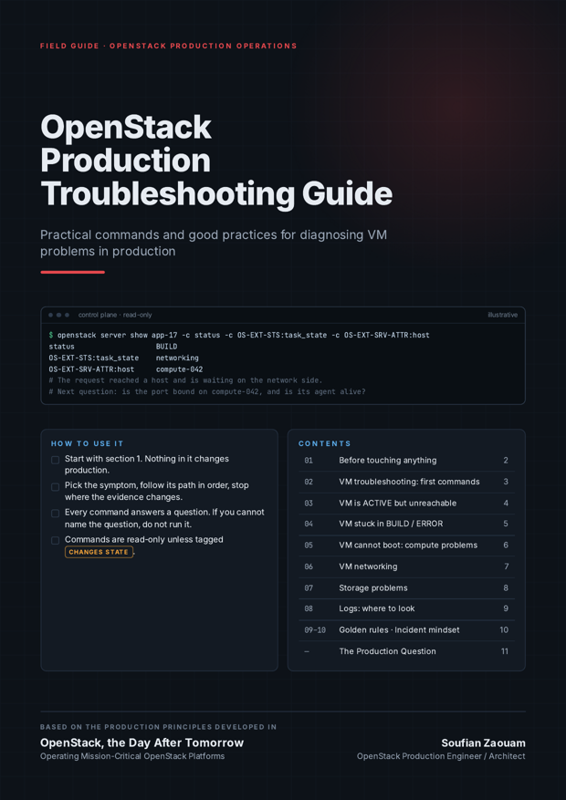

# OpenStack Production Guide

**How to operate and troubleshoot OpenStack in production.**

A practical field guide for engineers who run OpenStack after deployment: diagnostics, investigation paths, decision checklists and Day-2 practices, written for the moment when something is wrong and the platform still carries workloads that matter.

> Production troubleshooting is a methodology, not a list of commands.
> The commands are the tools. The value is in knowing which question each one answers, and what to do with the answer.

<p align="center">
  <a href="pdf/OpenStack-Production-Troubleshooting-Guide-v1.0.pdf"></a><br>
  <sub><a href="pdf/OpenStack-Production-Troubleshooting-Guide-v1.0.pdf">OpenStack Production Troubleshooting Guide (PDF, 11 pages)</a></sub>
</p>

---

## What this repository is

A companion to day-to-day OpenStack operations. It covers the questions an operator actually faces during an incident, in the order they usually matter:

- what is broken, for whom, and since when;
- where a request stopped, and which layer that points to;
- which read-only commands confirm or reject a hypothesis;
- what to check before changing anything in production;
- how to get from a symptom to a root cause without guessing.

Commands are always given with their context: the question they answer, the signal to look for, and where they run (control plane or compute / network node). Commands that change state are explicitly flagged.

## Who it is for

- OpenStack operators and administrators running production platforms;
- SRE and platform engineers on call for a private cloud;
- cloud architects who want to understand how their design behaves when it fails;
- engineers joining an OpenStack team, as an onboarding reference;
- technical leads who need a shared, written way of handling incidents.

It assumes you already know what Nova, Neutron, Cinder, Keystone and Placement are. It does not teach deployment.

## Why it exists

Most OpenStack documentation explains how services work and how to deploy them. Far less explains how to reason when a production platform misbehaves: when the error message points at the wrong service, when the obvious fix is the risky one, or when restarting something would destroy the evidence you still need.

This repository collects that reasoning in a form you can use during an incident.

## What you will find

| Area | Content |
| --- | --- |
| **Methodology** | [Production troubleshooting principles](methodology/production-troubleshooting.md) · [Before you act](methodology/before-you-act.md) · [Changes and rollback](methodology/changes-and-rollback.md) · [Root cause analysis](methodology/root-cause-analysis.md) · [Before you escalate](methodology/escalation-checklist.md) |
| **VM troubleshooting** | [First commands](troubleshooting/vm-first-commands.md) · [VM ACTIVE but unreachable](troubleshooting/vm-unreachable.md) · [VM stuck in BUILD / ERROR](troubleshooting/vm-build-error.md) |
| **By layer** | [Compute](troubleshooting/compute.md) · [Networking](troubleshooting/networking.md) · [Storage](troubleshooting/storage.md) |
| **Control plane** | [OpenStack services](troubleshooting/control-plane-services.md) · [RabbitMQ](troubleshooting/rabbitmq.md) · [MariaDB / Galera](troubleshooting/mariadb-galera.md) · [Keystone](troubleshooting/keystone.md) |
| **Evidence** | [Logs and correlation](troubleshooting/logs.md) |
| **Reference** | [Quick reference by question](reference/quick-reference.md) · [Upstream documentation](reference/upstream-documentation.md) |
| **PDF** | [OpenStack Production Troubleshooting Guide](pdf/OpenStack-Production-Troubleshooting-Guide-v1.0.pdf): the printable field guide |

## How to use it

1. **Start with [Before you act](methodology/before-you-act.md).** Nothing in it changes production.
2. **Pick the symptom** (VM unreachable, VM stuck in BUILD, service down…) and follow its page in order.
3. **Stop where the evidence changes.** The first check that contradicts your expectation tells you which layer to open next.
4. **Keep what you collect.** Output with timestamps, request IDs and UUIDs is what makes a root cause analysis possible later.
5. **Before any change**, go through [Changes and rollback](methodology/changes-and-rollback.md).

> [!NOTE]
> Commands target a recent OpenStack release with the unified `openstack` client. Options, output fields and API microversions vary between releases, distributions and deployment tools. Verify against your environment, and try unfamiliar commands outside production first.

## From symptom to root cause

An OpenStack error message tells you where a failure became visible. It rarely tells you where the failure started.

```text
User reports:
"VM cannot be created"

        ↓

Check Nova API            Was the request accepted? Which request ID?

        ↓

Check scheduler           Did it find a host, or "No valid host was found"?

        ↓

Check Placement           Do allocation candidates exist for this flavor?

        ↓

Check compute capacity    Are compute services up, enabled, and really free?

        ↓

Check Neutron             Was the port created and bound on the chosen host?

        ↓

Check RabbitMQ            Are RPC calls completing, or timing out?

        ↓

Check database            Is Galera in Primary state and accepting writes?

        ↓

Identify root cause       The explanation that accounts for every symptom
```

A concrete example of why the order matters. Users see `No valid host was found`. The scheduler looks guilty. But the scheduler ignores compute hosts whose service is reported down, and nova-compute reports its liveness through nova-conductor, over the message bus. If RabbitMQ is partitioned or degraded, heartbeats stop arriving, healthy hypervisors look dead, and the scheduler answers correctly with the information it has. Tuning the scheduler would change nothing. The root cause is in the messaging layer, two services away from the error.

Each step in this chain is a question, not a command. The pages in [`troubleshooting/`](troubleshooting/) give the commands that answer each question, and the signal that should make you move to the next layer.

## Production principles

1. **Understand before changing.** A change made to test a hypothesis is still a production change.
2. **Stability comes before new features.** Pausing a capability is acceptable. Losing a platform state you can trust is not.
3. **Protect what is working.** Running workloads come first.
4. **Never change production without a rollback strategy.**
5. **A command is not a diagnosis.** Output is evidence; the diagnosis is the explanation that fits all of it.
6. **Logs without context are not evidence.** Time, request ID and scope turn a log line into a fact.
7. **Correlate symptoms across layers.**
8. **Document production decisions.**
9. **Automate repetitive read-only diagnostics first.**
10. **Do not confuse recovery with root cause analysis.**

And one question to keep in mind throughout:

> **What do I know, what do I not know, and what evidence do I need before touching production?**

## 📖 Related book

**[OpenStack, the Day After Tomorrow — Operating Mission-Critical OpenStack Platforms](https://github.com/soufian-zaouam/openstack-the-day-after-tomorrow)**

The book is about what happens after OpenStack is deployed: keeping a mission-critical platform understandable, operable, recoverable and able to evolve. It develops the operating reasoning behind this repository, built around four capabilities: **visibility**, **stability**, **organization** and **governance**, and treats production decisions such as stopping a platform, patching without enough capacity, or rebuilding instead of repairing.

This repository is its practical companion. The book explains *why* control over a platform erodes and how to decide when the answer is not obvious. This guide gives the checks, commands and paths to use when an incident is already under way.

The book is free and available as a PDF from its [GitHub releases](https://github.com/soufian-zaouam/openstack-the-day-after-tomorrow/releases).

## Scope and safety

- **Read-only by default.** Unless a command is marked with a warning, it only reads state.
- **State-changing commands are flagged** with a `[!WARNING]` block explaining the impact. Run them only with an owner, a stop condition and a way back.
- **Examples are generic.** Hostnames, UUIDs and addresses are placeholders such as `<vm>`, `<compute>` or `192.0.2.10` (documentation range). Nothing here describes a specific organization or environment.
- **Deployment-specific details** (log paths, container names, service names) differ between distributions and deployment tools. The questions do not.

## Roadmap

This repository will grow over time with:

- field notes: anonymised production situations and the reasoning behind the decisions;
- deeper pages on live migration, host maintenance, upgrades and database consistency;
- incident and change templates ready to adapt.

Suggestions and corrections are welcome: see [CONTRIBUTING.md](CONTRIBUTING.md).

## License

The content of this repository, including the PDF guide, is licensed under the [Creative Commons Attribution-ShareAlike 4.0 International License](LICENSE) (CC BY-SA 4.0). You may share and adapt it, including in internal documentation, with attribution and under the same license.

OpenStack is a trademark of the Open Infrastructure Foundation. This is independent work, not affiliated with or endorsed by the OpenInfra Foundation or any OpenStack project team.

## Author

**Soufian Zaouam** — OpenStack production engineer / architect, author of *OpenStack, the Day After Tomorrow*.
