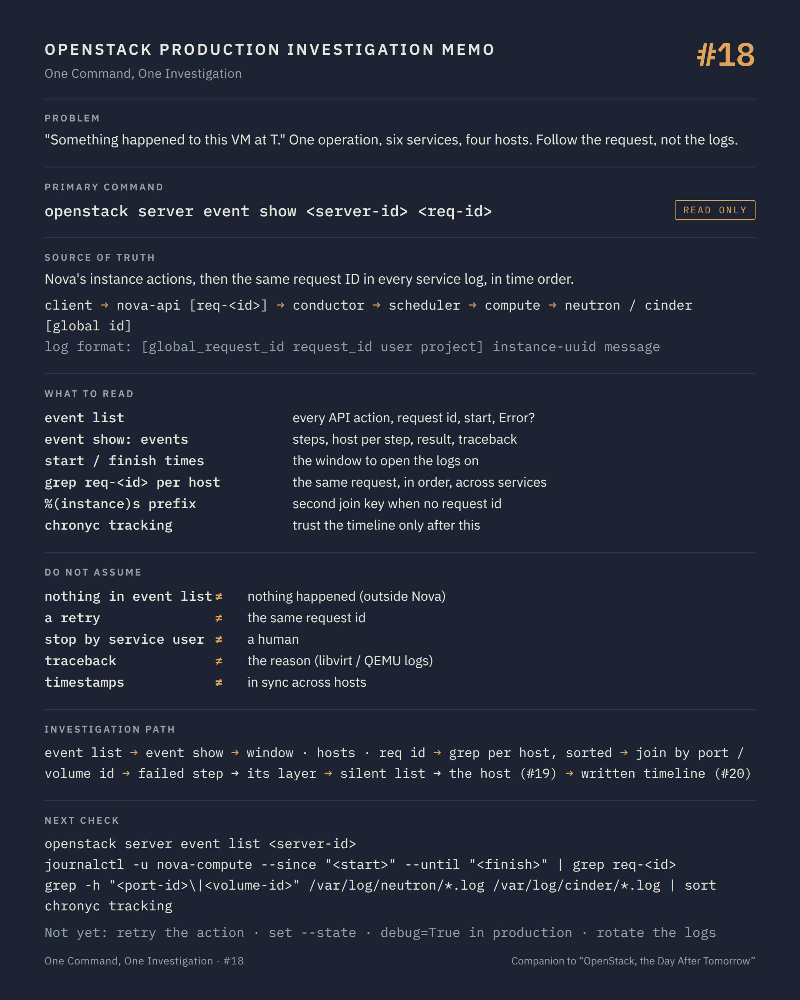

# OpenStack Production Guide

**How to operate and troubleshoot OpenStack in production.**

[](https://github.com/soufian-zaouam/openstack-production-guide/releases/latest)
[](LICENSE)
[](series/one-command-one-investigation/README.md)
[](incidents/README.md)

A field guide for engineers who run OpenStack after deployment: investigation paths by symptom and by command, an index by exact error message, anonymised incident case studies with their decisions, and the methodology for changing a platform that still carries workloads that matter.

> Production troubleshooting is a methodology, not a list of commands.
> The commands are the tools. The value is in knowing which question each one answers, and what to do with the answer.

## Four ways in

| You are here because… | Start with | What you will find |
| --- | --- | --- |
| **a symptom**: a VM is unreachable, builds fail, everything is slow | [`troubleshooting/`](troubleshooting/README.md) | pages by symptom and by layer, in the order the checks usually matter, with the signal that sends you to the next layer |
| **a command**: what does `openstack server show`, `virsh domstate --reason` or `ceph -s` tell me during an incident, and what does it not? | [`series/one-command-one-investigation/`](series/one-command-one-investigation/README.md) | twenty episodes, one command each, following one VM from Nova to the hypervisor, the network, the storage and the control plane; each with a one-page investigation memo |
| **an exact error message**: `No valid host was found`, `paused (I/O error)`, `MessagingTimeout`, `WSREP has not yet prepared node` | [`errors.md`](errors.md) | the message, what it usually means, the page that explains it, the first read-only check |
| **a decision to make**, or a question about how an incident was handled: evacuate or not, stop the APIs or not, patch without capacity | [`incidents/`](incidents/README.md) | six anonymised cases in RCA format: timeline, investigation, cause in three layers, the decision and the options rejected, blast radius and rollback, follow-ups |

Underneath all four: [`methodology/`](methodology/) (before you act, changes and rollback, root cause analysis, escalation, and the incident and decision record templates) and [`reference/`](reference/) (quick reference by question, upstream documentation).

<p align="center">
  <a href="series/one-command-one-investigation/18-request-id-log-correlation.md"></a>
  <br>
  <sub>Every episode of the series comes with a one-page investigation memo, generated from its JSON source. Above: episode #18, request-ID log correlation.</sub>
</p>

## What this repository is

A companion to day-to-day OpenStack operations. It covers the questions an operator actually faces during an incident, in the order they usually matter:

- what is broken, for whom, and since when;
- where a request stopped, and which layer that points to;
- which read-only commands confirm or reject a hypothesis;
- what to check before changing anything in production;
- how to get from a symptom to a root cause without guessing;
- how a decision was reached when the obvious fix was the risky one.

Commands are always given with their context: the question they answer, the signal to look for, where they run (control plane or compute / network node), and a safety label: **READ ONLY**, **STATE CHANGING** or **POTENTIALLY DISRUPTIVE**. Commands that change state are never presented as troubleshooting steps; when one appears, it comes with its impact, its prerequisites, its rollback and the conditions under which it must not be run.

## Who it is for

- OpenStack operators and administrators running production platforms;
- SRE and platform engineers on call for a private cloud;
- cloud architects who want to understand how their design behaves when it fails;
- engineers joining an OpenStack team, as an onboarding reference;
- technical leads who need a shared, written way of handling incidents and recording decisions.

It assumes you already know what Nova, Neutron, Cinder, Keystone and Placement are. It does not teach deployment.

## Why it exists

Most OpenStack documentation explains how services work and how to deploy them. Far less explains how to reason when a production platform misbehaves: when the error message points at the wrong service, when the obvious fix is the risky one, or when restarting something would destroy the evidence you still need.

This repository collects that reasoning in a form you can use during an incident.

## Map of the content

```text
README.md                          this page
errors.md                          index by exact error message → page, first check
methodology/                       the method
  production-troubleshooting.md    symptom, hypothesis, cause; where a symptom appears is not where it starts
  before-you-act.md                seven questions before any change
  changes-and-rollback.md          validation, stop conditions, rollback designed not assumed
  root-cause-analysis.md           timeline first, three-layer cause, blameless
  escalation-checklist.md          the minimum escalation package
  incident-record-template.md      the format used by incidents/
  decision-record-template.md      for a workaround, a setting, a stop, a postponed change
troubleshooting/                   by symptom and by layer
  vm-first-commands · vm-unreachable · vm-build-error
  compute · networking · storage
  control-plane-services · rabbitmq · mariadb-galera · keystone · logs
series/one-command-one-investigation/     by command: 20 episodes, 4 parts
  README.md                        concept, structure, roadmap
  01-openstack-server-show.md … 20-complete-investigation.md
  memo/                            one investigation memo per episode (PNG), its JSON source, the renderer
incidents/                         anonymised cases in RCA format
  evacuation-fencing-shared-storage · kernel-upgrade-console-recovery · rabbitmq-partition-api-stop
  patching-campaign-limited-capacity · cpu-pinning-steal-time-live-migration · ceph-full-osd-crush-weights
reference/                         quick reference by question, upstream documentation
```

The printable field guide (PDF, 11 pages, the first edition of the troubleshooting pages) and the twenty investigation memos (ZIP) are attached as assets to the [latest release](https://github.com/soufian-zaouam/openstack-production-guide/releases/latest).

## How to use it

1. **Start with [Before you act](methodology/before-you-act.md).** Nothing in it changes production.
2. **Pick your way in**: the symptom, the command in front of you, or the exact error message.
3. **Stop where the evidence changes.** The first check that contradicts your expectation tells you which layer to open next. The series episodes say, for each command, what it does *not* tell you; that is where most wrong turns start.
4. **Keep what you collect.** Output with timestamps, request IDs and UUIDs is what makes a root cause analysis possible later. [Episode #18](series/one-command-one-investigation/18-request-id-log-correlation.md) is about exactly that.
5. **Before any change**, go through [Changes and rollback](methodology/changes-and-rollback.md), and read the [incident case](incidents/README.md) closest to your situation: the option you are about to take is probably in its "rejected" list or its "decision", with the reasons.
6. **Afterwards**, write it down with the [incident record template](methodology/incident-record-template.md).

> [!NOTE]
> Commands target a recent OpenStack release with the unified `openstack` client. Options, output fields and API microversions vary between releases, distributions and deployment tools; the series episodes state the version dependencies that change what a command shows. Verify against your environment, and try unfamiliar commands outside production first.

## From symptom to root cause

An OpenStack error message tells you where a failure became visible. It rarely tells you where the failure started.

```text
User reports:
"VM cannot be created"

        ↓

Check Nova API            Was the request accepted? Which request ID?

        ↓

Check scheduler           Did it find a host, or "No valid host was found"?

        ↓

Check Placement           Do allocation candidates exist for this flavor?

        ↓

Check compute capacity    Are compute services up, enabled, and really free?

        ↓

Check Neutron             Was the port created and bound on the chosen host?

        ↓

Check RabbitMQ            Are RPC calls completing, or timing out?

        ↓

Check database            Is Galera in Primary state and accepting writes?

        ↓

Identify root cause       The explanation that accounts for every symptom
```

A concrete example of why the order matters. Users see `No valid host was found`. The scheduler looks guilty. But the scheduler ignores compute hosts whose service is reported down, and nova-compute reports its liveness through nova-conductor, over the message bus. If RabbitMQ is partitioned or degraded, heartbeats stop arriving, healthy hypervisors look dead, and the scheduler answers correctly with the information it has. Tuning the scheduler would change nothing. The root cause is in the messaging layer, two services away from the error. The full incident, with the decision it forced, is in [RabbitMQ partition: stopping the APIs](incidents/rabbitmq-partition-api-stop.md).

Each step in this chain is a question, not a command. The pages in [`troubleshooting/`](troubleshooting/) give the commands that answer each question, and the signal that should make you move to the next layer. The [series](series/one-command-one-investigation/README.md) takes one command per episode and asks what it can and cannot establish; [episode #20](series/one-command-one-investigation/20-complete-investigation.md) runs one incident through all of them.

## Production principles

1. **Understand before changing.** A change made to test a hypothesis is still a production change.
2. **Stability comes before new features.** Pausing a capability is acceptable. Losing a platform state you can trust is not.
3. **Protect what is working.** Running workloads come first.
4. **Never change production without a rollback strategy.**
5. **A command is not a diagnosis.** Output is evidence; the diagnosis is the explanation that fits all of it.
6. **Logs without context are not evidence.** Time, request ID and scope turn a log line into a fact.
7. **Correlate symptoms across layers.**
8. **Document production decisions.**
9. **Automate repetitive read-only diagnostics first.**
10. **Do not confuse recovery with root cause analysis.**

And one question to keep in mind throughout:

> **What do I know, what do I not know, and what evidence do I need before touching production?**

## Scope and safety

- **Read-only by default.** Unless a command is labelled otherwise, it only reads state.
- **State-changing commands are labelled** `STATE CHANGING` or `POTENTIALLY DISRUPTIVE`, or flagged with a `[!WARNING]` block explaining the impact. Run them only with an owner, a stop condition and a way back.
- **Examples are generic.** Hostnames, UUIDs and addresses are placeholders such as `<vm>`, `<compute>` or `192.0.2.10` (documentation range). The incident cases are composites of real patterns, generalised; nothing here describes a specific organisation, platform or person.
- **Deployment-specific details** (log paths, container names, service names) differ between distributions and deployment tools. The questions do not.
- **Every command is verified** against official documentation or source code before publication; the series episodes and the incident cases list their sources.

## Related book

**[OpenStack, the Day After Tomorrow — Operating Mission-Critical OpenStack Platforms](https://github.com/soufian-zaouam/openstack-the-day-after-tomorrow)**

The book is about what happens after OpenStack is deployed: keeping a mission-critical platform understandable, operable, recoverable and able to evolve. It develops the operating reasoning behind this repository, built around four capabilities: visibility, stability, organisation and governance, and treats production decisions such as stopping a platform, patching without enough capacity, or rebuilding instead of repairing.

This repository is its practical companion. The book explains *why* control over a platform erodes and how to decide when the answer is not obvious. This guide gives the checks, commands, cases and paths to use when an incident is already under way. Several of the incident cases here appear in the book as short *From the field* passages; here they carry the technical file.

The book is free and available as a PDF from its [GitHub releases](https://github.com/soufian-zaouam/openstack-the-day-after-tomorrow/releases).

For a first read, the **[Short Guide](https://github.com/soufian-zaouam/openstack-the-day-after-tomorrow-guide)** condenses the book into 18 illustrated pages.

## Roadmap

- **Season 2 of the series**: Keystone (`token issue`, `endpoint list`), Glance (images stuck in `queued`), live migration observed from the hypervisor (`virsh domjobinfo`, `server migration list`), `nova-manage` for state inconsistencies, and `openstack server set --state` treated as a decision.
- **`operations/`**: Day-2 practices as procedures: patching campaigns, SLURP upgrades, a live-migration policy, capacity management with maintenance scenarios, a technical-debt register, runbooks usable by someone who did not write them.
- **More incident cases**, from the questions and corrections received.

Suggestions, corrections and subjects are welcome: see [CONTRIBUTING.md](CONTRIBUTING.md), or open an issue with one of the templates. The [CHANGELOG](CHANGELOG.md) records what changed in each release.

## License

The content of this repository is licensed under the [Creative Commons Attribution-ShareAlike 4.0 International License](LICENSE) (CC BY-SA 4.0). You may share and adapt it, including in internal documentation, with attribution and under the same license. To cite it, see [CITATION.cff](CITATION.cff).

OpenStack is a trademark of the Open Infrastructure Foundation. This is independent work, not affiliated with or endorsed by the OpenInfra Foundation or any OpenStack project team.

## Author

**Soufian Zaouam** — platform engineer, Day-2 operations of mission-critical OpenStack platforms; author of *[OpenStack, the Day After Tomorrow](https://github.com/soufian-zaouam/openstack-the-day-after-tomorrow)*. [LinkedIn](https://www.linkedin.com/in/soufian-zaouam)
