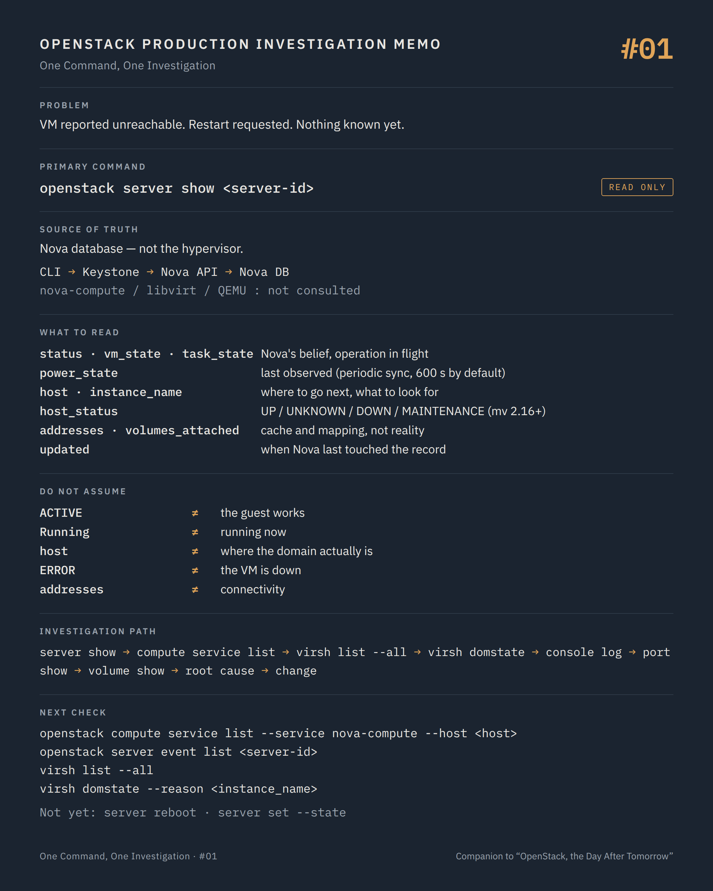

# One Command, One Investigation #01 — What Nova thinks it knows

**Command:** `openstack server show` · **Safety:** READ ONLY · **Layer:** Nova API / Nova database · **Level:** foundation

> Command → Evidence → Hypothesis → Investigation → Correlation → Decision
>
> The question of every episode: *what can this command actually tell us during a production incident, and what does it NOT tell us?*

---

## 1. Production situation

A production VM is reported unreachable. No ping, no SSH, no application response. No change was announced on the platform. The user is asking for a restart.

The first question is not "how do we restart it?"
The first question is "what do we actually know?"

Right now we know one thing: something between the user and the guest OS does not work. That covers the guest kernel, QEMU, libvirt, the compute host, its networking, its storage path, and Nova's own idea of where this VM lives. A reboot at this stage is a state change applied to a system we have not understood, and it may destroy the evidence: a crashed QEMU process, a wedged guest, a console log.

So we start with the cheapest, safest question we can ask the platform.

## 2. The command

```bash
openstack server show <server-id>
```

**READ ONLY.** It goes through Keystone to the Nova API, and the Nova API answers from its database. Nothing on the compute node is consulted.

```text
openstack CLI
     ↓
Keystone (token)
     ↓
Nova API
     ↓
Nova database (cell)           ← the answer comes from here

nova-compute / libvirt / QEMU  ← not consulted
```

That single fact shapes everything below.

## 3. What the command tells us

The fields that matter in an investigation (admin credentials assumed):

```text
status                               ACTIVE / SHUTOFF / ERROR / ...
OS-EXT-STS:vm_state                  the stable state Nova believes in
OS-EXT-STS:task_state                operation in flight (None = nothing running)
OS-EXT-STS:power_state               last power state nova-compute observed
OS-EXT-SRV-ATTR:host                 where Nova thinks the VM lives
OS-EXT-SRV-ATTR:hypervisor_hostname  node name reported by the virt driver
OS-EXT-SRV-ATTR:instance_name        libvirt domain name (instance-0000xxxx)
host_status                          UP / UNKNOWN / DOWN / MAINTENANCE
addresses                            IPs from Nova's network info cache
volumes_attached                     volumes Nova has recorded as attached
flavor                               vcpus, ram, extra_specs (pinning, NUMA...)
fault                                last error, only in ERROR state
updated                              last time Nova touched this record
```

`status` and `vm_state` are what Nova believes the stable state is. `task_state` says whether an operation is in flight. A `task_state` that has not changed for twenty minutes (`migrating`, `powering-off`, `rebooting`) is a finding in itself: something in the control plane started and never finished.

`power_state` is the last state nova-compute observed on the hypervisor. It is refreshed by libvirt lifecycle events and by a periodic sync, every 600 seconds by default. It is a recent observation at best, never a live one.

`host` and `instance_name` give you the two identifiers you will need on the compute node: the host to log into and the libvirt domain to look for. Note them now.

`host_status` (API microversion 2.16 or newer, admin policy) is the first hint about nova-compute on that host: `UNKNOWN` means the service has not reported within `service_down_time`, 60 seconds by default.

`addresses` is what Neutron told Nova when the port was bound, kept in Nova's info cache. It is not a live Neutron query.

`volumes_attached` is the block device mapping Nova recorded. It says nothing about whether the block device on the host is reachable.

`updated` deserves more attention than it gets. If nobody touched this VM and the record was updated three minutes ago, something did touch it: a power-state sync, a migration, a stop.

`flavor` (embedded with extra_specs from microversion 2.47) tells you whether this VM carries constraints, such as CPU pinning, NUMA or hugepages, that narrow the list of things that can go wrong.

## 4. What the command does NOT tell us

Every field above is a record written by a service at some point in the past. The command reports Nova's belief, not the hypervisor's state.

`status ACTIVE` plus `power_state Running` does not prove that:

- nova-compute on that host is alive
- libvirt answers
- the QEMU process still exists
- the guest kernel is not panicked
- the tap interface is plugged and flows are programmed
- the iSCSI/FC/RBD path behind `volumes_attached` is healthy
- the host still talks to RabbitMQ

Three failure modes an experienced operator keeps in mind:

**If nova-compute is down on that host, `power_state` freezes at its last value.** "Running" can describe a VM that died an hour ago. The sync that would correct it runs inside the very service that is down.

**After a live migration that failed midway, `host` can name a node where the domain no longer runs.** In the worst case the domain exists on both nodes. `host` is a database column, not a location.

**The reverse is also true: `status ERROR` does not mean the VM is down.** A failed resize or migration leaves the record in ERROR while QEMU keeps serving traffic. Read `fault` and the event list before touching anything.

And nothing here says anything about the guest OS. Nova's responsibility ends at the QEMU process.

## 5. What it lets us hypothesise

The value of this command is not the answer. It is the branch it sends you to.

```text
host_status UNKNOWN / DOWN     → compute node or its control-plane link          → #02
task_state stuck (not None)    → a control-plane operation never finished         → events, RabbitMQ
status ERROR, fault present    → read fault + server event list first             → #02, logs
ACTIVE, Running, host UP,
updated long ago               → the problem is below Nova:
                                 host, guest, network or storage                  → #04, #06, #07, #12
```

## 6. Next investigation

Take `host` and `instance_name` with you.

```bash
openstack compute service list --service nova-compute --host <host>
openstack server event list <server-id>
```

**READ ONLY.** The first tells you whether Nova has heard from that compute recently, and whether it is enabled or forced down. The second tells you what was last done to this VM, by whom and when.

Then, on the compute node, still read-only:

```bash
virsh list --all
virsh domstate --reason <instance_name>
```

This is the first moment we leave Nova's database and ask the hypervisor.

One variant worth knowing:

```bash
openstack server show --diagnostics <server-id>
```

Same command, different flag, different source of truth: this one goes through nova-compute to the virt driver and returns live CPU, NIC and disk counters (admin only, instance must be running). It is the only form of `server show` that proves the domain exists right now.

What we do not do at this stage: `openstack server reboot`, and above all `openstack server set --state active`. The second one edits the database to match what we would like to be true. It is the fastest way to make Nova's belief and reality diverge for good.

## 7. Investigation chain

```text
VM reported unreachable
        ↓
openstack server show                    Nova's belief: state, host, instance_name
        ↓
Is nova-compute on that host alive?      openstack compute service list
        ↓
Does the domain exist on the host?       virsh list --all
        ↓
Is QEMU running and sane?                virsh domstate, qemu log
        ↓
Does the guest boot?                     openstack console log show
        ↓
Is the port bound and plugged?           openstack port show, OVS/OVN
        ↓
Is the volume path healthy?              openstack volume show, os-brick
        ↓
Root cause, then change
```

## 8. Production lesson

`openstack server show` tells you what Nova has recorded, not what is happening.

A command does not solve an incident. It reduces uncertainty, and it tells you where to look next.

---

## Memo



## Version notes

- `OS-EXT-SRV-ATTR:host`, `hypervisor_hostname` and `instance_name` are returned only if the policy `os_compute_api:os-extended-server-attributes` allows it (admin by default). `OS-EXT-SRV-ATTR:hostname` is visible to all users from microversion 2.90.
- `host_status` requires API microversion 2.16 or newer and the policy `os_compute_api:servers:show:host_status` (admin by default). A recent `openstack` client (openstacksdk-based, 6.x and later) negotiates the microversion automatically; older clients need `--os-compute-api-version 2.16`.
- `flavor` with embedded `extra_specs` requires microversion 2.47; below that, only the flavor id/name is shown.
- The API returns `OS-EXT-STS:power_state` as an integer (0 NOSTATE, 1 RUNNING, 3 PAUSED, 4 SHUTDOWN, 6 CRASHED, 7 SUSPENDED); the client displays a label (`Running`, `Shutdown`, ...).
- Power-state synchronisation: `[DEFAULT] sync_power_state_interval` defaults to 600 seconds, complemented by libvirt lifecycle events (`[workarounds] handle_virt_lifecycle_events`). Documented behaviour in nova-compute: if the domain is found SHUTDOWN or CRASHED while Nova believes the instance is ACTIVE, nova-compute calls the stop API and the instance becomes SHUTOFF; if the domain is PAUSED or not found (NOSTATE), Nova logs a warning and does not act.
- `addresses` comes from the instance network info cache, updated by the `network-changed` external events Neutron sends to Nova. The periodic heal task (`heal_instance_info_cache_interval`) is disabled by default (-1) on recent Nova releases; older releases ran it every 60 seconds.
- `openstack server show --diagnostics` is governed by the policy `os_compute_api:os-server-diagnostics` (admin by default); the response format is standardised from microversion 2.48; the instance must be running.
- `openstack server set --state` is STATE CHANGING: it rewrites `vm_state` in the database without touching the hypervisor. It deserves its own episode.

## Sources

Fields, states and policies

- Nova API reference, *Show Server Details* (`OS-EXT-STS:*`, `OS-EXT-SRV-ATTR:*`, `host_status` new in 2.16, `fault`, `hostname` 2.90, `OS-SRV-USG:*`): https://docs.openstack.org/api-ref/compute/#show-server-details
- Nova API guide, *Server concepts* (status, vm_state, task_state): https://docs.openstack.org/api-guide/compute/server_concepts.html
- Nova policies (`os_compute_api:os-extended-server-attributes`, `os_compute_api:servers:show:host_status`, `os_compute_api:os-server-diagnostics`, `os_compute_api:os-services:list`): https://docs.openstack.org/nova/latest/configuration/policy.html

Synchronisation and heartbeat

- Nova configuration (`sync_power_state_interval`, `service_down_time`, `report_interval`, `heal_instance_info_cache_interval`): https://docs.openstack.org/nova/latest/configuration/config.html
- Nova source, `nova/compute/manager.py`, `_sync_instance_power_state`: https://opendev.org/openstack/nova/src/branch/master/nova/compute/manager.py
- Nova source, `nova/conf/compute.py` (`heal_instance_info_cache_interval`, `network-changed` events): https://opendev.org/openstack/nova/src/branch/master/nova/conf/compute.py

Client

- python-openstackclient source, `openstackclient/compute/v2/server.py` (`server show`, `--diagnostics`, `--topology` [2.78+], `power_state` labels): https://opendev.org/openstack/python-openstackclient/src/branch/master/openstackclient/compute/v2/server.py
- python-openstackclient, server commands (`server event list`, `server event show`, `console log show`): https://docs.openstack.org/python-openstackclient/latest/cli/command-objects/server.html
- python-openstackclient, compute service commands (`compute service list --host --service`, `compute service set --up/--down` [2.11+]): https://docs.openstack.org/python-openstackclient/latest/cli/command-objects/compute-service.html

libvirt

- virsh manual (`list --all`, `domstate --reason`, `dominfo`, `domblklist`, `domiflist`, `dumpxml`, domain states): https://www.libvirt.org/manpages/virsh.html

---

*Part of the series [One Command, One Investigation](README.md), a technical companion to the book [OpenStack, the Day After Tomorrow](https://github.com/soufian-zaouam/openstack-the-day-after-tomorrow).*

Next: [**#02 — `openstack compute service list`**](02-openstack-compute-service-list.md): is the compute host that Nova named still talking to the control plane?
