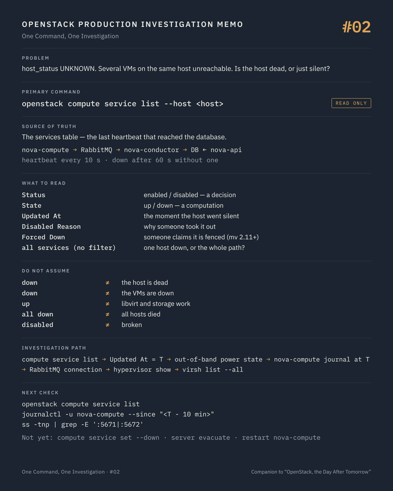

# One Command, One Investigation #02 — Is anyone listening on that host?

**Command:** `openstack compute service list` · **Safety:** READ ONLY · **Layer:** nova-compute heartbeat, Nova API · **Level:** foundation

> Command → Evidence → Hypothesis → Investigation → Correlation → Decision
>
> The question of every episode: *what can this command actually tell us during a production incident, and what does it NOT tell us?*

---

## 1. Production situation

Episode #01 left us with three facts about the unreachable VM: Nova believes it is `ACTIVE`, Nova places it on a given compute host, and `host_status` reads `UNKNOWN`. Meanwhile, two more tickets arrive: other VMs on the same host are unreachable too.

The pattern has shifted. This is no longer "a VM has a problem". It may be "a host has a problem", or "the control plane has lost sight of a host", which are not the same thing at all.

Before anyone connects to the host, we ask the control plane one precise question: when did it last hear from nova-compute on that host?

## 2. The command

```bash
openstack compute service list --service nova-compute --host <host>
```

**READ ONLY.** Admin policy by default (`os_compute_api:os-services:list`). The Nova API answers from the `services` table; no RPC call is made to the host.

To understand what the answer means, you need to know how the row gets written:

```text
nova-compute (on the host)
     │  every report_interval (10 s by default)
     ↓
RabbitMQ
     ↓
nova-conductor
     ↓
MariaDB   services.updated_at = now
     ↑
nova-api  reads updated_at, compares with service_down_time (60 s by default)
          → state = up | down
```

nova-compute has no direct database access. Its heartbeat is an RPC message that travels through the message bus and the conductor before it becomes a timestamp. Every hop on that path can turn a healthy host into a `down` service.

## 3. What the command tells us

```text
ID              service id (UUID from microversion 2.53)
Binary          nova-compute
Host            the host name, as the service registered it
Zone            availability zone
Status          enabled | disabled        ← a decision, made by a human or a tool
State           up | down                 ← a computation, from the last heartbeat
Updated At      timestamp of the last heartbeat that reached the database
Disabled Reason (--long) the text someone typed when disabling it
Forced Down     (--long, microversion 2.11+) true if someone declared the host fenced
```

`Status` and `State` answer two different questions and are read together.

`Status: disabled` means someone took this host out of scheduling on purpose: a patching campaign, a hardware ticket, an automation. `Disabled Reason` is where they were supposed to say why. Read it before doing anything; an incident on a host that a colleague disabled two hours ago for maintenance is not the same incident.

`State: down` means one thing only: no heartbeat has reached the database for more than `service_down_time`. It is an absence, not a diagnosis.

`Updated At` is the most useful timestamp on the platform right now. It is the exact moment the host went silent, and every other log you will read (nova-compute journal, RabbitMQ, the host's own kernel log, the out-of-band console) should be opened at that time, minus a few minutes.

`Forced Down: True` means an operator, or an automated fencing tool, told Nova the host is dead and that it is safe to evacuate from it. It is a claim, and one with consequences; we will come back to it.

Run the command a second time, without filters:

```bash
openstack compute service list
```

Now you see every Nova service: conductors, schedulers, every compute. This is the single most important view during a control-plane incident. If all of them are `down` at once, no forty hosts died together. The heartbeat path did: RabbitMQ, the conductors, or the database. The book's RabbitMQ partition incident started exactly like this.

## 4. What the command does NOT tell us

`down` is the absence of a heartbeat. At least four different realities produce the same word:

- the host is powered off, or its kernel has panicked
- the host is fine and nova-compute is hung or crashed, with every VM on it still running
- the host and nova-compute are fine, and the host's connection to RabbitMQ is broken
- the host is fine, and the heartbeat path (conductor, database) is broken for everyone

Only the first one is a dead host. The other three have running VMs on them, and treating them as a dead host is how VMs get corrupted.

`up` is not a health certificate either. The heartbeat is a small periodic task inside nova-compute. It keeps running while libvirt is hung, while the storage path is degraded, while the host is swapping. `up` proves that a Python process can reach RabbitMQ every ten seconds. Nothing more.

The state also depends on two clocks: the conductor writes `updated_at`, the API compares it with its own time. Drift between controllers can invent `down` services, or hide real ones.

And nothing here concerns the VMs. The data plane does not need the control plane to keep running. A host that has been `down` for an hour may be serving traffic perfectly. That is the property that gives you time to investigate instead of react.

## 5. What it lets us hypothesise

```text
every service down at once              → heartbeat path: RabbitMQ, conductor, DB     → #16, #17
one host down, Updated At = T           → what happened on that host at T?            → OOB console, journal
one host down, VMs still answering      → nova-compute or its bus connection, not host → journal, ss
status disabled, reason filled          → someone's maintenance; read the reason        → the person, the ticket
up and enabled, VM still unreachable    → the problem is below Nova                   → #03, #04
forced_down true                        → someone claimed the host is fenced; verify   → OOB power state
```

## 6. Next investigation

Two checks happen before touching the host, and both are read-only.

Out of band first. Whatever the BMC/IPMI/iDRAC/iLO console says about power state is the only evidence that does not go through the operating system you are trying to diagnose:

```bash
ipmitool -I lanplus -H <bmc-address> -U <user> -P <password> power status
```

Then, on the host if it answers, at the time given by `Updated At`:

```bash
systemctl status nova-compute
journalctl -u nova-compute --since "<Updated At minus 10 minutes>"
ss -tnp | grep -E ':5671|:5672'
```

In containerised deployments the unit name and the journal differ (`docker ps --filter name=nova_compute`, `docker logs nova_compute`), but the questions are the same: is the process alive, what did it log when it went silent, does it still hold a connection to RabbitMQ? The lines to look for are `AMQP server on ... is unreachable`, `Timed out waiting for a reply`, and anything mentioning libvirt.

Then Nova's own view of the hypervisor, which is where episode #03 starts:

```bash
openstack hypervisor show <host>
```

What we do not do at this stage:

- `openstack compute service set --down <host> nova-compute` — STATE CHANGING. `forced_down` is a declaration that the host has been fenced, "either hard powered off, or network unplugged", in the API's own words. The same documentation warns that setting it without completely fencing the host "will likely result in the corruption of VMs on that host". It is a decision, taken after out-of-band confirmation, never a troubleshooting step.
- `openstack server evacuate` — POTENTIALLY DISRUPTIVE, for the same reason: it rebuilds VMs elsewhere while the original may still be running.
- `systemctl restart nova-compute` — STATE CHANGING. It does not stop running VMs, but it aborts in-flight operations on that host (migrations, volume attachments) and it erases the evidence of why the service went silent. Read the journal first.

## 7. Investigation chain

```text
VM unreachable, host_status UNKNOWN
        ↓
openstack compute service list         one host or all of them?
        ↓
Updated At = T                         the moment to open every other log
        ↓
Out-of-band power state                the only evidence that bypasses the host
        ↓
nova-compute journal at T              hung, crashed, or cut off from RabbitMQ?
        ↓
openstack hypervisor show              Nova's record of the hypervisor      → #03
        ↓
virsh list --all                       the hypervisor's own answer          → #04
```

## 8. Production lesson

`down` is the absence of a heartbeat, not the presence of a failure. Four different failures produce the same word, and only one of them is a dead host.

---

## Memo



## Version notes

- `Forced Down` requires API microversion 2.11 or newer; recent `openstack` clients negotiate it automatically. `openstack compute service set --up/--down` requires 2.11 as well.
- From microversion 2.53, service IDs are UUIDs and the older `os-services/enable`, `disable`, `disable-log-reason` and `force-down` actions are superseded by `PUT /os-services/{service_id}`.
- `report_interval` (10 s) and `service_down_time` (60 s) are the defaults; deployments tune them. The `up`/`down` computation is done by the servicegroup API with the `db` driver by default (`[DEFAULT] servicegroup_driver`).
- `openstack compute service list --host` and `--service` filter by exact host name and binary name.

## Sources

- Nova API reference, *Compute services (os-services)*: fields `status`, `state`, `updated_at`, `disabled_reason`, `forced_down`; description and warning attached to `forced_down` in `PUT /os-services/{service_id}` (microversion 2.53): https://docs.openstack.org/api-ref/compute/#compute-services-os-services
- Nova API reference source, `api-ref/source/os-services.inc` and `parameters.yaml` (`forced_down_2_53_in`, `service_state`, `service_status`): https://opendev.org/openstack/nova/src/branch/master/api-ref/source
- Nova configuration: `report_interval`, `service_down_time`, `servicegroup_driver`: https://docs.openstack.org/nova/latest/configuration/config.html
- Nova policies: `os_compute_api:os-services:list`, `os_compute_api:os-services:update`: https://docs.openstack.org/nova/latest/configuration/policy.html
- python-openstackclient, compute service commands (`compute service list --host --service --long`, `compute service set --enable/--disable/--disable-reason/--up/--down`): https://docs.openstack.org/python-openstackclient/latest/cli/command-objects/compute-service.html
- Nova evacuation documentation (fencing prerequisite): https://docs.openstack.org/nova/latest/admin/evacuate.html

---

*Part of the series [One Command, One Investigation](README.md), a technical companion to the book [OpenStack, the Day After Tomorrow](https://github.com/soufian-zaouam/openstack-the-day-after-tomorrow).*

Previous: [**#01 — `openstack server show`**](01-openstack-server-show.md). Next: [**#03 — `openstack hypervisor show`**](03-openstack-hypervisor-show.md): the capacity Nova remembers, and why the scheduler does not read it.
