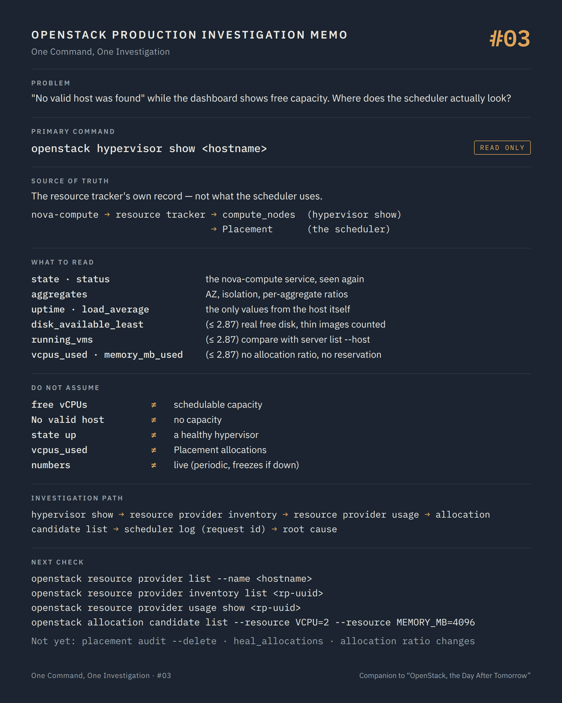

# One Command, One Investigation #03 — The capacity Nova remembers

**Command:** `openstack hypervisor show` · **Safety:** READ ONLY · **Layer:** resource tracker, compute_nodes, Placement · **Level:** intermediate

> Command → Evidence → Hypothesis → Investigation → Correlation → Decision
>
> The question of every episode: *what can this command actually tell us during a production incident, and what does it NOT tell us?*

---

## 1. Production situation

The host from episode #02 is back: nova-compute reports again, `State: up`, and someone has set `Status: disabled` with the reason "under investigation". Good.

A second symptom now appears, apparently unrelated: new instances fail to build. The fault message is the one every operator knows:

```text
No valid host was found. There are not enough hosts available.
```

The capacity dashboard says the region is 60 % used. The team's first reflex is to look at the hypervisors and count free vCPUs.

That reflex is where this episode starts, because it is based on a view of capacity that the scheduler has not used for years.

## 2. The command

```bash
openstack hypervisor show <hostname>
```

**READ ONLY.** Admin policy by default. The Nova API answers from the `compute_nodes` table in the cell database.

Who writes that table matters:

```text
nova-compute
     │  update_available_resource, periodic (about every 60 s)
     ↓
resource tracker  →  compute_nodes row        ← what hypervisor show returns
                  →  Placement inventory      ← what the scheduler uses
```

The resource tracker on each host writes two things at roughly the same time: its own accounting into `compute_nodes`, and an inventory into Placement. `hypervisor show` reads the first. The scheduler reads the second, through allocation candidates. They usually agree. When they do not, the scheduler is right by definition, because it is the one making the decision.

## 3. What the command tells us

With a client negotiating microversion 2.88 or newer (any recent `openstack` client):

```text
id                    hypervisor UUID (since 2.53)
hypervisor_hostname   the node name as the virt driver reports it
hypervisor_type       QEMU
hypervisor_version    libvirt's numeric version
state                 up | down          ← mirror of the nova-compute service
status                enabled | disabled ← mirror of the nova-compute service
service_host          the service behind the node
service_id
host_ip               the address nova-compute registered
aggregates            host aggregates this host belongs to (added by the client)
host_time / uptime / users / load_average
                      the host's `uptime` output, split by the client; cached, refreshed periodically
```

`aggregates` is added by the client from the aggregates API, and it matters for `No valid host`: aggregate metadata drives availability zones, tenant isolation and per-aggregate allocation ratios. A host that is not in the aggregate the request needs is invisible to that request, however empty it is.

Older API microversions (up to 2.87) also return the resource tracker's own accounting:

```text
vcpus / vcpus_used
memory_mb / memory_mb_used / free_ram_mb
local_gb / local_gb_used / free_disk_gb
disk_available_least
running_vms
current_workload
cpu_info
```

Two of the older fields are still useful evidence when your deployment exposes them.

`disk_available_least` is the free disk the host actually has once thin-provisioned images are accounted for, and it is what a migration or a build will hit long before `free_disk_gb` reaches zero.

`running_vms` compared with what Nova believes is on the host (`openstack server list --host <host> --all-projects`) is a quick consistency check between the hypervisor and the API.

Everything else in that block comes with a warning that Nova itself prints in its API reference: those totals "do not take allocation ratios into account", and "a more accurate representation of state can be obtained using placement". From microversion 2.88 the fields are simply gone, along with the `hypervisor stats` API, precisely to stop operators from reading capacity there.

`state` and `status` are worth a second look. They are not properties of the hypervisor. They are the nova-compute service's `up/down` and `enabled/disabled` from episode #02, shown again. A hypervisor cannot be `up` while its service is `down`, whatever libvirt is doing.

`uptime` and `load_average` are the only fields that come from the host itself: a short uptime on a host nobody rebooted is a finding, and a load average far above the core count on a host that looks idle in Nova is another.

## 4. What the command does NOT tell us

It does not tell you why the scheduler said no. The scheduler asks Placement for allocation candidates: providers whose inventory, minus what is already allocated, minus what is reserved, multiplied by the allocation ratio, still fits the request, and which carry the required traits and aggregates. Then the filters run: availability zone, server groups, NUMA and CPU pinning, image properties. `hypervisor show` shows none of this.

It does not show allocations. A host looks half empty in `hypervisor show` and is full in Placement when allocations were left behind by failed migrations, evacuations or resizes. Those orphaned allocations consume capacity that no running VM uses.

It does not reflect `allocation_ratio` or `reserved_host_*`. Sixteen physical cores with `cpu_allocation_ratio = 4.0` are 64 schedulable vCPUs; with `reserved_host_cpus = 2`, 56. The pre-2.88 `vcpus` field says 16.

It is a periodic snapshot, refreshed by nova-compute. The same trap as `server show`: if the service is down, the numbers freeze at their last value.

And in deployments where one nova-compute manages many nodes (Ironic), one service appears as many hypervisors; `hypervisor list` counts nodes, not hosts.

## 5. What it lets us hypothesise

```text
free resources here, still No valid host   → Placement: allocations, ratios, reserved, traits  → #15
state down / status disabled               → host out of the pool by failure or decision       → #02
running_vms ≠ server list --host           → Nova and the hypervisor disagree on what runs     → #04
disk_available_least near zero             → migrations and builds will fail on disk first     → #19
uptime shorter than the incident           → the host rebooted; nobody said so                 → dmesg, OOB log
```

## 6. Next investigation

Ask Placement, which is what the scheduler does. All read-only:

```bash
openstack resource provider list --name <hostname>
openstack resource provider inventory list <rp-uuid>
openstack resource provider usage show <rp-uuid>
```

`inventory list` gives, per resource class, `total`, `reserved`, `allocation_ratio`, `min_unit`, `max_unit`, `step_size`. `usage show` gives what is allocated. Schedulable capacity is `(total - reserved) * allocation_ratio - used`, per class, and the build needs every class to fit.

Then ask the scheduler's question directly:

```bash
openstack allocation candidate list --resource VCPU=2 --resource MEMORY_MB=4096 --resource DISK_GB=20
```

If this returns candidates and the build still fails, the rejection comes from the filters, and the nova-scheduler log for the request ID (`openstack server event list` gives it) will name the filter that returned zero hosts.

For orphaned allocations, read-only as long as `--delete` is absent:

```bash
nova-manage placement audit --verbose
```

What we do not do at this stage:

- `nova-manage placement audit --delete` and `nova-manage placement heal_allocations` — STATE CHANGING. They edit Placement. Right after a failed migration, an allocation that looks orphaned may belong to a migration record that is still being cleaned up.
- Changing `cpu_allocation_ratio` or `ram_allocation_ratio` in `nova.conf` to "make room" — STATE CHANGING with a region-wide blast radius: it changes every scheduling decision from that moment on, and it is how overcommitted hosts are born.
- `openstack compute service set --enable` on the host under investigation, to get capacity back. It is exactly the wrong order: enable after understanding, not to relieve pressure.

## 7. Investigation chain

```text
No valid host, capacity "available"
        ↓
openstack hypervisor show               state, status, uptime, resource tracker view
        ↓
openstack resource provider inventory   total, reserved, allocation_ratio
        ↓
openstack resource provider usage       allocations, including orphans
        ↓
openstack allocation candidate list     what the scheduler would get right now
        ↓
nova-scheduler log, request ID          which filter said no
        ↓
Root cause: allocations, ratios, traits, aggregates, or a real shortage
```

## 8. Production lesson

Capacity is not a number. It is an inventory, a ratio, a reservation and a set of allocations. `hypervisor show` reads none of them, and neither should you when the scheduler says no.

---

## Memo



## Version notes

- Microversion 2.53: hypervisor and service IDs become UUIDs; `hypervisor show` accepts the UUID; `with_servers` query replaces the older `servers` and `search` APIs.
- Microversion 2.88: the resource usage fields (`vcpus`, `vcpus_used`, `memory_mb*`, `local_gb*`, `free_*`, `disk_available_least`, `running_vms`, `current_workload`, `cpu_info`) are removed from hypervisor responses; `uptime` is added to `hypervisor show`; `GET /os-hypervisors/statistics` and the separate uptime API fail with 404. Recent `openstack` clients negotiate 2.88+ automatically, so the usage fields are not displayed; pass `--os-compute-api-version 2.87` to see them on a deployment that still allows it.
- `hypervisor list --long` adds hypervisor type and host IP; these are not returned at microversion 2.52 or lower.
- `update_resources_interval = 0` (default) runs the resource tracker at the default periodic spacing; a positive value sets the interval in seconds.
- `openstack resource provider list --in-tree` requires Placement API 1.14 or newer; `nova-manage placement audit` exists since the Ussuri release.

## Sources

- Nova API reference, *Hypervisors (os-hypervisors)*: microversion 2.53 and 2.88 notes, `state`/`status` definitions, `uptime`, the warning on totals and allocation ratios: https://docs.openstack.org/api-ref/compute/#hypervisors-os-hypervisors
- Nova API reference source, `api-ref/source/os-hypervisors.inc` and `parameters.yaml` (`hypervisor_state`, `hypervisor_status`, `hypervisor_uptime`, `disk_available_least`): https://opendev.org/openstack/nova/src/branch/master/api-ref/source
- python-openstackclient, hypervisor commands (`hypervisor list --long --matching`, `hypervisor show`): https://docs.openstack.org/python-openstackclient/latest/cli/command-objects/hypervisor.html
- osc-placement CLI (`resource provider list/show/inventory list/usage show`, `allocation candidate list`): https://docs.openstack.org/osc-placement/latest/cli/index.html
- Nova, `nova-manage placement audit` and `heal_allocations` (return codes, `--delete`): https://docs.openstack.org/nova/latest/cli/nova-manage.html
- Nova scheduler and Placement overview (allocation candidates, filters): https://docs.openstack.org/nova/latest/admin/scheduling.html
- Nova configuration: `update_resources_interval`, `cpu_allocation_ratio`, `ram_allocation_ratio`, `reserved_host_cpus`, `reserved_host_memory_mb`: https://docs.openstack.org/nova/latest/configuration/config.html

---

*Part of the series [One Command, One Investigation](README.md), a technical companion to the book [OpenStack, the Day After Tomorrow](https://github.com/soufian-zaouam/openstack-the-day-after-tomorrow).*

Previous: [**#02 — `openstack compute service list`**](02-openstack-compute-service-list.md). Next: [**#04 — `virsh list --all`**](04-virsh-list-domstate.md): the first question asked to the hypervisor itself.
