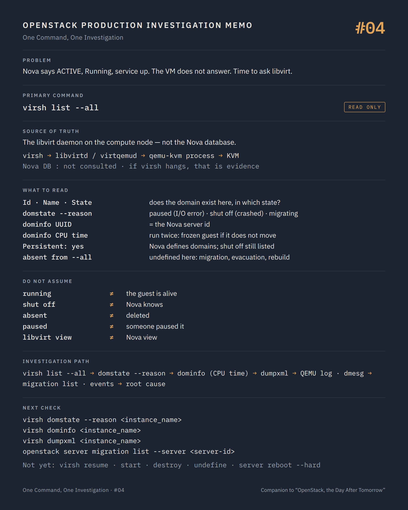

# One Command, One Investigation #04 — Asking the hypervisor

**Command:** `virsh list --all`, `virsh domstate --reason` · **Safety:** READ ONLY · **Layer:** libvirt, on the compute node · **Level:** intermediate

> Command → Evidence → Hypothesis → Investigation → Correlation → Decision
>
> The question of every episode: *what can this command actually tell us during a production incident, and what does it NOT tell us?*

---

## 1. Production situation

Three episodes in, everything Nova can say has been said. The VM is `ACTIVE`, `power_state` reads `Running`, the compute service is `up`, the hypervisor record looks normal. The VM is still unreachable.

Every answer so far came from a database. It is time to ask the process that actually runs the VM. That means logging into the compute host and talking to libvirt.

The two identifiers from episode #01 come with us: the host name, and `OS-EXT-SRV-ATTR:instance_name`, the libvirt domain name of the form `instance-0000abcd`.

## 2. The command

On the compute node:

```bash
virsh list --all
virsh domstate --reason <instance_name>
virsh dominfo <instance_name>
```

**READ ONLY.** `virsh` talks to the local libvirt daemon over its socket (`qemu:///system`); it needs root or membership of the libvirt group. In containerised deployments it runs inside the libvirt container (for example `docker exec nova_libvirt virsh list --all` with Kolla Ansible); the commands and their meaning are the same.

```text
virsh
  ↓
libvirtd / virtqemud        holds the definition and the state of every domain
  ↓
qemu-kvm process            one per running domain
  ↓
KVM (kernel)

Nova database                ← not consulted, at all
```

One practical rule: if `virsh list` itself hangs, that is evidence, not an inconvenience. Wrap it (`timeout 30 virsh list --all`) and note it. A libvirt daemon that does not answer explains a lot of what Nova has been reporting, because nova-compute talks to the same daemon.

## 3. What the command tells us

`virsh list --all` prints every domain libvirt knows on this host, active or not:

```text
 Id   Name                State
------------------------------------
 12   instance-0000abcd   running
 -    instance-0000ab12   shut off
 15   instance-0000abf3   paused
```

Nova defines its domains as persistent (it calls `defineXML` before starting them), so a Nova instance that is stopped still appears here as `shut off`. The `--all` flag is what makes those visible. A domain that is not in this list at all has been undefined: deleted, cleaned up after a migration or an evacuation, or never created on this host.

The states are libvirt's: `running`, `paused`, `shut off`, `crashed`, `pmsuspended`, `in shutdown`, `idle`. Nova maps them to its own `power_state` (`paused` → `PAUSED`, `shut off` → `SHUTDOWN`, `crashed` → `CRASHED`, `pmsuspended` → `SUSPENDED`), and episode #01 explained what the sync does with each: `SHUTDOWN` and `CRASHED` on an `ACTIVE` instance trigger a stop through the API; `PAUSED` is logged and ignored.

`virsh domstate --reason` adds the part that matters:

```text
running (booted)          started normally
running (migrated)        arrived here by live migration
running (unpaused)        someone resumed it
paused (I/O error)        QEMU stopped the guest on a storage error
paused (migrating)        a live migration is in progress, or stuck
paused (user)             someone paused it
paused (post-copy failed) a post-copy migration broke midway
shut off (shutdown)       the guest shut itself down
shut off (destroyed)      libvirt was told to kill it
shut off (crashed)        QEMU died
shut off (failed)         it never started
shut off (migrated)       it left this host
crashed (panicked)        the guest kernel panicked (needs a panic device)
```

`paused (I/O error)` is the one that explains most "ACTIVE but unreachable" tickets on platforms with shared storage. QEMU hit an error on a write and, with its default error handling (`werror=enospc`: pause the guest when a write fails for lack of space), stopped the guest instead of passing the error through. The most common trigger is a backend that ran out of space: a full Ceph pool, a thin-provisioned LUN at its limit. Nova sees `PAUSED`, logs a warning, and leaves the instance `ACTIVE`. From the API side nothing changed. From the user's side, the VM froze.

`virsh dominfo` completes the picture:

```text
Id:             12
Name:           instance-0000abcd
UUID:           <the Nova server id>
State:          running
CPU(s):         4
CPU time:       9123.4s
Max memory:     8388608 KiB
Used memory:    8388608 KiB
Persistent:     yes
Autostart:      disable
Managed save:   no
```

`UUID` is the Nova server ID. It is the reliable link between the two worlds when the `instance_name` numbering has drifted, and `virsh list --all --uuid` lists domains by it. `CPU time` is the first sign of life or death of the guest: run `dominfo` twice thirty seconds apart; a running guest that does not consume a single second of CPU is not running anything.

## 4. What the command does NOT tell us

`running` means QEMU exists and its vCPUs are scheduled. It does not mean the guest kernel is alive, that the network path is plugged, or that a disk is readable. A guest stuck in a kernel panic without a panic device is `running (booted)` forever.

`shut off (crashed)` tells you QEMU died. It does not say why. The QEMU log and the kernel log do; that is episode #05.

`paused (I/O error)` tells you the storage path failed. It does not say which volume, which path, or whether the backend is still degraded.

A domain absent from this host is not a deleted VM. It may be running on another host after a migration that Nova did not record, or it may be defined nowhere at all. `virsh` sees one host. Nova's migration history and event list see the platform.

libvirt has no idea of Nova's `task_state`. A domain `paused (migrating)` may belong to a migration that Nova still thinks is progressing, or to one Nova gave up on an hour ago while libvirt was never told.

And `virsh` answers for the libvirt daemon, not for the QEMU process. After a libvirt restart the daemon reconnects to running domains and everything is fine; the rare cases where it does not are exactly the ones where `virsh` and `ps` disagree, which is why #05 checks the process directly.

## 5. What it lets us hypothesise

```text
domain not in the list                → Nova and libvirt diverged: failed migration, evacuation, rebuild  → events, migration list
shut off (crashed)                    → QEMU died; why is in its log and in dmesg                        → #05
paused (I/O error)                    → storage path: volume, iSCSI/RBD session, backend                 → #12, #13, #14
paused (migrating), task_state None   → a migration stuck on the libvirt side                            → migration list, domjobinfo
running (booted), no CPU time         → the guest is frozen or panicked                                  → #05, #06
running (booted), CPU time growing    → the guest lives; the problem is network or inside the guest      → #06, #07
```

## 6. Next investigation

Still on the host, still read-only:

```bash
virsh dumpxml <instance_name>
virsh domblklist <instance_name>
virsh domiflist <instance_name>
```

And back on the API side, to reconcile the two views:

```bash
openstack server migration list --server <server-id>
openstack server event list <server-id>
```

What we do not do at this stage:

- `virsh resume` on a domain paused for an I/O error, before the storage path is fixed — POTENTIALLY DISRUPTIVE. Resuming a guest whose storage is still failing sends the same errors into the guest filesystem. Fix the path first. And note a trap for later: because Nova's sync ignores `PAUSED` (#01), the instance stays `ACTIVE` in the API, and `openstack server unpause` is refused (the API requires `vm_state PAUSED`). Once the path is repaired, `virsh resume` on the host is the way back; libvirt's lifecycle event then lets nova-compute set `power_state` to `Running` again. It is a change made outside Nova's event list, so it is written in the incident record by hand.
- `virsh start` or `virsh destroy` — STATE CHANGING, behind Nova's back. Episode #01 showed the periodic sync: a domain started by hand under an instance Nova believes `SHUTOFF` will be stopped again by nova-compute within ten minutes. Nova must be the one issuing the action.
- `virsh undefine` — POTENTIALLY DISRUPTIVE. It erases the only local record of the domain's definition. Nothing here is undefined during an investigation.
- `openstack server reboot --hard` — STATE CHANGING. It destroys and recreates the domain, and with it the QEMU log context and the paused guest's memory that #05 needs.

## 7. Investigation chain

```text
Nova: ACTIVE, Running, service up — VM unreachable
        ↓
virsh list --all                     does the domain exist here, in which state?
        ↓
virsh domstate --reason              why is it in that state?
        ↓
virsh dominfo                        UUID = server id; CPU time moving or not?
        ↓
  shut off (crashed) ───────────────────→ QEMU log, dmesg                 → #05
  paused (I/O error) ───────────────────→ volumes, os-brick, backend      → #12–#14
  running, CPU time frozen ─────────→ dumpxml, console log            → #05, #06
  running, CPU time moving ─────────→ console log, port               → #06, #07
  absent ───────────────────────────────→ migration list, events           → #18
```

## 8. Production lesson

Nova holds a state. libvirt holds a state. When they disagree, neither is right by default. The disagreement is the finding, and the investigation is about which one stopped being told.

---

## Memo



## Version notes

- The state reasons printed by `virsh domstate --reason` are libvirt's `virDomain*Reason` enumerations; the exact wording above is from the virsh source. Older libvirt versions have fewer reasons (for example no `post-copy failed`).
- `virsh list` filters exist for scripting: `--state-running`, `--state-paused`, `--state-shutoff`, `--state-other`, `--uuid`, `--name`.
- Nova's mapping of libvirt states to `power_state` is in `nova/virt/libvirt/guest.py` (`LIBVIRT_POWER_STATE`); `in shutdown` is mapped to `SHUTDOWN`, `blocked` (Xen only) to `RUNNING`.
- Nova does not set a disk `error_policy` in the domain XML by default, so QEMU's defaults apply: `werror=enospc` pauses the guest when a write fails because the backend has no space left, `rerror=report` passes read errors to the guest. A deployment may override this; the `<driver>` element of each `<disk>` in the XML (#05) is where to check.
- In Kolla Ansible the libvirt container is `nova_libvirt`; in TripleO-based deployments it is `nova_virtqemud` (modular daemons) or `nova_libvirt` on older releases. Some deployments expose a `virsh` wrapper on the host.

## Sources

- libvirt, virsh manual (`list`, `domstate`, `dominfo`, `domblklist`, `domiflist`, domain states): https://www.libvirt.org/manpages/virsh.html
- libvirt source, `tools/virsh-domain-monitor.c` (reason strings for running, paused, shut off, crashed): https://gitlab.com/libvirt/libvirt/-/blob/master/tools/virsh-domain-monitor.c
- libvirt, domain state and reason API (`virDomainGetState`, `virDomainRunningReason`, `virDomainPausedReason`, `virDomainShutoffReason`): https://libvirt.org/html/libvirt-libvirt-domain.html
- Nova source, `nova/virt/libvirt/guest.py` (`LIBVIRT_POWER_STATE`) and `nova/virt/libvirt/host.py` (`write_instance_config` → `defineXML`): https://opendev.org/openstack/nova/src/branch/master/nova/virt/libvirt
- Nova source, `nova/compute/manager.py`, `_sync_instance_power_state` (what Nova does with PAUSED, SHUTDOWN, CRASHED, NOSTATE): https://opendev.org/openstack/nova/src/branch/master/nova/compute/manager.py
- python-openstackclient, `server migration list --server` (source: `openstackclient/compute/v2/server_migration.py`), `server event list`: https://docs.openstack.org/python-openstackclient/latest/cli/command-objects/server.html
- QEMU, block device error handling (`werror`, `rerror`, default `enospc`/`report`): https://www.qemu.org/docs/master/system/invocation.html

---

*Part of the series [One Command, One Investigation](README.md), a technical companion to the book [OpenStack, the Day After Tomorrow](https://github.com/soufian-zaouam/openstack-the-day-after-tomorrow).*

Previous: [**#03 — `openstack hypervisor show`**](03-openstack-hypervisor-show.md). Next: [**#05 — `virsh dumpxml` and the QEMU log**](05-virsh-dumpxml-qemu-log.md): what QEMU was asked to run, and what it said before it stopped.
