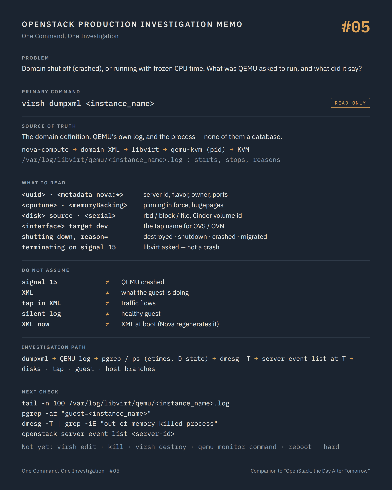

# One Command, One Investigation #05 — What QEMU was asked to run

**Command:** `virsh dumpxml`, the QEMU domain log, `ps` · **Safety:** READ ONLY · **Layer:** libvirt domain definition, QEMU/KVM process · **Level:** advanced

> Command → Evidence → Hypothesis → Investigation → Correlation → Decision
>
> The question of every episode: *what can this command actually tell us during a production incident, and what does it NOT tell us?*

---

## 1. Production situation

Episode #04 ended on one of two findings. Either the domain is `shut off (crashed)` and Nova has not caught up yet, or it is `running (booted)` with a CPU time that has not moved in a minute.

In both cases the next question is the same: what exactly was this VM built from, and what did QEMU say before it stopped, or before it went quiet?

The answer is in three places on the compute node, and none of them is a database.

## 2. The command

```bash
virsh dumpxml <instance_name>
tail -n 100 /var/log/libvirt/qemu/<instance_name>.log
pgrep -af "guest=<instance_name>"
```

**READ ONLY.** All three need root (or libvirt group membership for the first). In containerised deployments the log path is inside the libvirt container, or mounted on the host under a deployment-specific path.

```text
nova-compute            builds the domain XML from flavor, image, ports, volumes
     ↓
libvirt                 defines the domain (persistent), starts a QEMU process from it
     ↓  writes /var/log/libvirt/qemu/<domain>.log
qemu-kvm                one process per domain, command line derived from the XML
     ↓
KVM (kernel)            dmesg is where the kernel reports what it did to that process
```

The XML is the contract between Nova and the hypervisor. The QEMU log is QEMU's own account of each start and stop. The process is what exists right now. An investigation reads all three, because they disagree in instructive ways.

## 3. What the command tells us

### The domain XML

Read it top to bottom, once. It contains more of the VM's history than any API call:

```text
<name>                    instance-0000abcd
<uuid>                    the Nova server id
<metadata><nova:instance> package version, flavor name and specs, owner user/project,
                          creation time, root disk type and image, ports and IPs (nova:ports)
<memory> <vcpu>           what was granted
<cputune><vcpupin>        CPU pinning: which physical CPUs each vCPU is bound to
<numatune>                NUMA node binding for memory
<memoryBacking><hugepages> hugepages requested; boot fails when the host has none left
<cpu mode='...'>          host-passthrough or host-model: decides where this VM can migrate
<devices>
  <disk type='network'>   RBD: <source protocol='rbd' name='pool/volume-uuid'>, monitors, auth
  <disk type='block'>     iSCSI/FC through os-brick: /dev/disk/by-id/... or /dev/mapper/...
  <disk type='file'>      local qcow2 under /var/lib/nova/instances/<uuid>/disk
    <driver ... cache='...' io='...'>   caching and error policy actually in force
    <serial>              the Cinder volume id, as the guest sees it
  <interface type='bridge'|'ethernet'>
    <target dev='tapXXXXXXXX-XX'>      the tap name to look for in OVS/OVN (#07, #09, #10)
    <source bridge='br-int'> <virtualport type='openvswitch'>
    <mac address='fa:16:3e:...'>       the Neutron port's MAC
  <serial>/<console>      <log file='/var/lib/nova/instances/<uuid>/console.log'>  (#06)
  <watchdog>              action on hang, if the flavor asked for one
  <panic>                 lets libvirt report crashed (panicked) instead of running
```

Three elements answer questions Nova cannot: the tap device name is the bridge to the network investigation, the disk sources are the bridge to the storage investigation, and `<cputune>` is the bridge to every performance ticket that mentions pinning.

### The QEMU log

libvirt appends to this file at every start and stop of the domain. Each start writes the full QEMU command line, so the number of command lines is the number of times this domain was started on this host, with timestamps. Then the lines that matter:

```text
2026-09-18 08:12:41.318+0000: shutting down, reason=destroyed
```

written by libvirt, with the same reason vocabulary as `virsh domstate --reason`: `destroyed` (libvirt was told to kill it), `shutdown` (the guest stopped itself), `crashed` (QEMU died), `migrated`, `failed`.

```text
qemu-kvm: terminating on signal 15 from pid 2381 (/usr/sbin/libvirtd)
```

written by QEMU: a clean termination requested by libvirt. This is not a crash. Someone, through Nova or otherwise, asked for a stop, a hard reboot, a migration cleanup or a destroy at that moment. The "who" is in `openstack server event list` at that timestamp.

Lines that are a crash or a fault:

```text
KVM: entry failed, hardware error 0x...          CPU/virtualization fault, read dmesg
qemu-kvm: ... Input/output error                 storage path, correlate with paused (I/O error)
Unable to map backing store for guest RAM        hugepages or memory exhausted at start
```

### The process

```bash
pgrep -af "guest=<instance_name>"
ps -o pid,etimes,rss,pcpu,stat,wchan -p <pid>
```

`etimes` is how long the process has existed. Compare with `OS-SRV-USG:launched_at` from #01 and with the QEMU log: a process younger than the last start recorded in the log did not come from libvirt as you know it. `rss` is the memory the guest actually touched; `stat` `D` means the process is blocked in uninterruptible I/O, which points to storage before anyone reads a single log line. No process while `virsh` says `running` is the rare libvirt/QEMU disagreement mentioned in #04.

Then the kernel:

```bash
dmesg -T | grep -iE "out of memory|killed process|qemu|kvm"
```

`Out of memory: Killed process 31337 (qemu-kvm)` closes the case for a `shut off (crashed)` domain and opens another one about host memory, overcommit and reservations (#19).

## 4. What the command does NOT tell us

The XML is what libvirt was asked to run, not what the guest is doing. A perfect XML runs a panicked kernel just as well.

The tap name and the RBD source prove that QEMU was given a network device and a disk. They do not prove that the tap is connected to a flow or that the RBD image is reachable. Those are episodes #09 and #13.

`terminating on signal 15` says libvirt asked QEMU to stop. It does not say why libvirt asked. That decision was Nova's, or an operator's, and it lives in Nova's instance actions and nova-compute's log. Reading the QEMU log as "QEMU crashed" is the most common misreading of this file.

A running process with a frozen guest writes nothing in the QEMU log. Silence here is not health.

The XML you dump now is the live definition. Nova regenerates it at every hard reboot, migration and resize; a change made by hand with `virsh edit` disappears at the next one, and so does the evidence that it was ever there.

And the kernel log shows what the host did to QEMU. It does not show steal time, CPU contention or a noisy neighbour on the same pinned cores; that is `top` and the scheduler statistics in #19.

## 5. What it lets us hypothesise

```text
dmesg: Out of memory, Killed process (qemu-kvm)     → host memory: overcommit, hugepages, reservations   → #19, #03
log: shutting down, reason=destroyed at T           → who asked at T? stop, hard reboot, migration, evacuation → server event list, #18
log: reason=crashed, no OOM                         → QEMU fault: read the lines above it, then dmesg     → vendor/QEMU version
log: Input/output error, domain paused (I/O error)  → storage path, backend space                       → #12, #13, #14
process in D state                                  → blocked on storage I/O                             → #13
Unable to map backing store for guest RAM           → hugepages exhausted on the host                     → #19
<vcpupin> overlapping with another domain's         → pinning conflict, steal time inside the guest       → #19, performance
process etimes < last start in log                  → the domain was restarted outside the known history  → #18
```

## 6. Next investigation

Still on the host, read-only, to turn the XML into the next two branches:

```bash
virsh domblklist <instance_name>        disks: target device → source
virsh domiflist <instance_name>         interfaces: tap → bridge → MAC
virsh vcpupin <instance_name>           the pinning in force, to compare across domains
virsh dommemstat <instance_name>        balloon and RSS as libvirt sees them
```

On the API side, at the timestamps found in the log:

```bash
openstack server event list <server-id>
openstack server event show <server-id> <request-id>
```

Then the guest's own account, which is episode #06:

```bash
openstack console log show --lines 100 <server-id>
```

What we do not do at this stage:

- `virsh edit` or any hand-written change to the XML — STATE CHANGING, and lost at the next Nova operation. If a pinning or a device needs to change, it changes in the flavor or the image properties, through Nova, followed by a resize or a rebuild that the team decides on.
- `kill <pid>` or `virsh destroy` — POTENTIALLY DISRUPTIVE. A frozen guest may be recoverable (an I/O-error pause is), and killing the process destroys its memory and its state before anyone understood them.
- `virsh qemu-monitor-command` — libvirt's own manual describes it as a debugging aid that bypasses libvirt, which then cannot account for what was done on the monitor. If it is used at all, it is `--hmp 'info status'` or `'info block'`, nothing that changes state, and it is noted in the incident record.
- `openstack server reboot --hard` — STATE CHANGING. It writes a new command line into the QEMU log and a new `shutting down, reason=destroyed` line, and it erases the process, its memory and the current console log. Copy the QEMU log and the console log before, if a reboot is decided.

## 7. Investigation chain

```text
shut off (crashed), or running with frozen CPU time
        ↓
virsh dumpxml                          contract: uuid, pinning, hugepages, disks, tap, console path
        ↓
/var/log/libvirt/qemu/<domain>.log     starts, stops, reasons, QEMU's own errors
        ↓
pgrep / ps                             does the process exist? since when? blocked on I/O?
        ↓
dmesg -T                               did the kernel kill it?
        ↓
openstack server event list at T       who asked, if libvirt was told to stop it
        ↓
  disks / tap  →  #12, #13 / #07, #09
  guest        →  #06
  host         →  #19
```

## 8. Production lesson

The domain XML is the contract between Nova and the hypervisor, and the QEMU log is the only witness to what happened to the process. Read the contract and the witness before blaming either party, and before writing "QEMU crashed" in a ticket about a signal 15.

---

## Memo



## Version notes

- `shutting down, reason=<reason>` is written by libvirt into the domain log at every stop (`qemuProcessStop` in `src/qemu/qemu_process.c`); the reason vocabulary is `virDomainShutoffReason`. Old libvirt releases (before 1.x) do not write the reason.
- The QEMU binary name in the log and in `ps` varies: `qemu-kvm` (RHEL/CentOS family), `qemu-system-x86_64` (Debian/Ubuntu). The `-name guest=<domain>,debug-threads=on` argument is added by libvirt and is the reliable pattern for `pgrep -f`.
- Nova does not set a disk `error_policy` by default; QEMU's defaults (`werror=enospc`, `rerror=report`) apply unless the deployment overrides them. The `<driver>` element in the XML shows what is in force.
- The `nova:ports` element in the metadata namespace exists in the 1.1 version of Nova's libvirt metadata schema (recent releases); older XML carries flavor, owner, creation time and root disk only.
- Log location and rotation: `/var/log/libvirt/qemu/<domain>.log` is libvirt's default; some deployments rotate it with logrotate, so the history may be in `.log.1`, `.log.2.gz`. The console log path is defined in the XML, under `instances_path` (`/var/lib/nova/instances` by default).

## Sources

- libvirt, domain XML format (`<metadata>`, `<cputune>`, `<numatune>`, `<memoryBacking>`, `<cpu mode>`, `<disk>`, `<interface>`, `<serial>`, `<watchdog>`, `<panic>`): https://libvirt.org/formatdomain.html
- libvirt, virsh manual (`dumpxml`, `domblklist`, `domiflist`, `vcpupin`, `dommemstat`, `qemu-monitor-command`): https://www.libvirt.org/manpages/virsh.html
- libvirt source, `src/qemu/qemu_process.c` (`shutting down, reason=` log line): https://gitlab.com/libvirt/libvirt/-/blob/master/src/qemu/qemu_process.c
- libvirt, logging and domain log files: https://libvirt.org/logging.html
- QEMU, invocation reference (`-name guest=`, `werror`/`rerror` defaults): https://www.qemu.org/docs/master/system/invocation.html
- Nova, libvirt driver source, `nova/virt/libvirt/driver.py` (console log path under `instances_path`, XML generation) and `nova/virt/libvirt/config.py` (Nova metadata namespace): https://opendev.org/openstack/nova/src/branch/master/nova/virt/libvirt
- Nova, CPU topologies and pinning (`hw:cpu_policy`, `hw:mem_page_size`): https://docs.openstack.org/nova/latest/admin/cpu-topologies.html
- Nova configuration, `instances_path`: https://docs.openstack.org/nova/latest/configuration/config.html

---

*Part of the series [One Command, One Investigation](README.md), a technical companion to the book [OpenStack, the Day After Tomorrow](https://github.com/soufian-zaouam/openstack-the-day-after-tomorrow).*

Previous: [**#04 — `virsh list --all`**](04-virsh-list-domstate.md). Next: [**#06 — `openstack console log show`**](06-openstack-console-log-show.md): the guest's side of the story.
