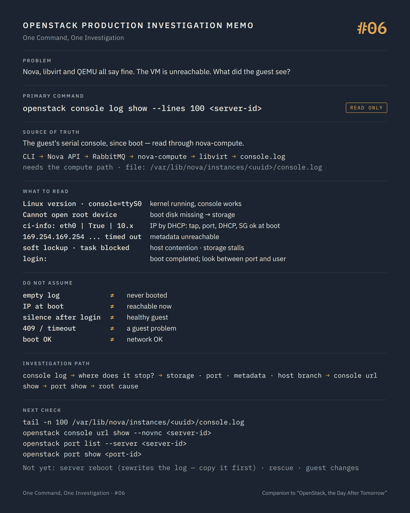

# One Command, One Investigation #06 — The guest's side of the story

**Command:** `openstack console log show` · **Safety:** READ ONLY · **Layer:** guest OS, through nova-compute and libvirt · **Level:** foundation

> Command → Evidence → Hypothesis → Investigation → Correlation → Decision
>
> The question of every episode: *what can this command actually tell us during a production incident, and what does it NOT tell us?*

---

## 1. Production situation

The domain is `running (booted)`. The QEMU process is healthy, nothing in the QEMU log, nothing in `dmesg`. Nova, libvirt and QEMU agree: this VM is fine.

The user still cannot reach it.

Three layers have now said "fine", and each of them was telling the truth about its own layer. The platform's responsibility ends where the guest kernel starts. Before opening the network investigation, one more read-only question, this time to the guest itself: did it boot, how far, and what did it complain about?

## 2. The command

```bash
openstack console log show --lines 100 <server-id>
```

**READ ONLY.** Owner or admin. This is the first command in the series that goes all the way down the stack, and the path matters:

```text
openstack CLI
     ↓
Nova API                 POST /servers/{id}/action  os-getConsoleOutput
     ↓
RabbitMQ                 RPC to the compute host recorded in OS-EXT-SRV-ATTR:host
     ↓
nova-compute
     ↓
libvirt                  reads the console device from the domain XML
     ↓
/var/lib/nova/instances/<uuid>/console.log      the guest's serial console, "since boot"
```

Unlike `server show`, this call needs the message bus and nova-compute on that host to work. A `409 Conflict` or a timeout here is not information about the guest; it is information about the control plane path, and it sends you back to episode #02.

When that path is broken, or when you are already on the host, the file itself is readable with root:

```bash
tail -n 100 /var/lib/nova/instances/<uuid>/console.log
```

The API documentation describes the content as "the text of the console since boot". The file is what the guest kernel writes to its serial console, provided the image was built with one (`console=ttyS0` on the kernel command line; every mainstream cloud image has it).

## 3. What the command tells us

Read the log as a timeline, from the top of the boot to the last line, and note where it stops. Each stage rules out a layer.

```text
firmware / GRUB lines                      QEMU started and found a bootable disk
Linux version ... Command line: ... console=ttyS0 ...
                                           the kernel is running; the console works
Cannot open root device / Gave up waiting for root device
                                           the root disk is missing: storage path       → #12, #13
EXT4-fs error / XFS ... metadata I/O error the disk is there, its content is not         → #13, #14
systemd[1]: Reached target Multi-User      the OS is up
cloud-init: ci-info: | eth0 | True | 10.20.30.41 | 255.255.255.0 | ...
                                           the guest got an IP by DHCP: L2 and DHCP work up to here
url_helper.py[WARNING]: Calling 'http://169.254.169.254/...' failed ... timed out
                                           the metadata service is unreachable            → #11
Cloud-init v. ... finished                 the image's first-boot configuration completed
<hostname> login:                          the guest reached a login prompt
```

Then, after the boot, the lines that answer "why is it unreachable now":

```text
Kernel panic - not syncing: ...            the guest is dead; running (booted) in libvirt, forever
BUG: soft lockup - CPU#0 stuck for 22s!    the vCPU was not scheduled for 22 s: host CPU contention,
                                           pinning conflict, steal time                   → #19
INFO: task jbd2/vda1-8:123 blocked for more than 120 seconds
                                           storage I/O stalled from the guest's point of view → #13
Out of memory: Killed process ... (java)   the guest's own OOM killer; the VM is alive, the app is not
virtio_net virtio1 eth0: link is not ready / NETDEV WATCHDOG
                                           the guest's network device lost its link
```

The most valuable observation is often the simplest: where does the log end, and when? A boot that stops at "Waiting for root device" and a boot that reaches `login:` are two different incidents with the same ticket.

`ci-info` deserves a second look. If cloud-init printed an IP address, then at boot time the tap was plugged, the port was bound, the DHCP agent or OVN answered, and the security group allowed DHCP. That is four layers of the network investigation already answered for the moment of boot. Whether they still hold now is the next question.

## 4. What the command does NOT tell us

It is a log, not a shell. It shows what the guest wrote, when it wrote it. A guest that booted cleanly and then lost its network an hour later may have written nothing since. Silence after `login:` is not health.

An empty log is not "the guest never booted". It may mean the image has no serial console configured, that the console was redirected elsewhere, or that the log was reset when the domain was last started. Check the `<serial>`/`<console>` element in the XML (#05) before concluding anything from emptiness.

Kernel lines carry seconds since boot, not wall-clock time. To align them with Nova's events or the QEMU log, anchor on the cloud-init lines, which carry timestamps, or on the boot time from `OS-SRV-USG:launched_at`.

An IP in `ci-info` proves that DHCP worked at boot. It does not prove that the VM is reachable from where the user sits: security group rules, the router, the floating IP association and the provider network are all outside the guest and outside this log (#07 and after).

Nothing here says anything about the current state of the platform. The console log is the guest's diary. It is written by a witness who cannot see the hypervisor, the bus, or the storage cluster, only their effects.

And one thing it may tell you that you did not ask for: console logs contain whatever careless scripts print, including credentials. Treat the content as confidential and do not paste it into tickets or chats without reading it first.

## 5. What it lets us hypothesise

```text
stops at root device                      → the boot disk is not visible: attachment, path, backend    → #12, #13
filesystem errors after boot              → the disk is there, damaged or stalled                        → #13, #14
DHCP timed out, no ci-info IP             → port binding, tap, OVS/OVN, DHCP                             → #07, #08, #09, #10
IP obtained, metadata timed out           → metadata path (namespace, haproxy, OVN metadata)             → #11
soft lockups, long gaps in timestamps     → host CPU contention or storage stalls; check pinning         → #19, #05
kernel panic                              → guest-side, or a device/driver issue; the platform ran it    → image, guest owner
login prompt reached, then silence        → the guest lives; the problem is between its port and the user → #07
empty log                                 → no serial console, or path broken; check XML and the file      → #05, #02
```

## 6. Next investigation

If the guest is alive but unreachable, an interactive look is the shortest path, and it is still read-only on the platform:

```bash
openstack console url show --novnc <server-id>
```

Then the network investigation begins from the guest's port, which is the first command of Part II:

```bash
openstack port list --server <server-id>
openstack port show <port-id>
```

If the log stops at the root device, storage comes first:

```bash
openstack server volume list <server-id>
openstack volume show <volume-id>
```

What we do not do at this stage:

- `openstack server reboot` — STATE CHANGING. A reboot rewrites the console log from the top. The current log is the only record of what the guest saw; if a reboot is decided later, the file is copied first (`cp /var/lib/nova/instances/<uuid>/console.log /root/incident-<id>/`), with the QEMU log next to it.
- Logging into the guest through the VNC console to "fix" the network configuration. That is a change inside a customer's system, made during an investigation, on a hypothesis. If the guest's network configuration is the cause, it is the guest owner's change, agreed and recorded.
- `openstack server rescue` — STATE CHANGING. It replaces the boot device and reboots. Useful later, if a broken root filesystem is the diagnosis; destructive to the evidence if it is a guess.

## 7. Investigation chain

```text
Nova, libvirt, QEMU all "fine" — VM unreachable
        ↓
openstack console log show          how far did the guest boot? what did it say last?
        ↓
  stops at root device  ────────→  volumes, os-brick, backend         → #12, #13, #14
  no IP from DHCP       ────────→  port, agents, OVS/OVN              → #07–#10
  IP ok, metadata fails ────────→  metadata path                      → #11
  soft lockups / stalls ────────→  host contention, storage stalls    → #19, #13
  login prompt, silence ────────→  port, security groups, routing     → #07
  empty                 ────────→  XML console element, compute path  → #05, #02
        ↓
Root cause, then change
```

## 8. Production lesson

The platform's job ends when the guest kernel starts. Three layers can be right about themselves and the VM still unreachable; the guest had been writing its side of the story since boot, and nobody had read it.

---

## Memo



## Version notes

- The API action is `os-getConsoleOutput` with an optional `length` (number of lines from the end; all lines if omitted). Error responses: 401, 403, 404, 409 (conflict, typically the instance is not in a state where the console can be read or the compute cannot serve it), 501 (the virt driver does not implement it).
- `openstack console log show --lines <n>` maps to `length`. The client prints the raw text; control characters are escaped by the API.
- The console log path is `<instances_path>/<instance uuid>/console.log` with the libvirt driver (`instances_path` defaults to `$state_path/instances`, usually `/var/lib/nova/instances`). Nova's driver reads the path from the domain XML (`file`, `tcp` or `pty` console types) and truncates very large logs when returning them through the API, with a log message on the compute side.
- Serial console access through the API (`openstack console url show --serial`) requires `nova-serialproxy` and `[serial_console] enabled = true` on the compute; VNC through `nova-novncproxy` is the common default.
- Images must enable a serial console (`console=ttyS0` in the kernel arguments) for the log to contain anything; Windows guests require a different setup and often produce an empty log.

## Sources

- Nova API reference, *Show Console Output (os-getConsoleOutput Action)*: description ("the text of the console since boot"), `length`, error codes: https://docs.openstack.org/api-ref/compute/#show-console-output-os-getconsoleoutput-action
- Nova API reference source, `api-ref/source/servers-action-console-output.inc` and `parameters.yaml` (`length`, `console_output`): https://opendev.org/openstack/nova/src/branch/master/api-ref/source
- Nova source, `nova/virt/libvirt/driver.py` (`get_console_output`, `_get_console_log_path`, `_get_console_output_file`): https://opendev.org/openstack/nova/src/branch/master/nova/virt/libvirt/driver.py
- python-openstackclient, `console log show --lines`, `console url show --novnc/--serial`: https://docs.openstack.org/python-openstackclient/latest/cli/command-objects/server.html
- Nova, remote console access (VNC, serial console): https://docs.openstack.org/nova/latest/admin/remote-console-access.html
- cloud-init, boot stages and network reporting (`ci-info`), datasource metadata URL 169.254.169.254: https://cloudinit.readthedocs.io/en/latest/explanation/boot.html
- Nova configuration, `instances_path`, `[serial_console]`: https://docs.openstack.org/nova/latest/configuration/config.html

---

*Part of the series [One Command, One Investigation](README.md), a technical companion to the book [OpenStack, the Day After Tomorrow](https://github.com/soufian-zaouam/openstack-the-day-after-tomorrow).*

Previous: [**#05 — `virsh dumpxml` and the QEMU log**](05-virsh-dumpxml-qemu-log.md). Next: [**#07 — `openstack port show`**](07-openstack-port-show.md): Part II begins where the guest's network device ends.
