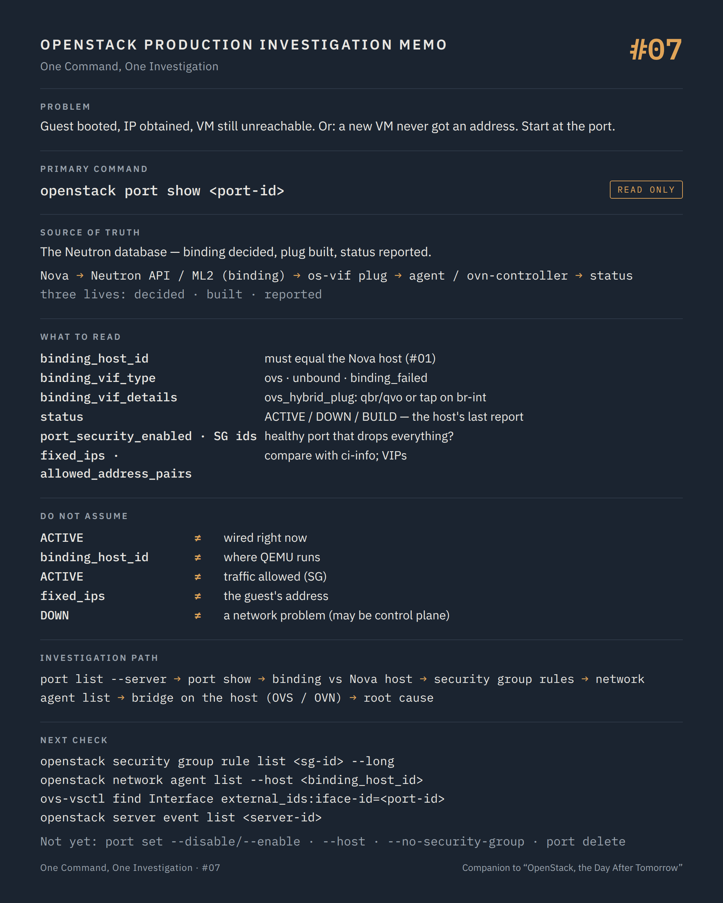

# One Command, One Investigation #07 — Bound, plugged, or merely listed?

**Command:** `openstack port show` · **Safety:** READ ONLY · **Layer:** Neutron API, ML2 port binding · **Level:** intermediate

> Command → Evidence → Hypothesis → Investigation → Correlation → Decision
>
> The question of every episode: *what can this command actually tell us during a production incident, and what does it NOT tell us?*

---

## 1. Production situation

Part I ended with a guest that booted to a login prompt. The console log even showed an IP address obtained by DHCP. Nova, libvirt, QEMU and the guest kernel are all fine. The user still cannot reach the VM, and a second ticket reports a freshly built VM on another host that never obtained an address at all.

Both tickets now belong to Part II: the path between the guest's virtual NIC and the rest of the world. That path is long. It starts at one object that every layer below refers to: the Neutron port.

## 2. The command

```bash
openstack port list --server <server-id>
openstack port show <port-id>
```

**READ ONLY.** Owner or admin; the `binding:*` attributes are shown to administrators. The Neutron API answers from its database.

How a port gets from "created" to "carrying traffic" explains every field below:

```text
Nova (server create / interface attach)
     ↓  creates the port, sets device_id, device_owner
Neutron API → ML2 plugin
     ↓  binding: chooses a mechanism driver for binding:host_id (openvswitch, ovn, sriov...)
     ↓  result: binding:vif_type (ovs, ..., binding_failed, unbound), binding:vif_details
Nova / os-vif on the compute
     ↓  plugs the tap into the integration bridge with external_ids = port id, MAC
L2 backend on the host
     ↓  ML2/OVS: the agent wires the port and reports it up (RPC update_device_up)
     ↓  ML2/OVN: ovn-controller claims the Port_Binding; the LSP "up" column turns true
Neutron   status = ACTIVE
```

Two things in that chain are decided by the control plane (the binding), two by the host (the plug and the wiring), and `status` is the host's report reaching the API. This is why the port's fields are read in a precise order.

## 3. What the command tells us

```text
id / name
status                  ACTIVE | DOWN | BUILD | ERROR | N/A
admin_state_up          True unless someone administratively disabled the port
device_id               the server UUID (or router, DHCP agent...)
device_owner            compute:nova, compute:<az>, network:dhcp, network:router_interface...
binding_host_id         the compute host the port is bound to
binding_vif_type        ovs | bridge | vhostuser | hw_veb | ... | unbound | binding_failed
binding_vif_details     port_filter, ovs_hybrid_plug, bridge_name, connectivity...
binding_vnic_type       normal | direct | direct-physical | macvtap | ...
binding_profile         extra binding data (SR-IOV PCI slot, trusted VF...)
mac_address             fa:16:3e:...
fixed_ips               ip_address, subnet_id
network_id
port_security_enabled   True: security groups and anti-spoofing apply
security_group_ids
allowed_address_pairs   extra MAC/IP the port may use (VRRP, keepalived, VIPs)
updated_at
```

`binding_host_id` is the first check, against `OS-EXT-SRV-ATTR:host` from #01. They must be identical. When they are not, the VM lives on one host and its port is wired on another: the signature of a live migration that failed after the port binding was moved, or of an evacuation whose cleanup did not finish.

`binding_vif_type` is the result of the binding decision. `ovs` (or the type your driver uses) means ML2 found a mechanism driver willing to bind the port on that host. `binding_failed` means none did, and the reason is in neutron-server's log at `updated_at`: usually an agent that is not alive on that host, a physical network the host has no bridge mapping for, or a vnic type nothing on that host supports. `unbound` means Nova never asked for a binding, or the port was detached.

`binding_vif_details` tells Nova how to plug: `ovs_hybrid_plug: true` means the iptables hybrid firewall, with a Linux bridge `qbr` and a veth pair `qvb`/`qvo` between the tap and `br-int`; `false` with `port_filter: true` means the OVS native firewall, tap directly on `br-int`. Which one you have decides what you look for on the host in #09.

`status` is the host's report. `ACTIVE` means the L2 backend on `binding_host_id` told Neutron the port is wired. `DOWN` on a port whose VM is running is a real finding: either the wiring never completed, or the report never reached Neutron. `BUILD` is transient; a port stuck in `BUILD` for minutes is a control-plane problem, not a network one.

`port_security_enabled` and `security_group_ids` close the loop with the user's symptom. A port with port security on and a security group that allows nothing inbound is a perfectly healthy port that drops every packet the user sends. `allowed_address_pairs` explains VIPs and keepalived that "work on one VM and not the other".

`fixed_ips` compared with the address the guest actually configured (`ci-info` in #06) catches the case where the guest kept an old address after a port replacement.

## 4. What the command does NOT tell us

`ACTIVE` is a report about the past. The agent or ovn-controller said "wired" at some point; nothing re-validates it. A tap that was later unplugged, a bridge that lost its flows after an agent restart, or a host that rebooted with a stale port record all show `ACTIVE` until something on the host changes the status again.

The port says nothing about what the packets meet after the tap: the local VLAN tag, the OpenFlow tables, the tunnel to the other host, the router namespace, the provider network. Those are #09, #10 and #11.

`binding_host_id` is where Neutron bound the port, not where the QEMU process runs. The comparison with Nova is the check; neither side alone is proof.

Security groups are listed by ID here. The rules themselves, their direction, their remote group references, are one more command away, and they are where most "healthy port, no traffic" tickets end.

And the DHCP side is invisible from the port: whether a DHCP agent (or OVN's native DHCP) serves this subnet, whether `enable_dhcp` is on, whether the lease exists, are subnet and agent questions, in #08 and #11.

## 5. What it lets us hypothesise

```text
binding_host_id ≠ Nova host                → wiring on the wrong host: failed migration or evacuation  → #18, then rebind by Nova
binding_vif_type = binding_failed          → no driver could bind: agent dead, no bridge mapping, vnic  → #08, neutron-server log
status DOWN, VM running                    → tap never wired, or the up report never arrived            → #08, #09, #10
status ACTIVE, SG allows nothing inbound   → the port works exactly as configured                       → security group rules
status ACTIVE, ci-info IP ≠ fixed_ips      → the guest configured a stale address                       → guest, DHCP lease
allowed_address_pairs empty, VIP in use    → anti-spoofing drops the VIP traffic                        → port update (decision)
```

## 6. Next investigation

The rules behind the IDs, read-only:

```bash
openstack security group rule list <sg-id> --long
```

Then the host-side agents that were supposed to wire this port, which is episode #08:

```bash
openstack network agent list --host <binding_host_id>
```

And on the compute node, the object the tap was plugged into, to be read in #09 (OVS) or #10 (OVN):

```bash
ovs-vsctl --columns=name,ofport,error,external_ids find Interface external_ids:iface-id=<port-id>
```

What we do not do at this stage:

- `openstack port set --disable` / `--enable` to "bounce" the port — STATE CHANGING. It changes `admin_state_up`, triggers a re-wiring on the host, and erases the evidence of why the port was `DOWN`.
- `openstack port set --host <other>` or any manual rebinding — STATE CHANGING with a real blast radius: Nova's view of where the VM runs is not updated, and a port bound to a host where the VM does not run is exactly the divergence we are investigating.
- `openstack port set --no-security-group` or `--disable-port-security` to test a hypothesis — POTENTIALLY DISRUPTIVE. It exposes the VM to prove a point. The rule list proves the same point without changing anything.
- `openstack port delete` / `openstack server remove port` followed by a re-add — STATE CHANGING. The guest loses its address, and the old binding history with it.

## 7. Investigation chain

```text
Guest booted, VM unreachable (or no address at boot)
        ↓
openstack port list --server         which port, which network, which address
        ↓
openstack port show                  bound where? vif_type? status? SG? port security?
        ↓
  binding_host_id ≠ Nova host ─────→ divergence: events, migrations           → #18
  binding_failed ────────────────→ agents on that host, neutron-server log     → #08
  DOWN ──────────────────────────→ agents, then the bridge on the host         → #08, #09/#10
  ACTIVE ────────────────────────→ security group rules, then the bridge       → rules, #09/#10
        ↓
Root cause, then change
```

## 8. Production lesson

A port has three lives: the one Neutron decided (the binding), the one the host built (the plug and the flows), and the one the host reported (the status). `port show` prints all three on one screen, and the investigation is about finding which one stopped matching the others.

---

## Memo



## Version notes

- `binding:vif_type` values defined by the API: `ovs`, `bridge`, `macvtap`, `hw_veb`, `hostdev_physical`, `vhostuser`, `distributed`, `other`, plus the special values `unbound` and `binding_failed`. The `openstack` client prints them as `binding_vif_type`, `binding_host_id`, `binding_vif_details`, `binding_vnic_type`, `binding_profile`.
- `status` values: `ACTIVE`, `DOWN`, `BUILD`, `ERROR` (and `N/A` for some port types). With ML2/OVS the agent reports `up` after wiring; with ML2/OVN the status follows the `up` column of the Logical_Switch_Port (`LogicalSwitchPortUpdateUpEvent` / `...DownEvent` in the OVN mechanism driver).
- `binding:vif_details` keys documented by the API: `port_filter`, `ovs_hybrid_plug`; drivers add others (`bridge_name`, `datapath_type`, `connectivity`).
- `openstack port list --server <server>` filters by `device_id`; `--host <host>` filters by `binding:host_id` (admin).
- The `binding:*` attributes require the `binding` extension and admin policy by default (`get_port:binding:host_id`, `get_port:binding:vif_type`...).

## Sources

- Neutron API reference, *Ports* (attributes `status`, `binding:host_id`, `binding:vif_type`, `binding:vif_details`, `binding:vnic_type`, `binding:profile`, `device_owner`, `port_security_enabled`, `allowed_address_pairs`): https://docs.openstack.org/api-ref/network/v2/index.html#ports
- neutron-lib API reference source, `api-ref/source/v2/parameters.yaml` (exact definitions quoted above): https://opendev.org/openstack/neutron-lib/src/branch/master/api-ref/source/v2/parameters.yaml
- Neutron, ML2 port binding (mechanism drivers, `binding_failed`): https://docs.openstack.org/neutron/latest/admin/config-ml2.html
- Neutron source, OVN mechanism driver `ovsdb_monitor.py` (`LogicalSwitchPortUpdateUpEvent` → `set_port_status_up`): https://opendev.org/openstack/neutron/src/branch/master/neutron/plugins/ml2/drivers/ovn/mech_driver/ovsdb/ovsdb_monitor.py
- os-vif source, `vif_plug_ovs/ovsdb/ovsdb_lib.py` (interface `external_ids`: `iface-id`, `iface-status`, `attached-mac`, `vm-uuid`): https://opendev.org/openstack/os-vif/src/branch/master/vif_plug_ovs/ovsdb/ovsdb_lib.py
- python-openstackclient, port commands (`port list --server/--host`, `port show`, `port set`): https://docs.openstack.org/python-openstackclient/latest/cli/command-objects/port.html
- python-openstackclient, security group rule commands: https://docs.openstack.org/python-openstackclient/latest/cli/command-objects/security-group-rule.html
- Neutron policies (`get_port:binding:*`): https://docs.openstack.org/neutron/latest/configuration/policy.html

---

*Part of the series [One Command, One Investigation](README.md), a technical companion to the book [OpenStack, the Day After Tomorrow](https://github.com/soufian-zaouam/openstack-the-day-after-tomorrow).*

Previous: [**#06 — `openstack console log show`**](06-openstack-console-log-show.md). Next: [**#08 — `openstack network agent list`**](08-openstack-network-agent-list.md): the processes that were supposed to wire this port.
