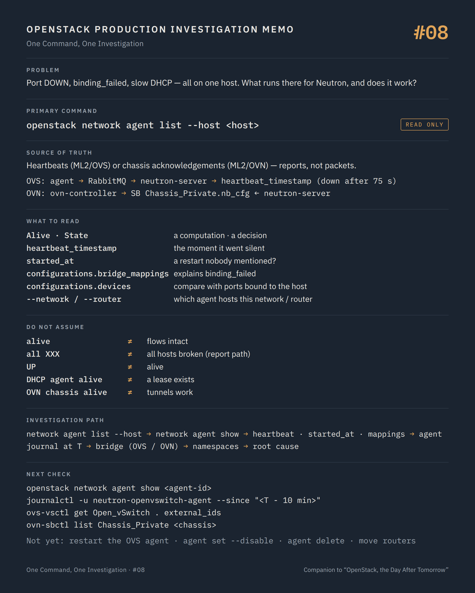

# One Command, One Investigation #08 — Alive is not the same as working

**Command:** `openstack network agent list`, `openstack network agent show` · **Safety:** READ ONLY · **Layer:** Neutron agents (ML2/OVS) and OVN chassis (ML2/OVN) · **Level:** intermediate

> Command → Evidence → Hypothesis → Investigation → Correlation → Decision
>
> The question of every episode: *what can this command actually tell us during a production incident, and what does it NOT tell us?*

---

## 1. Production situation

Episode #07 left two open branches. On the first VM the port is `ACTIVE`, correctly bound, with a security group that allows the traffic; the problem is further down. On the second VM, freshly built, the port shows `binding_vif_type: binding_failed`, and a third ticket now mentions slow DHCP for every new VM on that host.

Three symptoms, one question: what is running, on that host, on behalf of Neutron, and is it actually doing its job?

## 2. The command

```bash
openstack network agent list --host <host>
openstack network agent show <agent-id>
```

**READ ONLY.** Admin. The Neutron API answers from its `agents` table (ML2/OVS) or from the OVN southbound database (ML2/OVN); nothing is asked of the host itself.

What "alive" means depends on the backend, and it changes how to read the column:

```text
ML2/OVS
  neutron-openvswitch-agent, neutron-dhcp-agent, neutron-l3-agent, neutron-metadata-agent
       │  report_state every report_interval (30 s by default), over RabbitMQ
       ↓
  neutron-server → agents.heartbeat_timestamp
       alive = now - heartbeat_timestamp < agent_down_time (75 s by default)

ML2/OVN
  ovn-controller on each chassis, neutron-ovn-metadata-agent
       │  ovn-controller acknowledges each northbound change: Chassis_Private.nb_cfg
       ↓
  neutron-server reads the OVN southbound DB
       alive = the chassis is at most one nb_cfg behind, or its nb_cfg_timestamp is
               younger than agent_down_time
```

Same word, two mechanisms: a heartbeat over the message bus on one side, an acknowledgement of configuration changes in a database on the other. Both are reports; neither is a packet.

## 3. What the command tells us

```text
ID
Agent Type          Open vSwitch agent | DHCP agent | L3 agent | Metadata agent
                    OVN Controller agent | OVN Controller Gateway agent | OVN Metadata agent
Host
Availability Zone
Alive               :-) or XXX (True / False with --format)
State               UP | DOWN          ← admin_state_up: a decision
Binary
```

`Alive` and `State` are the same pair as `state`/`status` in #02: a computation and a decision. An agent `State: DOWN` was disabled by an administrator, usually to keep the scheduler from placing routers or DHCP servers on it. An agent `XXX` has not reported within `agent_down_time`.

`openstack network agent show` adds the fields that matter in an investigation:

```text
heartbeat_timestamp     the last report that reached neutron-server
started_at              when this agent process started (a recent value = a restart nobody mentioned)
created_at              when this host first registered
configurations          what the agent says it is configured with:
   OVS agent            bridge_mappings, tunnel_types, l2_population, datapath_type,
                        enable_distributed_routing, devices (number of ports it manages)
   DHCP agent           networks, subnets, ports, dhcp_driver, dhcp_lease_duration
   L3 agent             routers, agent_mode (legacy/dvr/dvr_snat), external_network_bridge
   OVN controller       bridge-mappings, ovn-bridge, ovn-encap-ip, ovn-cms-options
```

`configurations.bridge_mappings` on the OVS agent, or `ovn-bridge-mappings` on the chassis, answers `binding_failed` faster than any log: a port on a provider network `physnet2` cannot bind on a host whose mapping only knows `physnet1`. The binding is refused before anything reaches the host.

`devices` on the OVS agent, compared with the number of ports Neutron binds to that host, is a consistency check between what the agent manages and what the API believes.

`started_at` on the agent that "has always been fine" is often where the incident begins: an agent restarted at 03:12 by a package upgrade, an automation, or an OOM kill, and every port wired before that had to be rewired. The rewiring is what the slow DHCP ticket is about.

Two more filters are worth knowing:

```bash
openstack network agent list --agent-type dhcp --network <network-id>
openstack network agent list --agent-type l3 --router <router-id>
```

They answer "which DHCP agents host this network" and "which L3 agent hosts this router": the host you must log into for #11.

## 4. What the command does NOT tell us

`Alive` is a report reaching a database. With ML2/OVS it proves that the agent process can publish to RabbitMQ every thirty seconds. It does not prove that the agent can talk to the local OVS (`ovs-vswitchd` may be wedged while the Python process reports happily), that its flows are intact, or that its RPC loop is not stuck processing a backlog of ports. The book's RabbitMQ partition made every agent `XXX` at once while every packet on the platform kept flowing; the reverse also exists, agents `:-)` and a bridge with no flows.

With ML2/OVN, `Alive` proves that ovn-controller acknowledged northbound changes recently. A chassis with a broken tunnel interface, or one whose `ovn-encap-ip` points to an address that no longer exists on the host, is alive and cannot deliver a single packet to another host.

`OVN Metadata agent` alive is derived: it is marked down whenever its ovn-controller is down, whatever the metadata process itself is doing.

`State: UP` says only that nobody disabled the agent. An agent can be `UP` and `XXX`, and that combination is the one that matters.

The command lists agents, not their work. The DHCP agent hosting the network is alive; whether dnsmasq is running in the namespace, with a lease for this port, is a host question (#11). The L3 agent is alive; whether the router namespace has its routes and its NAT rules is the same host question.

And nothing here concerns OVS or OVN internals: the tag on the port, the OpenFlow tables, the tunnel ports, the chassis' Port_Binding. That is #09 and #10.

## 5. What it lets us hypothesise

```text
all agents XXX at once                     → the report path: RabbitMQ (OVS) or SB DB access (OVN)   → #16
one host XXX, ports ACTIVE, traffic flows  → agent process or its bus connection, data plane intact   → agent journal
binding_failed + missing bridge mapping    → configuration gap on that host, binding refused           → host config, PR
started_at = a few minutes ago             → the agent restarted; rewiring in progress or failed       → agent journal, #09
DHCP agent alive, no lease for the port    → dnsmasq or the namespace, not the agent                    → #11
OVN chassis alive, cross-host traffic fails → tunnel: encap IP, MTU, firewall between hosts             → #10
agent UP but XXX for hours                 → nobody noticed; monitoring gap before any network fix       → observability
```

## 6. Next investigation

On the host, read-only, for the agent that owns the symptom:

```bash
systemctl status neutron-openvswitch-agent          # or the container: docker ps --filter name=neutron_openvswitch_agent
journalctl -u neutron-openvswitch-agent --since "<heartbeat_timestamp - 10 min>"
```

Lines to look for: `AMQP server ... unreachable`, `Agent out of sync with plugin!`, `Port ... not present in bridge br-int`, `Error while processing VIF ports`, `ofctl request ... timed out`.

For ML2/OVN, the equivalent is ovn-controller's own state:

```bash
ovs-vsctl get Open_vSwitch . external_ids
ovn-sbctl list Chassis_Private <chassis-name>
journalctl -u ovn-controller --since "<time>"
```

Then the bridge, in #09 (OVS) or #10 (OVN).

What we do not do at this stage:

- `systemctl restart neutron-openvswitch-agent` — STATE CHANGING, and misunderstood. On restart the agent re-examines every port on the host; with the OVS firewall driver, it may reprogram flows for all of them. On a host with hundreds of ports this is minutes of partial connectivity, and it is also how the current incident may have started. It is a decision with a blast radius equal to the host, not a diagnostic step.
- `openstack network agent set --disable` / `--enable` — STATE CHANGING. Disabling an L3 or DHCP agent triggers rescheduling of routers and networks to other agents: routers move, addresses of DHCP ports change, and the incident spreads to VMs that were not part of it.
- `openstack network agent delete` on an agent that looks stale — POTENTIALLY DISRUPTIVE. Deleting a live agent's record while its host still runs ports makes Neutron forget who wires them; rebinding fails afterwards.
- `openstack router set` / `openstack network agent add router|network` to move resources by hand — STATE CHANGING, and a change to a symptom before the cause is known.

## 7. Investigation chain

```text
Port DOWN / binding_failed / slow DHCP on one host
        ↓
openstack network agent list --host      alive? UP? which agents exist on that host?
        ↓
openstack network agent show             heartbeat, started_at, bridge mappings, devices
        ↓
  all XXX ───────────────────────────→  report path (RabbitMQ / SB DB)          → #16
  one XXX ───────────────────────────→  agent journal at heartbeat_timestamp
  alive, mapping missing ────────────→  configuration gap, binding refused
  alive, restarted recently ─────────→  rewiring; then the bridge               → #09 / #10
  alive, everything looks right ─────→  the bridge and the namespaces           → #09 / #10, #11
```

## 8. Production lesson

Alive is a report about the process. Working is a property of the packets. The agent list can only give you the first, and an investigation that stops there has confirmed a heartbeat, not a network.

---

## Memo



## Version notes

- `agent_down_time` defaults to 75 seconds (neutron.conf, `[DEFAULT]`); `[agent] report_interval` defaults to 30 seconds on the agent side. Neutron's own documentation asks for `agent_down_time` to be at least twice `report_interval`.
- ML2/OVN synthesises agents from the OVN southbound database: `OVN Controller agent` and `OVN Controller Gateway agent` (chassis with `enable-chassis-as-gw` in `ovn-cms-options`), `OVN Metadata agent`, and `OVN Neutron agent` on recent releases. Their liveness uses `Chassis_Private.nb_cfg` compared with `NB_Global.nb_cfg` and `nb_cfg_timestamp` against `agent_down_time` (source: `neutron/plugins/ml2/drivers/ovn/agent/neutron_agent.py`). The metadata agent is reported down whenever its chassis' ovn-controller is down.
- `--agent-type` accepted values in the client: `bgp, dhcp, open-vswitch, linux-bridge, ofa, l3, loadbalancer, metering, metadata, macvtap, nic, baremetal, ovn-controller, ovn-controller-gateway, ovn-metadata, ovn-agent`.
- Restart cost of the OVS agent depends on the release and on the firewall driver; since the introduction of the native OpenFlow driver and flow cookies, restarts avoid dropping all flows, but ports are still re-examined and, with the OVS firewall, may be reprogrammed.
- Container and unit names vary by deployment tool (`neutron_openvswitch_agent`, `neutron_dhcp_agent`, `neutron_l3_agent`, `ovn_controller` in Kolla Ansible).

## Sources

- Neutron API reference, *Agents* (`alive`, `admin_state_up`, `heartbeat_timestamp`, `started_at`, `configurations`) and *Agent schedulers* (DHCP agents per network, L3 agents per router): https://docs.openstack.org/api-ref/network/v2/index.html#agents
- Neutron configuration, `agent_down_time`, `[agent] report_interval`, `dhcp_agents_per_network`: https://docs.openstack.org/neutron/latest/configuration/neutron.html
- python-openstackclient, network agent commands (`network agent list --agent-type/--host/--network/--router`, `network agent show`, `network agent set`): https://docs.openstack.org/python-openstackclient/latest/cli/command-objects/network-agent.html
- Neutron source, `neutron/plugins/ml2/drivers/ovn/agent/neutron_agent.py` (OVN agent types and `alive` logic): https://opendev.org/openstack/neutron/src/branch/master/neutron/plugins/ml2/drivers/ovn/agent/neutron_agent.py
- Neutron source, `neutron/common/ovn/constants.py` (agent type names): https://opendev.org/openstack/neutron/src/branch/master/neutron/common/ovn/constants.py
- Neutron, OVN reference architecture (chassis registration, metadata design): https://docs.openstack.org/neutron/latest/admin/ovn/refarch/refarch.html
- Neutron, Open vSwitch self-service deployment (agent types and verification): https://docs.openstack.org/neutron/latest/admin/deploy-ovs-selfservice.html

---

*Part of the series [One Command, One Investigation](README.md), a technical companion to the book [OpenStack, the Day After Tomorrow](https://github.com/soufian-zaouam/openstack-the-day-after-tomorrow).*

Previous: [**#07 — `openstack port show`**](07-openstack-port-show.md). Next: [**#09 — `ovs-vsctl`, `ovs-ofctl`**](09-ovs-vsctl-ofctl.md): what the integration bridge actually did with the port (ML2/OVS).
