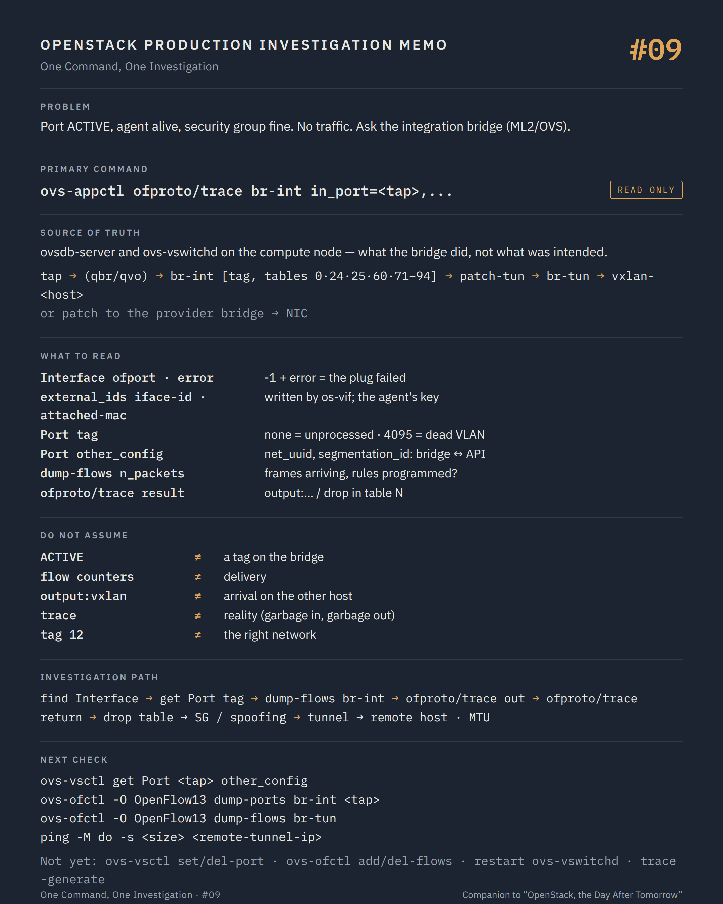

# One Command, One Investigation #09 — What the bridge did with the port

**Command:** `ovs-vsctl`, `ovs-ofctl`, `ovs-appctl ofproto/trace` · **Safety:** READ ONLY (the forms used here) · **Layer:** Open vSwitch on the compute node, ML2/OVS · **Level:** advanced

> Command → Evidence → Hypothesis → Investigation → Correlation → Decision
>
> The question of every episode: *what can this command actually tell us during a production incident, and what does it NOT tell us?*

---

## 1. Production situation

The port is `ACTIVE`, bound to the right host, the security group allows the traffic, the agent is alive and was not restarted. Every record agrees. The VM still receives nothing.

The records have run out. What is left is the thing the records describe: the integration bridge on the compute node, the tap device attached to it, the VLAN tag it carries, and the OpenFlow rules that decide where each frame goes. This episode is for ML2/OVS; the OVN equivalent is #10.

From #05 we have the tap name (`<target dev>` in the domain XML), from #07 the port ID and MAC.

## 2. The command

On the compute node:

```bash
ovs-vsctl show
ovs-vsctl --columns=name,ofport,error,external_ids find Interface external_ids:iface-id=<port-id>
ovs-vsctl get Port <tap-name> tag
ovs-ofctl -O OpenFlow13 dump-flows br-int
ovs-appctl ofproto/trace br-int in_port=<tap-name>,dl_src=<mac>,dl_dst=<dst-mac>,dl_type=0x0800,nw_src=<ip>,nw_dst=<dst-ip>
```

**READ ONLY**, all of them: they query `ovsdb-server` and `ovs-vswitchd` and change nothing. In containerised deployments they run inside the `openvswitch_vswitchd` container or through the host's `ovs-*` binaries pointing at the same sockets.

```text
VM (virtio NIC)
     ↓
tap<port-id[0:11]>                 created by libvirt, plugged by os-vif
     ↓  (hybrid plug: tap → qbr<id> linux bridge → qvb/qvo veth pair)
br-int    port tag = local VLAN    ← the agent chose it; 4095 means "dead"
     ↓  OpenFlow tables: security groups (OVS firewall), ARP/MAC spoof checks
patch-tun ↔ patch-int              br-int ↔ br-tun
br-tun    VXLAN/GRE/Geneve ports   vxlan-<hex-ip> to each other host
     ↓                             (or: int-br-ex ↔ phy-br-ex → provider bridge → NIC)
physical NIC
```

Each arrow is a place where a frame can stop, and each one has a command that shows whether it did.

## 3. What the command tells us

### `ovs-vsctl show` and the interface record

```text
Bridge br-int
    Port "tap3f2a9c1e-7b"
        tag: 12
        Interface "tap3f2a9c1e-7b"
            error: "could not open network device tap3f2a9c1e-7b (No such device)"
```

The `Interface` row is where the plug is recorded. `external_ids` carries what os-vif wrote at plug time: `iface-id` (the Neutron port ID), `attached-mac`, `vm-uuid`, `iface-status: active`. The agent uses `iface-id` to recognise the port; an interface without it, or with the wrong ID, is one the agent will never wire.

`ofport` is the OpenFlow port number; `-1` means the device could not be attached, and `error` says why. A tap that exists in the domain XML but not on the bridge, or on the bridge with `ofport -1`, is a plug problem, not a flow problem.

`tag` is the local VLAN the agent assigned to this network on this host. It is local: the same network has a different tag on another host. No tag means the agent has not processed the port; `4095` means the agent deliberately put it on the dead VLAN, which it does when it cannot resolve the network (no segmentation ID, no binding, port marked dead after an error). Two VMs on the same network on the same host with different tags are on different networks as far as this bridge is concerned.

`ovs-vsctl show` as a whole shows the topology: `br-int`, `br-tun` with its `vxlan-*` ports (one per remote host, `remote_ip` in options), the provider bridges and the patch ports between them. A missing `vxlan-<host>` port means no tunnel to that host; a patch port present on one side only means the bridges are disconnected.

### `ovs-ofctl dump-flows`

The agent programs `br-int` and `br-tun` with OpenFlow rules; the tables are the agent's logic made visible:

```text
br-int
  table 0      local switching, drop-by-default entries for unknown ports
  table 24/25  ARP and MAC anti-spoofing per port (matches in_port + dl_src / arp_spa)
  table 60     the "transient" table; NORMAL action = MAC learning switch
  tables 71–94 OVS firewall driver: 71 egress base, 72 egress rules, 73 accept/ingress,
               81 ingress base, 82 ingress rules, 91–94 accepted / dropped traffic
br-tun
  table 0      classify: from patch-int or from a tunnel
  table 2/3/4  by tunnel type; VXLAN in table 4 (tun_id → local VLAN)
  table 10     learn MAC → tunnel
  table 20     unicast to known MACs (l2population)
  table 22     flood to all tunnels for a VLAN (broadcast, unknown unicast)
```

Reading all flows on a busy host is not the goal. The goal is three checks: does a flow match this port's `in_port` in table 0 and in the firewall base tables (the port is known to the agent); do the firewall rule tables contain entries for this port's `reg_port` that correspond to the security group rules from #07 (the rules were programmed); and do the flows have packet counters (`n_packets`) increasing when the guest sends traffic (frames arrive at the bridge). A flow with `n_packets=0` on a port that "sends constantly" moves the problem back into the guest or the tap.

`ovs-ofctl dump-ports br-int <tap-name>` gives the interface's own counters: rx and tx frames, errors, drops. Rx growing and tx zero is a one-way problem, and a precise one.

### `ovs-appctl ofproto/trace`

This is the command that answers the question directly. It injects a described packet into the bridge's pipeline and prints every table it traverses, every rule it matches, and the final action: `output:<port>`, `drop`, `NORMAL` with the learned destination, or a jump through the patch port into `br-tun`. It does not send anything; it simulates.

Run it twice: once for a frame from the tap towards the destination, once for the return frame arriving from `patch-tun` towards the tap. The trace that ends in `drop` names the table that dropped it, and that table names the layer: 24/25 is anti-spoofing (a MAC or IP the port is not allowed to use, the VIP case from #07), 72/82 is a security group rule, table 0 with no match is a port the agent never wired.

## 4. What the command does NOT tell us

OVS shows this host. A frame that leaves through `vxlan-<remote>` correctly and never arrives is a problem on the wire, on the remote host, or in the MTU between them; the same commands on the remote host are the next step, and `ping -M do -s <size>` between the two hosts' tunnel endpoints is how MTU is confirmed.

Flow counters count frames that matched, not frames that were delivered. `output:vxlan-...` with a growing counter proves the encapsulation was attempted, not that the underlay carried it.

The trace is a simulation of the pipeline for the packet you described. Describe the wrong VLAN, MAC or protocol and it will faithfully trace a packet that never exists. Take the fields from the real objects: the tap's `attached-mac`, the port's `fixed_ips`, the destination's MAC from the Neutron port of the destination.

With the hybrid plug, the OVS pipeline starts at `qvo`, not at the tap. The Linux bridge `qbr` and the iptables chains (`neutron-openvswi-i<port>`, `neutron-openvswi-o<port>`) sit before it, and `iptables -S` in those chains is a separate read-only investigation that OVS cannot see.

And nothing here knows about Neutron's intent. A tag of 12 is right or wrong depending on which segmentation ID the network has and which tag the agent mapped it to; the agent's own log and `ovs-vsctl get Port <tap> other_config` (where the agent stores `net_uuid`, `network_type`, `segmentation_id`, `physical_network`) are what connects the bridge back to the API.

## 5. What it lets us hypothesise

```text
interface absent from br-int, or ofport -1     → plug failed: os-vif, libvirt, device name       → nova-compute log, #05
tag missing                                    → the agent has not processed the port            → agent journal, #08
tag 4095                                       → port put on the dead VLAN by the agent           → agent journal: why
tag ≠ other VMs of the same network on host    → mapping error, stale port record                → other_config, agent
firewall tables without this port's rules      → security groups not programmed                  → agent journal
trace drops in table 24/25                     → anti-spoofing: MAC/IP not allowed                → allowed_address_pairs (#07)
trace drops in table 72/82                     → a security group rule                           → rule list (#07)
trace output:vxlan-<remote>, nothing arrives   → underlay, MTU, remote host                       → remote host, MTU test
counters rx>0, tx=0                            → the return path                                 → trace the return frame
```

## 6. Next investigation

Read-only, on the same host:

```bash
ovs-vsctl get Port <tap-name> other_config
ovs-ofctl -O OpenFlow13 dump-ports br-int <tap-name>
ovs-ofctl -O OpenFlow13 dump-flows br-tun | grep -E "tun_id|vlan_tci"
ovs-appctl fdb/show br-int
```

And, when the trace leaves through a tunnel, the same set on the remote host, plus the underlay:

```bash
ping -M do -s 1422 <remote-tunnel-ip>       # from the local tunnel endpoint; adapt the size to the overlay MTU
```

If the port is bound but the destination is a router or a DHCP server, the namespaces on the network node or on this host are episode #11.

What we do not do at this stage:

- `ovs-vsctl set Port <tap> tag=<n>` or `ovs-vsctl del-port` / `add-port` — STATE CHANGING, behind the agent's back. The agent owns these objects and will rewrite them at its next sync; the change disappears and, until then, the bridge and the agent disagree.
- `ovs-ofctl add-flow` / `del-flows` / `mod-flows` — POTENTIALLY DISRUPTIVE. `del-flows br-int` without a match deletes every flow on the bridge and takes every VM on the host off the network until the agent resyncs. There is no rollback except the agent's own.
- Restarting `ovs-vswitchd` or `openvswitch` — POTENTIALLY DISRUPTIVE for the whole host: every bridge, every port, every flow is rebuilt, and the agent must resync afterwards.
- `ovs-appctl ofproto/trace` with the `-generate` option, or `ovs-ofctl packet-out` — these inject real packets. The trace form used here does not; keep it that way during an investigation.

## 7. Investigation chain

```text
Port ACTIVE, agent alive, no traffic
        ↓
ovs-vsctl show / find Interface         is the tap on br-int? ofport? error? iface-id?
        ↓
ovs-vsctl get Port tag                  wired (tag), unprocessed (none), or dead (4095)?
        ↓
ovs-ofctl dump-flows br-int             port known in table 0? SG rules in 72/82? counters moving?
        ↓
ovs-appctl ofproto/trace                where does this frame go? where does the return frame stop?
        ↓
  drop in 24/25 ──────→ anti-spoofing, allowed address pairs    → #07
  drop in 72/82 ──────→ security group rule                     → #07
  output:vxlan ───────→ remote host, underlay, MTU              → #09 on the other host, #19
  output:patch-int ───→ provider bridge, NIC                     → host networking, #19
  towards a router ───→ namespaces                               → #11
```

## 8. Production lesson

Records say what the platform intended. The bridge says what it did. When they disagree, `ofproto/trace` is the fastest honest witness on the host, and it does not need a single packet from the guest to testify.

---

## Memo



## Version notes

- The Neutron OVS agent sets `br-int` protocols to OpenFlow 1.0 and 1.3 (`add_protocols(OPENFLOW10, OPENFLOW13)` in the native driver); `ovs-ofctl -O OpenFlow13` shows every field the agent uses (`reg5`, `reg6`, `conj_id`, `ct_state` for the OVS firewall).
- The dead VLAN tag is 4095 (`DEAD_VLAN_TAG`); the agent sets it when it cannot map a port to a network, and on new ports before wiring.
- The OVS firewall driver (`[securitygroup] firewall_driver = openvswitch`) uses tables 71–94 on `br-int` and conntrack; the iptables hybrid driver (`iptables_hybrid`) uses the `qbr`/`qvb`/`qvo` chain and iptables in the host namespace. `binding:vif_details.ovs_hybrid_plug` (#07) says which one a port uses.
- `ovs-appctl ofproto/trace` accepts port names for `in_port` on current OVS releases; older releases need the `ofport` number. The `-generate` flag makes it inject a real packet: not used here.
- `other_config` on the Port row (`net_uuid`, `network_type`, `physical_network`, `segmentation_id`, `tag`) is written by the agent and is the link between the local tag and the Neutron network.
- Container names (Kolla Ansible): `openvswitch_vswitchd`, `openvswitch_db`, `neutron_openvswitch_agent`.

## Sources

- Open vSwitch, `ovs-vsctl` manual (`show`, `find`, `get`, `list`; Interface columns `ofport`, `error`, `external_ids`; Port column `tag`, `other_config`): https://www.openvswitch.org/support/dist-docs/ovs-vsctl.8.html
- Open vSwitch, `ovs-ofctl` manual (`dump-flows`, `dump-ports`, `-O` OpenFlow version): https://www.openvswitch.org/support/dist-docs/ovs-ofctl.8.html
- Open vSwitch, `ovs-appctl` and `ofproto/trace` (`ovs-vswitchd` manual, "OFPROTO COMMANDS"): https://www.openvswitch.org/support/dist-docs/ovs-vswitchd.8.html
- Open vSwitch, database schema (`Interface.external_ids`, `Port.tag`, `Port.other_config`): https://www.openvswitch.org/support/dist-docs/ovs-vswitchd.conf.db.5.html
- Neutron, Open vSwitch agent internals and OpenFlow tables (`br-int`, `br-tun`, table numbers): https://docs.openstack.org/neutron/latest/contributor/internals/openvswitch_agent.html
- Neutron, Open vSwitch firewall driver (tables 71–94, conntrack): https://docs.openstack.org/neutron/latest/contributor/internals/openvswitch_firewall.html
- neutron-lib source, `neutron_lib/plugins/ml2/ovs_constants.py` (table numbers: 24/25 spoofing, 60 transient, 71–94 firewall; br-tun 2/3/4/6/10/20/21/22; `DEAD_VLAN_TAG`): https://opendev.org/openstack/neutron-lib/src/branch/master/neutron_lib/plugins/ml2/ovs_constants.py
- Neutron source, `neutron/agent/common/ovs_lib.py` (dead VLAN 4095 on new ports) and `neutron/plugins/ml2/drivers/openvswitch/agent/openflow/native/ovs_bridge.py` (protocols OpenFlow10 + OpenFlow13): https://opendev.org/openstack/neutron/src/branch/master
- os-vif source, `vif_plug_ovs/ovsdb/ovsdb_lib.py` (`external_ids` written at plug time): https://opendev.org/openstack/os-vif/src/branch/master/vif_plug_ovs/ovsdb/ovsdb_lib.py
- Neutron, MTU considerations for overlay networks: https://docs.openstack.org/neutron/latest/admin/config-mtu.html

---

*Part of the series [One Command, One Investigation](README.md), a technical companion to the book [OpenStack, the Day After Tomorrow](https://github.com/soufian-zaouam/openstack-the-day-after-tomorrow).*

Previous: [**#08 — `openstack network agent list`**](08-openstack-network-agent-list.md). Next: [**#10 — `ovn-nbctl`, `ovn-sbctl`**](10-ovn-nbctl-sbctl.md): the same questions, asked of OVN.
