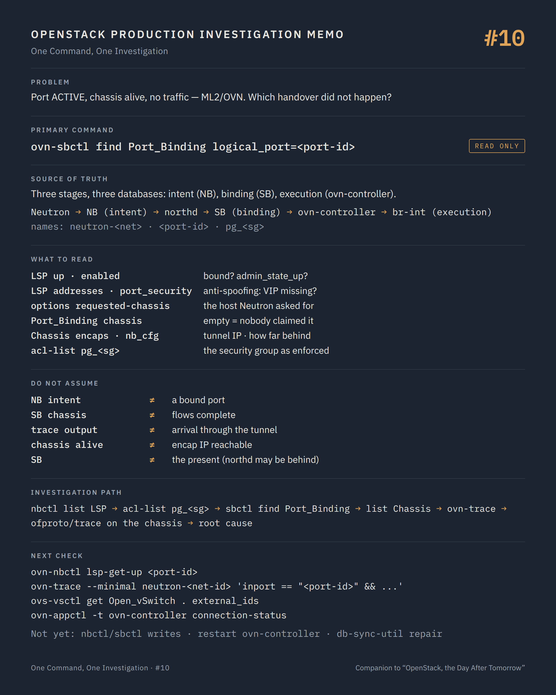

# One Command, One Investigation #10 — Intent, binding, and the chassis that answers

**Command:** `ovn-nbctl`, `ovn-sbctl`, `ovn-trace` · **Safety:** READ ONLY (the forms used here) · **Layer:** OVN northbound and southbound databases, ovn-controller, ML2/OVN · **Level:** advanced

> Command → Evidence → Hypothesis → Investigation → Correlation → Decision
>
> The question of every episode: *what can this command actually tell us during a production incident, and what does it NOT tell us?*

---

## 1. Production situation

Same symptom as #09, different backend. The port is `ACTIVE`, bound to the right host, the security group allows the traffic, the chassis is alive. The VM receives nothing, and on this platform there is no OVS agent to blame: Neutron speaks to OVN, and OVN speaks to every compute node through two databases.

That changes the shape of the investigation. With ML2/OVS, intent lived in Neutron and execution lived in one agent per host. With ML2/OVN, intent is written by Neutron into the northbound database, translated by ovn-northd into the southbound database, and executed by ovn-controller on each chassis. A port that does not work has stopped at one of those three handovers, and each has a read-only command.

## 2. The command

From a node with access to the OVN databases (a controller, or through the deployment's container):

```bash
ovn-nbctl show neutron-<network-id>
ovn-nbctl lsp-get-up <port-id>
ovn-nbctl list Logical_Switch_Port <port-id>
ovn-sbctl find Port_Binding logical_port=<port-id>
ovn-sbctl list Chassis <chassis-name>
ovn-trace --minimal neutron-<network-id> 'inport == "<port-id>" && eth.src == <mac> && ip4.src == <ip> && ip4.dst == <dst-ip>'
```

**READ ONLY.** `ovn-nbctl` and `ovn-sbctl` `show`, `list`, `find`, `lsp-*get*` and `acl-list` only read; `ovn-trace` simulates a packet through the logical pipeline and sends nothing.

```text
Neutron (ML2/OVN driver)
     ↓  writes intent
OVN Northbound DB     Logical_Switch neutron-<net>, Logical_Switch_Port <port-id>,
                      Logical_Router neutron-<router>, Port_Group pg_<sg>, ACLs, DHCP_Options
     ↓  ovn-northd translates
OVN Southbound DB     Datapath_Binding, Port_Binding (chassis), Logical_Flow, Chassis, Chassis_Private
     ↓  each ovn-controller reads what concerns it
ovn-controller        on every compute and gateway node; registers as a Chassis
     ↓  programs
br-int (OpenFlow)     the same bridge as #09, driven by a different brain
     ↓
Geneve tunnels        ovn-<chassis>-0 ports on br-int, one per remote chassis
```

Neutron's naming makes the mapping mechanical: the logical switch is `neutron-<network uuid>`, the logical switch port name is the Neutron port UUID, the router is `neutron-<router uuid>`, security groups are port groups `pg_<sg uuid with underscores>`, and `neutron_pg_drop` holds the default drop.

## 3. What the command tells us

### Northbound: what Neutron asked for

```bash
ovn-nbctl list Logical_Switch_Port <port-id>
```

```text
name              the Neutron port UUID
addresses         ["fa:16:3e:.. 10.20.30.41"]   MAC and IPs OVN will answer for
port_security     ["fa:16:3e:.. 10.20.30.41"]   what the port may send; empty = port security off
enabled           true                            false = admin_state_up False in Neutron
up                true | false                    set by ovn-northd once the port is bound
type              "" (VIF) | localport (metadata) | router | localnet | virtual
options           requested-chassis=<host>        the host Neutron bound the port to
external_ids      neutron:device_id, neutron:device_owner, neutron:host_id,
                  neutron:network_name, neutron:port_name, neutron:security_group_ids
```

`up` is the field Neutron's port `status` follows. `false` with a VM running means no chassis has claimed this port: the `requested-chassis` does not match any chassis name, ovn-controller on that chassis has not bound it, or the binding was released. `lsp-get-up` prints the same bit in one word.

`port_security` and `addresses` are anti-spoofing made visible. A VIP or a keepalived address missing from `port_security` is dropped at the first table of the logical pipeline; this is `allowed_address_pairs` from #07, as OVN sees it.

`ovn-nbctl acl-list pg_<sg uuid with underscores>` prints the security group as ACLs: direction (`from-lport` egress, `to-lport` ingress), priority, match, action. The default drop lives in `neutron_pg_drop`. Reading them is faster, and more truthful, than reading the security group rules: this is what northd will translate into flows.

### Southbound: where the port actually is

```bash
ovn-sbctl find Port_Binding logical_port=<port-id>
```

```text
chassis           reference to a Chassis row, or empty
requested_chassis the chassis Neutron asked for, when not yet bound
datapath          the Datapath_Binding of the logical switch
tunnel_key        the port's key inside the datapath's Geneve encapsulation
mac               ["fa:16:3e:.. 10.20.30.41"]
type              "" for a VIF
```

`chassis` empty while `requested_chassis` is set is the exact moment where the handover to the host failed: ovn-controller on that host did not claim the port. Either it is not running, it is connected to the wrong southbound, or the interface on `br-int` does not carry the `iface-id` external ID it matches on (the os-vif fields from #09 are the same here).

`ovn-sbctl list Chassis <name>` and `ovn-sbctl list Chassis_Private <name>` give the host's side of the registration: `hostname`, `encaps` (type and IP of the tunnel endpoint), `external_ids` (`ovn-bridge-mappings`, `ovn-cms-options`), and `nb_cfg` / `nb_cfg_timestamp`, the acknowledgement counter behind the `Alive` column of #08. The `encaps` IP must be an address that exists on the host and is reachable from the other chassis; the bridge mappings must include the physical network of any provider port bound there.

`ovn-sbctl show` prints every chassis with its encapsulation and the ports it binds: the fastest way to see a chassis that binds nothing, or a port bound to a chassis that is not the one Nova named.

### The trace

`ovn-trace` runs a described packet through the logical pipeline of the switch: ingress ACLs, port security, L2 lookup, the router if the destination is elsewhere, egress ACLs, and the output port with the chassis it lives on. `--minimal` prints the outcome and the reason for a drop; `--detailed` prints every logical flow matched. Like `ofproto/trace` in #09, it sends nothing and depends entirely on the accuracy of the packet you describe.

## 4. What the command does NOT tell us

The northbound database is intent. `enabled true`, addresses correct, ACLs allowing: all of that can be true of a port that no chassis has bound. Intent without binding is a port on paper.

The southbound `chassis` is a claim: ovn-controller wrote it because it saw an interface with the right `iface-id` on its `br-int`. It does not prove that the flows it programmed are complete, that the tunnel to the destination chassis carries traffic, or that the MTU on the underlay fits Geneve encapsulation. `ovn-trace` stops at the logical output; `ofproto/trace` on `br-int` (#09, same command, OVN's flows this time) is what shows the physical pipeline, and `ovn-appctl -t ovn-controller connection-status` shows whether the controller still talks to the southbound at all.

The trace evaluates the logical flows as they are in the southbound now. Neutron writes the northbound; northd translates; if northd is behind (a large platform, a burst of changes, a northd that lost its lock), the southbound describes the past. `NB_Global.nb_cfg` compared with `SB_Global.nb_cfg` and the chassis' `nb_cfg` is how far behind each stage is.

DHCP under OVN is not a dnsmasq process in a namespace: `DHCP_Options` rows in the northbound, applied by ovn-controller on the chassis where the port lives. A VM that gets no address on OVN is a port not bound, a `DHCP_Options` row not attached to the port (`dhcpv4_options`), or a subnet with `enable_dhcp` off. The namespace tools of #11 apply to metadata only.

And these databases say nothing about the guest, the tap, or QEMU: that is Part I.

## 5. What it lets us hypothesise

```text
LSP up=false, requested-chassis set           → ovn-controller on that host did not claim: down, wrong SB, no iface-id   → #08, chassis
Port_Binding chassis ≠ Nova host              → bound elsewhere: stale binding after migration/evacuation                → #18
addresses/port_security without the VIP       → anti-spoofing at the first logical table                                → allowed_address_pairs (#07)
acl-list shows no allow for the flow          → security group as written, not as remembered                            → rules (#07)
ovn-trace: drop in ACL stage                  → the rule that drops, by priority and match                              → rules
ovn-trace: output on chassis B, nothing there → tunnel: encaps IP, MTU, underlay, ovn-controller B                      → #09 on B, #19
Chassis encaps IP not on the host             → misconfigured or migrated tunnel endpoint                              → host config
NB nb_cfg ≫ SB / chassis nb_cfg               → northd or controllers behind; the SB describes the past                 → northd, load
```

## 6. Next investigation

On the compute node the port is supposed to live on, read-only:

```bash
ovs-vsctl get Open_vSwitch . external_ids
ovn-appctl -t ovn-controller connection-status
ovs-vsctl --columns=name,ofport,external_ids find Interface external_ids:iface-id=<port-id>
ovs-appctl ofproto/trace br-int in_port=<tap>,dl_src=<mac>,dl_dst=<dst-mac>,dl_type=0x0800,nw_src=<ip>,nw_dst=<dst-ip>
```

`external_ids` gives `system-id` (the chassis name to look for in the southbound), `ovn-remote`, `ovn-encap-ip`, `ovn-bridge-mappings`. When the chassis name in `Port_Binding` and `system-id` on the host differ, the two sides are talking about different machines.

For an address problem: `ovn-nbctl list DHCP_Options` and the `dhcpv4_options` reference on the port. For metadata: the `ovnmeta-<network-id>` namespace on the compute, in #11.

What we do not do at this stage:

- `ovn-nbctl lsp-set-*`, `lsp-del`, `acl-add` / `acl-del`, `set Logical_Switch_Port ...` — STATE CHANGING, behind Neutron's back. Neutron owns the northbound; its maintenance task and the next port update will overwrite what was changed by hand, and until then Neutron's database and OVN disagree, which is the divergence we are investigating.
- `ovn-sbctl` writes of any kind (`chassis-del`, `set Port_Binding ...`) — POTENTIALLY DISRUPTIVE. The southbound is northd's output and the controllers' input; editing it by hand produces flows that nothing will ever reconcile.
- Restarting `ovn-controller` on a chassis — STATE CHANGING with a host-wide blast radius: every port on that chassis is re-evaluated and its flows reprogrammed. Restarting `ovn-northd` or the database clusters is a platform-wide change and a decision.
- `neutron-ovn-db-sync-util` — STATE CHANGING. It rewrites the northbound from Neutron's database; run in `--ovn-neutron_sync_mode log` mode it only reports, which is the only form that belongs in an investigation.

## 7. Investigation chain

```text
Port ACTIVE, chassis alive, no traffic (ML2/OVN)
        ↓
ovn-nbctl list Logical_Switch_Port      intent: enabled, addresses, port_security, up, requested-chassis
        ↓
ovn-nbctl acl-list pg_<sg>              the security group as OVN will enforce it
        ↓
ovn-sbctl find Port_Binding             which chassis claimed it, if any
        ↓
ovn-sbctl list Chassis / Chassis_Private  encaps IP, mappings, nb_cfg (behind?)
        ↓
ovn-trace                               where the logical pipeline sends or drops the packet
        ↓
  drop in ACL / port security ────→ rules, allowed address pairs           → #07
  not bound ──────────────────────→ ovn-controller on the host, iface-id   → #08, #09
  bound, output on chassis B ─────→ ofproto/trace, tunnels, MTU            → #09, #19
  address problem ────────────────→ DHCP_Options                           → this episode
  metadata problem ───────────────→ ovnmeta namespace                      → #11
```

## 8. Production lesson

OVN separates intent from binding from execution, and gives each a database you can read. Most incidents are a handover that did not happen. Find the handover before touching either side of it.

---

## Memo



## Version notes

- Neutron object names in OVN: `neutron-<network uuid>` (Logical_Switch), `<port uuid>` (Logical_Switch_Port), `neutron-<router uuid>` (Logical_Router), `lrp-<port uuid>` (Logical_Router_Port), `pg_<security group uuid with hyphens replaced by underscores>` (Port_Group), `neutron_pg_drop` (default drop group); metadata ports are `localport` type LSPs with `neutron:device_owner network:distributed`.
- `Logical_Switch_Port.up` is set by ovn-northd when the port is bound in the southbound; Neutron's OVN driver turns that into port `status` ACTIVE / DOWN (#07).
- `Chassis_Private` (with `nb_cfg` and `nb_cfg_timestamp`) exists since OVN 20.06; older OVN keeps `nb_cfg` on `Chassis`. Neutron's agent liveness (#08) reads `Chassis_Private`.
- `ovn-trace` needs access to the southbound database (`--db=` or the default socket on a node that runs it); `--minimal`, `--summary` and `--detailed` change the verbosity.
- Database access differs by deployment: on Kolla Ansible the tools run inside `ovn_nb_db` / `ovn_sb_db` / `ovn_northd` containers or with `--db=tcp:<ip>:6641` / `6642`; clustered databases (RAFT) require pointing at the leader for writes, which is irrelevant here since nothing is written.
- `neutron-ovn-db-sync-util --ovn-neutron_sync_mode log` reports differences between Neutron and the northbound without changing anything; `repair` mode rewrites the northbound.

## Sources

- OVN, `ovn-nbctl` manual (`show`, `lsp-get-up`, `lsp-list`, `lsp-get-addresses`, `lsp-get-port-security`, `acl-list` with `--type=port-group`, `dhcp-options-list`, `list`, `find`): https://www.ovn.org/support/dist-docs/ovn-nbctl.8.html
- OVN, `ovn-sbctl` manual (`show`, `list`, `find`, `lflow-list`): https://www.ovn.org/support/dist-docs/ovn-sbctl.8.html
- OVN, northbound database schema (`Logical_Switch_Port`: `up`, `enabled`, `addresses`, `port_security`, `options`; `Port_Group`, `ACL`, `DHCP_Options`): https://www.ovn.org/support/dist-docs/ovn-nb.5.html
- OVN, southbound database schema (`Port_Binding`: `chassis`, `requested_chassis`, `tunnel_key`; `Chassis`: `hostname`, `encaps`, `name`; `Chassis_Private`: `nb_cfg`, `nb_cfg_timestamp`): https://www.ovn.org/support/dist-docs/ovn-sb.5.html
- OVN, `ovn-trace` manual: https://www.ovn.org/support/dist-docs/ovn-trace.8.html
- OVN, `ovn-controller` manual (`external_ids` keys on Open_vSwitch: `system-id`, `ovn-remote`, `ovn-encap-ip`, `ovn-bridge-mappings`, `ovn-cms-options`; `ovn-appctl` commands): https://www.ovn.org/support/dist-docs/ovn-controller.8.html
- Neutron, OVN reference architecture and ML2/OVN driver documentation: https://docs.openstack.org/neutron/latest/admin/ovn/refarch/refarch.html and https://docs.openstack.org/neutron/latest/ovn/index.html
- Neutron source, `neutron/common/ovn/constants.py` and `neutron/common/ovn/utils.py` (naming of switches, routers, port groups; `external_ids` keys): https://opendev.org/openstack/neutron/src/branch/master/neutron/common/ovn
- Neutron source, `ovsdb_monitor.py` (`LogicalSwitchPortUpdateUpEvent` → port status): https://opendev.org/openstack/neutron/src/branch/master/neutron/plugins/ml2/drivers/ovn/mech_driver/ovsdb/ovsdb_monitor.py
- Neutron, `neutron-ovn-db-sync-util` (sync modes): https://docs.openstack.org/neutron/latest/ovn/faq/index.html

---

*Part of the series [One Command, One Investigation](README.md), a technical companion to the book [OpenStack, the Day After Tomorrow](https://github.com/soufian-zaouam/openstack-the-day-after-tomorrow).*

Previous: [**#09 — `ovs-vsctl`, `ovs-ofctl`**](09-ovs-vsctl-ofctl.md). Next: [**#11 — `ip netns`**](11-ip-netns.md): where DHCP, routing and metadata actually live.
