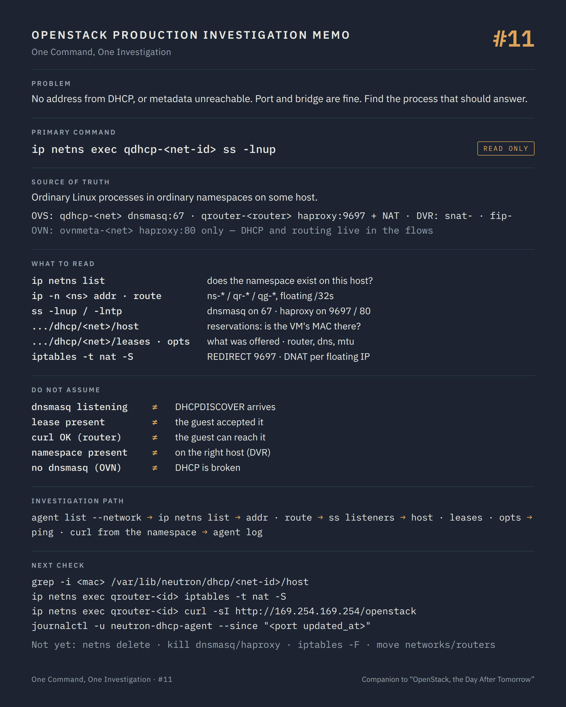

# One Command, One Investigation #11 — Where DHCP, routing and metadata actually live

**Command:** `ip netns`, `ip -n <ns> addr`, `ip netns exec <ns> ss` · **Safety:** READ ONLY (listing; probes noted) · **Layer:** network namespaces on network and compute nodes, DHCP, L3, metadata · **Level:** intermediate

> Command → Evidence → Hypothesis → Investigation → Correlation → Decision
>
> The question of every episode: *what can this command actually tell us during a production incident, and what does it NOT tell us?*

---

## 1. Production situation

Two tickets from #06 are still open. A VM that boots, prints `DHCPDISCOVER` retries in its console log and never gets an address. Another that gets its address, then logs `url_helper.py[WARNING]: Calling 'http://169.254.169.254/...' failed` twenty times and boots without its SSH key.

Neither is a port problem: #07 showed both ports `ACTIVE` and correctly bound. Neither is a bridge problem: the traces in #09 or #10 deliver the frames. What the frames reach is a service that Neutron runs inside a Linux network namespace: a DHCP server, a router, a metadata proxy. The namespace is the thing to look at, and it is on a host that the agent list (#08) tells you.

## 2. The command

On the node that hosts the namespace (network node, or the compute with DVR / OVN):

```bash
ip netns list
ip -n <namespace> addr
ip -n <namespace> route
ip netns exec <namespace> ss -lntup
```

**READ ONLY.** Root. The namespace names are Neutron's convention:

```text
ML2/OVS
  qdhcp-<network-id>     dnsmasq for the network; one per DHCP agent hosting it
  qrouter-<router-id>    the router: qr-* ports on tenant subnets, qg-* port on the external network,
                         NAT rules, and the metadata proxy (haproxy)
  snat-<router-id>       DVR: centralised SNAT on the network node
  fip-<ext-net-id>       DVR: floating IPs on the compute node
ML2/OVN
  ovnmeta-<network-id>   metadata proxy only (haproxy); DHCP and routing are in OVN's flows, no namespace
```

And the two services under investigation:

```text
DHCP (ML2/OVS)
  VM ──DHCPDISCOVER──▶ tap ──▶ br-int ──▶ [tunnel or provider] ──▶ ns-<port> in qdhcp-<net> ──▶ dnsmasq
                                                                   /var/lib/neutron/dhcp/<net-id>/{host,leases,opts}
Metadata (ML2/OVS, via the router)
  VM ──HTTP 169.254.169.254:80──▶ qr-* in qrouter-<router> ──iptables REDIRECT 9697──▶ haproxy
      ──unix socket──▶ neutron-metadata-agent ──X-Instance-ID + signature──▶ nova-metadata-api :8775
Metadata (ML2/OVN)
  VM ──HTTP 169.254.169.254:80──▶ localport ──▶ tap in ovnmeta-<net> ──▶ haproxy :80
      ──unix socket──▶ neutron-ovn-metadata-agent ──▶ nova-metadata-api :8775
```

Both services end at a process that must exist, listen, and have the right data. The namespace commands check all three.

## 3. What the command tells us

`ip netns list` answers the first question: does the namespace exist on this host at all? Neutron creates it when the agent takes the network or router; an absent `qdhcp-<net>` on the host that `network agent list --network` named means the agent never built it, or removed it. An `ovnmeta-<net>` missing on a compute that runs VMs of that network means the OVN metadata agent did not see the port.

`ip -n qdhcp-<net> addr` shows the `ns-<port-id[0:11]>` interface with the DHCP port's fixed IP, and, when isolated metadata is enabled, `169.254.169.254/16` on the same interface. No IP, or an interface `DOWN`, is a wiring problem for the DHCP port itself: it is a Neutron port like any other (`device_owner network:dhcp`) and #07–#10 apply to it.

`ip netns exec qdhcp-<net> ss -lnup` must show a listener on UDP 67 (`dnsmasq`). Then the files dnsmasq reads:

```text
/var/lib/neutron/dhcp/<net-id>/host     one line per port: MAC,hostname,IP  — the reservations
/var/lib/neutron/dhcp/<net-id>/leases   what was handed out, with expiry
/var/lib/neutron/dhcp/<net-id>/opts     per-port options: router, dns, mtu, classless routes
```

Neutron's dnsmasq serves reservations, not a pool. A MAC that is not in `host` gets no answer: the VM's port MAC from #07 must appear on a line with its `fixed_ips` address. A `host` file that lacks the port, or carries a stale address, is the DHCP agent's cache out of sync with the API, and the agent's log at the port's `updated_at` says why. `opts` explains "got an address, no default route" and MTU mismatches.

`ip -n qrouter-<router> addr` and `route` show the router as Linux sees it: `qr-*` interfaces carrying the subnet gateways, `qg-*` carrying the external address and every floating IP as `/32`, and a default route through the external gateway. A missing `/32` for the floating IP the user is dialling, or a `qg-*` without carrier, is the answer to "the floating IP does not respond" before any packet capture.

`ip netns exec qrouter-<router> iptables -t nat -S` lists the NAT the L3 agent programmed: `neutron-l3-agent-PREROUTING` with the `REDIRECT --to-ports 9697` for metadata and the `DNAT` per floating IP, `neutron-l3-agent-float-snat` and `neutron-l3-agent-snat` for the return path. Listing is read-only; the rules are the router's configuration made visible.

`ss -lntp` in the router or metadata namespace must show `haproxy` on `9697` (router) or `80` (isolated or OVN metadata). No listener means the proxy was not spawned: the agent's log, or the `metadata_proxy_socket` it should forward to, is next. The proxy's own configuration, `/var/lib/neutron/ns-metadata-proxy/<router-id>.conf` or `/var/lib/neutron/ovn-metadata-proxy/<net-id>.conf`, shows the socket path and the headers it adds.

Two probes complete the picture. They send packets, but nothing else, and they are the shortest path to a fact:

```bash
ip netns exec qdhcp-<net> ping -c 2 <vm-ip>
ip netns exec qrouter-<router> curl -s -o /dev/null -w '%{http_code}\n' http://169.254.169.254/openstack
```

The first says whether the DHCP namespace can reach the VM at L3 (the return path of a DHCP offer). The second says whether the metadata chain answers from inside the router: a `200`, `404` or `403` means haproxy, the agent and Nova all answered; a timeout means the chain is broken after the namespace.

## 4. What the command does NOT tell us

A namespace with the right interfaces and a listening dnsmasq proves the server side exists. It does not prove the `DHCPDISCOVER` arrives: broadcast reaching the namespace depends on the tunnel or the provider VLAN carrying the network's broadcast domain to this host, which is #09 and #10 again, with the DHCP port's tap as the destination.

A lease in `leases` proves an offer was made at some point. The guest may have released it, rebooted, or never accepted it; the console log (#06) is the guest's side.

Metadata answering from inside the router proves the chain from the router outward. It does not prove the guest can reach the router: a route inside the guest, a security group on the guest's port, or a guest that asks for metadata before its interface is up (a cloud-init ordering problem) all produce the same twenty warnings.

With DVR, the router is split: `qrouter-` on every compute, `snat-` on the network node, `fip-` on the compute for floating IPs. The namespace that matters depends on the direction of the traffic and on where the VM runs; `ip rule` inside `qrouter-` shows the policy routing that decides.

With OVN there is no DHCP namespace to inspect and no router namespace: an address problem is a `DHCP_Options` question (#10), a routing problem is a logical router question (`ovn-nbctl lr-route-list`, `ovn-trace` through the router). Only metadata keeps a namespace.

And nothing here knows about the physical network beyond `qg-*`: the upstream gateway, the provider VLAN, the ARP entry the external router holds for the floating IP. `ip -n qrouter-<router> neigh` shows what the namespace learned; the switch's side is outside OpenStack.

## 5. What it lets us hypothesise

```text
namespace absent on the host named by the agent list → the agent never built it, or removed it        → agent log, #08
ns-* interface without IP / DOWN                     → the DHCP port itself is not wired                → #07–#10 on that port
dnsmasq not listening on 67                          → dnsmasq died or was never spawned                → agent log, process list
port MAC absent from the host file                   → agent cache out of sync with the API             → agent log at updated_at
lease present, VM keeps asking                       → offer made, not received: return path            → #09/#10 towards the tap
opts without router / wrong MTU                      → address ok, no connectivity beyond the subnet     → subnet configuration
floating IP /32 missing on qg-*                      → L3 agent did not program the association         → L3 agent log
haproxy not listening (9697 / 80)                    → metadata proxy not spawned                       → agent log, config
curl from the router times out                       → chain after haproxy: agent socket, nova metadata → agent, Nova API
curl answers, guest still fails                      → guest side: route, SG, cloud-init timing         → #06, #07
```

## 6. Next investigation

Still read-only:

```bash
cat /var/lib/neutron/dhcp/<net-id>/host | grep -i <mac>
ip netns exec qrouter-<router> ip rule
ip -n qrouter-<router> neigh
journalctl -u neutron-dhcp-agent --since "<port updated_at>"
journalctl -u neutron-metadata-agent --since "<boot time>"       # or neutron-ovn-metadata-agent
```

For a floating IP that answers from the router but not from outside, the question leaves OpenStack and enters the provider network: the upstream router's ARP table and the VLAN on the switch port of this node.

What we do not do at this stage:

- `ip netns delete`, `ip -n <ns> link set ... down`, removing addresses or routes by hand — POTENTIALLY DISRUPTIVE. The namespace serves every VM on that network or behind that router; the agent will rebuild it at its next sync, which is minutes of outage and the loss of the state you were reading.
- `kill` of dnsmasq or haproxy to "restart" it — STATE CHANGING. The agent supervises these processes; killing them outside the agent produces a race between your restart and its own.
- `iptables` insertions or flushes in the router namespace — POTENTIALLY DISRUPTIVE. A flushed NAT table breaks every floating IP behind that router; the L3 agent restores its rules only on a full sync.
- `openstack network agent remove network` / `add network`, `remove router` / `add router` to move the service elsewhere — STATE CHANGING. Moving a DHCP network changes the DHCP port's address; moving a router interrupts every flow through it. These are decisions, taken when the host is the diagnosis, not before.
- `openstack subnet set --dhcp` / `--no-dhcp`, `--gateway`, `--host-route` — STATE CHANGING on the whole subnet.

## 7. Investigation chain

```text
No address from DHCP  /  metadata unreachable
        ↓
openstack network agent list --network / --router        which host runs the namespace
        ↓
ip netns list                                             does it exist there?
        ↓
ip -n <ns> addr / route                                   interfaces, addresses, floating /32s, default route
        ↓
ip netns exec <ns> ss -lntup                              dnsmasq on 67? haproxy on 9697 / 80?
        ↓
host / leases / opts   ·   iptables -t nat -S             reservations and options  ·  REDIRECT and DNAT rules
        ↓
ping from qdhcp  ·  curl from qrouter                     the return path  ·  the chain outward
        ↓
  server side broken ─────→ agent log at the port's updated_at
  server side fine ───────→ the path to the tap (#09 / #10), or the guest (#06)
  metadata chain broken ──→ neutron-metadata-agent, nova-metadata-api            → #18
```

## 8. Production lesson

The services a VM depends on at boot are ordinary Linux processes in ordinary namespaces on some host. When a guest says "no answer", find the process that should have answered, and ask it directly before asking the platform why.

---

## Memo



## Version notes

- Metadata via the router (ML2/OVS): the L3 agent inserts `-d 169.254.169.254/32 -p tcp --dport 80 -j REDIRECT --to-ports 9697` (`metadata_port`, default 9697) in the `qrouter` namespace and spawns haproxy (older releases used `neutron-ns-metadata-proxy`). Isolated networks use the DHCP namespace instead when `enable_isolated_metadata = true` (or `force_metadata = true`) in `dhcp_agent.ini`, with `169.254.169.254` on the `ns-*` interface and haproxy on port 80.
- With ML2/OVN, `neutron-ovn-metadata-agent` runs on every compute and creates one `ovnmeta-<network-id>` namespace per network that has a VM on that host, with haproxy listening on `169.254.169.254:80` behind an OVN `localport`; DHCP is served by ovn-controller from `DHCP_Options` rows, without dnsmasq.
- dnsmasq files live under `dhcp_confs` (default `$state_path/dhcp`, usually `/var/lib/neutron/dhcp/<network-id>/`); Neutron passes reservations through `--dhcp-hostsfile` and options through `--dhcp-optsfile`, so a MAC unknown to Neutron receives no lease.
- DVR splits the router across `qrouter-` (every compute with a VM on the router), `snat-` (network node) and `fip-` (compute) namespaces; `ip rule` in `qrouter-` shows the policy routing between them.
- `ss`, `ip`, `iptables` inside a namespace need root; `ip -n <ns>` is shorthand for `ip netns exec <ns> ip`. Container deployments (Kolla Ansible) keep the namespaces in the host's network stack, so the commands run on the host.

## Sources

- Neutron, Open vSwitch self-service deployment (namespaces `qdhcp-`, `qrouter-`, agent types): https://docs.openstack.org/neutron/latest/admin/deploy-ovs-selfservice.html
- Neutron, DVR deployment (`qrouter-`, `snat-`, `fip-` namespaces): https://docs.openstack.org/neutron/latest/admin/deploy-ovs-ha-dvr.html
- Neutron, metadata service configuration (`metadata_proxy_shared_secret`, `enable_isolated_metadata`, `force_metadata`, `metadata_port`): https://docs.openstack.org/neutron/latest/configuration/dhcp-agent.html and https://docs.openstack.org/neutron/latest/configuration/l3-agent.html and https://docs.openstack.org/neutron/latest/configuration/metadata-agent.html
- Neutron, OVN metadata design (`ovnmeta-` namespaces, haproxy, localport): https://docs.openstack.org/neutron/latest/admin/ovn/refarch/refarch.html and https://docs.openstack.org/neutron/latest/contributor/internals/ovn/metadata_api.html
- Neutron source, `neutron/agent/ovn/metadata/agent.py` (`ovnmeta-` prefix) and `neutron/common/ovn/constants.py`: https://opendev.org/openstack/neutron/src/branch/master/neutron/agent/ovn/metadata
- Neutron source, `neutron/agent/linux/dhcp.py` (dnsmasq invocation: `--dhcp-hostsfile`, `--dhcp-optsfile`, `--dhcp-leasefile`, `host` / `opts` / `leases` files): https://opendev.org/openstack/neutron/src/branch/master/neutron/agent/linux/dhcp.py
- Neutron source, `neutron/agent/l3/router_info.py` and `neutron/agent/metadata/driver.py` (metadata REDIRECT rule, haproxy configuration path): https://opendev.org/openstack/neutron/src/branch/master/neutron/agent
- Nova, metadata service (`nova-metadata-api`, `X-Instance-ID`, shared secret): https://docs.openstack.org/nova/latest/admin/metadata-service.html
- iproute2, `ip-netns` manual: https://man7.org/linux/man-pages/man8/ip-netns.8.html
- cloud-init, datasource OpenStack (metadata URL, retries): https://cloudinit.readthedocs.io/en/latest/reference/datasources/openstack.html

---

*Part of the series [One Command, One Investigation](README.md), a technical companion to the book [OpenStack, the Day After Tomorrow](https://github.com/soufian-zaouam/openstack-the-day-after-tomorrow).*

Previous: [**#10 — `ovn-nbctl`, `ovn-sbctl`**](10-ovn-nbctl-sbctl.md). Next: [**#12 — `openstack volume show`**](12-openstack-volume-show.md): Part III begins where the guest's disk ends.
