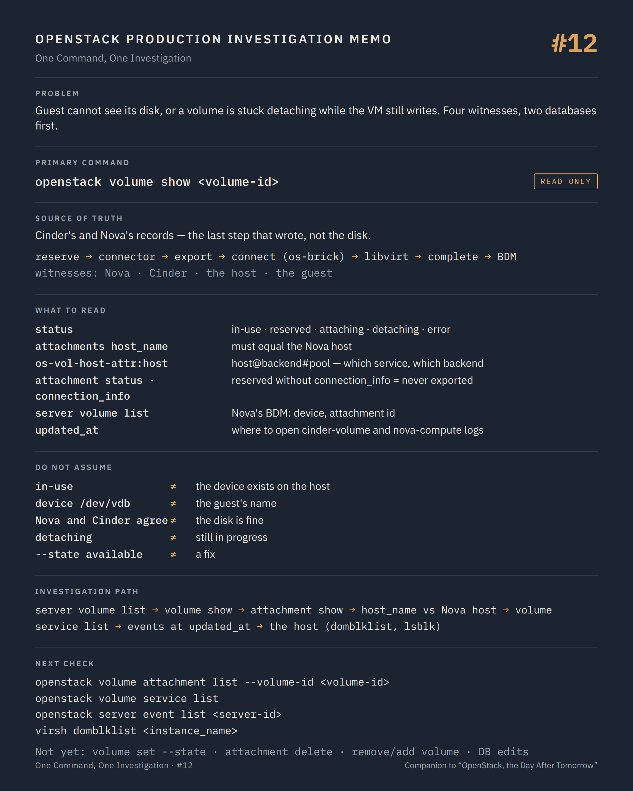

# One Command, One Investigation #12 — Four opinions about one disk

**Command:** `openstack volume show`, `openstack volume attachment list`, `openstack server volume list` · **Safety:** READ ONLY · **Layer:** Cinder API, attachments, Nova block device mappings · **Level:** intermediate

> Command → Evidence → Hypothesis → Investigation → Correlation → Decision
>
> The question of every episode: *what can this command actually tell us during a production incident, and what does it NOT tell us?*

---

## 1. Production situation

Part III opens with two tickets that Part I could not close. The first is the VM whose console log (#06) ended at "Gave up waiting for root device": the guest cannot see its boot volume. The second is more familiar: a user tried to detach a data volume, the operation "hung", and the volume now shows `detaching` for two hours while the VM still writes to it.

Both tickets involve the same four parties: Nova, which believes the volume is attached to the instance; Cinder, which tracks the attachment and the backend; the compute host, where a block device or an RBD session exists or does not; and the guest, which sees a disk or does not. Storage incidents are almost always a disagreement between two of these four. The first command reads the two that live in databases.

## 2. The command

```bash
openstack server volume list <server-id>
openstack volume show <volume-id>
openstack volume attachment list --volume-id <volume-id>
```

**READ ONLY.** Owner or admin for the first two; the attachment API is admin or owner from microversion 3.27. `server volume list` reads Nova's block device mappings; `volume show` and `attachment list` read Cinder's database.

How an attachment is built explains what the fields mean:

```text
Nova API           attach request
     ↓
nova-compute       1. Cinder: create attachment (status reserved, volume reserved)
                   2. os-brick: build the connector (initiator IQN / WWPNs / host IP)
                   3. Cinder: update attachment with the connector
                              → backend exports the volume (LUN mapping, RBD auth)
                              → connection_info returned
                   4. os-brick: connect_volume (iSCSI login, multipath, RBD credentials)
                   5. libvirt: attach the device to the domain
                   6. Cinder: complete attachment (status attached, volume in-use)
                   7. Nova: block_device_mapping saved
```

Seven steps, four owners, one record on each side. The `status` you read is the step where the last successful write happened.

## 3. What the command tells us

### Nova's side

```bash
openstack server volume list <server-id>
```

```text
ID              the volume id
Device          /dev/vdb            ← what Nova asked libvirt for; not necessarily the guest's name
Server ID
Volume ID
Tag
Delete On Termination
Attachment ID   the Cinder attachment id (microversion 2.89)
BDM UUID        the block device mapping id (2.89)
```

This is what Nova will try to reconcile at the next hard reboot, migration or evacuation. A volume present here and absent from Cinder's attachments is Nova's orphan; a volume absent here and `in-use` in Cinder is Cinder's.

### Cinder's side

```bash
openstack volume show <volume-id>
```

```text
status                     available | in-use | reserved | attaching | detaching | error | maintenance | ...
attachments                [{server_id, attachment_id, host_name, device, attached_at}]
multiattach                true if several attachments are legal
bootable
encrypted
migration_status           set during a volume migration or retype (admin)
os-vol-host-attr:host      host@backend#pool   ← which cinder-volume service and which backend owns it (admin)
volume_type
size
created_at / updated_at
```

`status` is Cinder's state machine. `in-use` and `available` are stable. `reserved`, `attaching` and `detaching` are transitions, and a transition that has lasted longer than the operation it describes is the finding: step 1 happened and a later step did not, on the Nova side, on the backend, or on the host.

`attachments` lists the attachment records with `host_name` (the compute host that holds the connection) and `device`. `host_name` compared with `OS-EXT-SRV-ATTR:host` from #01 is the storage equivalent of the port binding check in #07: an attachment held by a host where the VM no longer runs is the residue of a migration or an evacuation that did not clean up, and that host still has an iSCSI session or an RBD watcher on the volume.

`os-vol-host-attr:host` tells you which backend to ask in #13 and #14, and which `cinder-volume` service must be up for any operation on this volume to progress. `openstack volume service list` shows those services with the same `State`/`Status` pair as #02: a `detaching` that never completes on a backend whose service is `down` is not a mystery.

`updated_at` is the timestamp to open the cinder-volume and nova-compute logs at.

### The attachment record

```bash
openstack volume attachment list --volume-id <volume-id>
openstack volume attachment show <attachment-id>
```

```text
ID
Volume ID
Server ID          the instance uuid
Status             reserved | attaching | attached | detaching | detached | error_attaching | error_detaching | deleted
Attach Mode        rw | ro
Attached At / Detached At
Connection Info    (show, admin) driver_volume_type (iscsi, fibre_channel, rbd, nvmeof...),
                   target_portal / target_iqn / target_lun, or hosts + ports + auth for rbd,
                   the multipath id, the volume's serial
```

`connection_info` is what the backend handed to the host at step 3: the exact target and LUN, or the exact RBD pool/image and monitors. It is the input of #13. An attachment in `reserved` with no `connection_info` never got past step 2: the connector was never sent, which means nova-compute never started the host-side work, or the backend refused to export.

`Status` on the attachment and `status` on the volume are supposed to move together (`attached` / `in-use`, `deleted` / `available`). When they do not, the two records were written by different steps and one of them is stale.

## 4. What the command does NOT tell us

Both databases record what a step wrote. Neither knows whether the block device exists on the host now. `in-use` with `attached` describes a volume that may have lost its iSCSI session an hour ago, or whose RBD image is unreachable because the cluster is full; the guest's I/O errors, the `paused (I/O error)` from #04 and the D-state process from #05 are the truth, and they live on the host.

`device` is Nova's request to libvirt (`/dev/vdb`), not what the guest kernel named the disk. Guests renumber. The volume's serial (the Cinder volume id, exposed through the `<serial>` element in #05) is the only stable link from the guest's `/dev/disk/by-id/virtio-<serial prefix>` to the record.

`status` says nothing about the backend's health. A backend with a failed controller, a full pool or a broken replication still shows `in-use` volumes; it is `cinder-volume`'s log and the backend's own tools (#14 for Ceph) that know.

`attachments` in `volume show` is a summary; the attachment API is the record. On platforms upgraded from the old attach flow (before microversion 3.27), volumes attached years ago may carry attachment records with no `connection_info`, and that is history, not a fault.

And nothing here says whether data is intact. A volume that is attached, exported and mapped may still present a filesystem the guest cannot mount; that is #06 again, and the guest owner's problem to share.

## 5. What it lets us hypothesise

```text
Nova BDM present, no Cinder attachment          → Nova orphan: a detach completed in Cinder, not in Nova       → events, #18
Cinder in-use, no Nova BDM                      → Cinder orphan: a detach completed in Nova, not in Cinder     → events, #18
attachment host_name ≠ Nova host                → stale connection on the old host after migration/evacuation → #13 on both hosts
volume reserved/attaching for a long time,
no connection_info                              → nova-compute never sent the connector, or backend refused   → nova-compute log, cinder-volume log
detaching for a long time, VM still writing     → the detach stopped before libvirt or before os-brick        → nova-compute log at updated_at
in-use, guest sees no disk                      → the host side: session, multipath, RBD auth                  → #13
in-use, guest sees I/O errors                   → the backend: paths, cluster, space                          → #13, #14
cinder-volume for that backend down             → nothing on this volume can progress until it is back        → volume service list, #16
```

## 6. Next investigation

Still read-only, on the API side:

```bash
openstack volume service list
openstack volume attachment show <attachment-id>       # admin: connection_info
openstack server event list <server-id>
```

Then the host from `host_name`, with `connection_info` and the volume serial in hand, for episode #13:

```bash
virsh domblklist <instance_name>
lsblk -o NAME,SERIAL,SIZE,TYPE,MOUNTPOINT
```

What we do not do at this stage:

- `openstack volume set --state available` / `--state in-use` / `--detached` — STATE CHANGING, and the client's own help text says it plainly: "This option simply changes the state of the volume in the database with no regard to actual status, exercise caution when using". Resetting a `detaching` volume to `available` while the host still holds the session is how the next attach maps the same LUN to a second host, and how two VMs end up writing to one disk.
- `openstack volume attachment delete <id>` — STATE CHANGING. It removes the Cinder record only; the API documentation notes it does not touch the hypervisor connection, and since the fix for bug 2004555 the API refuses it with a 409 when a Nova instance still uses the attachment. Removing the record while the connection exists produces exactly the orphan you are investigating.
- `openstack server remove volume` / `openstack server add volume` to "re-seat" the attachment — STATE CHANGING. On a volume in a transitional state it fails or, worse, succeeds halfway and adds a second attachment record.
- `cinder-manage volume update_host`, `nova-manage` edits of block device mappings, or SQL — POTENTIALLY DISRUPTIVE. They belong to a repair decided after the four views have been reconciled and documented, not to the investigation.

## 7. Investigation chain

```text
Guest cannot see its disk  /  volume stuck detaching
        ↓
openstack server volume list           Nova's view: BDM, device, attachment id
        ↓
openstack volume show                  Cinder's view: status, attachments (host_name), backend
        ↓
openstack volume attachment show       the record: status, connection_info
        ↓
  views disagree ─────────────→ which step wrote last? events, logs at updated_at        → #18
  views agree, host_name wrong ─→ stale connection on the old host                       → #13
  views agree, all "attached" ──→ the host: device, session, multipath, RBD              → #13
  backend service down ─────────→ cinder-volume, its bus connection                      → #16
        ↓
Root cause, then change — reconcile, never reset
```

## 8. Production lesson

A volume has four witnesses: Nova, Cinder, the host and the guest. Two databases can agree with each other and both be wrong about the disk. Read all four before changing any one of them, and never "fix" a state by editing it.

---

## Memo



## Version notes

- The attachment API (`/v3/attachments`) exists from Block Storage API microversion 3.27; `attachment complete` from 3.44; `attach_mode` in create from 3.54. Recent `openstack` clients negotiate the microversion; older ones need `--os-volume-api-version 3.27` or higher.
- `openstack volume attachment list --volume-id` and `--status` are deprecated in favour of `--filters` (3.33+); both still work on current clients.
- `openstack server volume list` shows `Attachment ID` and `BDM UUID` from Compute API microversion 2.89; before that, the list shows `id`, `device`, `server_id`, `volume_id` only.
- `os-vol-host-attr:host`, `migration_status` and `connection_info` are admin-only by default (Cinder policies `volume_extension:volume_host_attribute`, `volume_extension:volume_mig_status_attribute`, `volume:attachment_*`).
- Since the fix for Launchpad bug 2004555, `DELETE /v3/attachments/{id}` returns 409 when a Nova instance still uses the attachment; calls from Nova itself are accepted.
- Volume `status` values and their descriptions are defined in the Block Storage API reference (`creating`, `available`, `reserved`, `attaching`, `detaching`, `in-use`, `maintenance`, `deleting`, `error*`, `extending`, `retyping`, ...).

## Sources

- Block Storage API reference, *Volumes* (status table, `attachments`, `multiattach`, `migration_status`, `os-vol-host-attr:host`): https://docs.openstack.org/api-ref/block-storage/v3/index.html#volumes-volumes
- Block Storage API reference, *Attachments* (statuses `reserved`, `attaching`, `attached`, `detaching`, `detached`, `error_*`, `deleted`; microversions 3.27 / 3.44; delete refused with 409 while Nova uses the attachment, bug 2004555): https://docs.openstack.org/api-ref/block-storage/v3/index.html#attachments-attachments
- Cinder source, `api-ref/source/v3/attachments.inc` and `parameters.yaml`: https://opendev.org/openstack/cinder/src/branch/master/api-ref/source/v3
- Compute API reference, *Servers with volume attachments (os-volume_attachments)* (`attachment_id`, `bdm_uuid` from 2.89): https://docs.openstack.org/api-ref/compute/#servers-with-volume-attachments-servers-os-volume-attachments
- python-openstackclient, volume commands (`volume show`, `volume set --state` with its caution text, `volume service list`): https://docs.openstack.org/python-openstackclient/latest/cli/command-objects/volume.html
- python-openstackclient, volume attachment commands (`list`, `show`, `create`, `set`, `complete`, `delete`): https://docs.openstack.org/python-openstackclient/latest/cli/command-objects/volume-attachment.html
- python-openstackclient, `server volume list`: https://docs.openstack.org/python-openstackclient/latest/cli/command-objects/server.html
- Nova, block device mapping: https://docs.openstack.org/nova/latest/user/block-device-mapping.html
- Cinder, attach/detach conventions v2 (the attachment workflow: create, update with connector, complete): https://docs.openstack.org/cinder/latest/contributor/attach_detach_conventions_v2.html
- os-brick documentation (connectors, `connect_volume`, `disconnect_volume`): https://docs.openstack.org/os-brick/latest/

---

*Part of the series [One Command, One Investigation](README.md), a technical companion to the book [OpenStack, the Day After Tomorrow](https://github.com/soufian-zaouam/openstack-the-day-after-tomorrow).*

Previous: [**#11 — `ip netns`**](11-ip-netns.md). Next: [**#13 — `virsh domblklist`, `lsblk`, `multipath -ll`, `iscsiadm`**](13-os-brick-block-devices.md): the block device the databases talk about.
