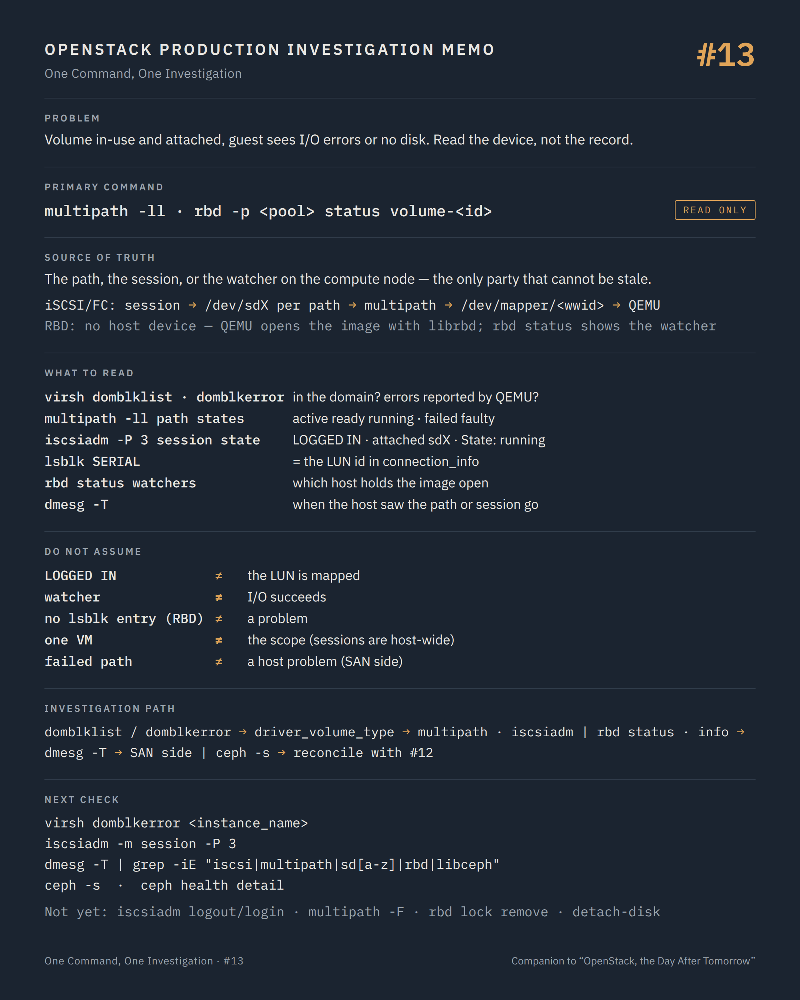

# One Command, One Investigation #13 — The device the databases talk about

**Command:** `virsh domblklist`, `lsblk`, `multipath -ll`, `iscsiadm -m session`, `rbd status` · **Safety:** READ ONLY · **Layer:** os-brick connectors and Linux block devices on the compute node · **Level:** advanced

> Command → Evidence → Hypothesis → Investigation → Correlation → Decision
>
> The question of every episode: *what can this command actually tell us during a production incident, and what does it NOT tell us?*

---

## 1. Production situation

Episode #12 ended with Nova and Cinder in agreement: the volume is `in-use`, the attachment is `attached`, `host_name` is the host where the VM runs, and `connection_info` names an iSCSI target and a LUN, or an RBD image. The guest still reports I/O errors, and on another VM the QEMU process from #05 sits in D state.

The records have been read. The disk has not. This episode is on the compute node, with three things in hand: the instance name, the volume id (which is also the disk's serial), and `connection_info`.

## 2. The command

On the compute node:

```bash
virsh domblklist <instance_name>
lsblk -o NAME,SERIAL,SIZE,TYPE,STATE,MOUNTPOINT
multipath -ll
iscsiadm -m session -P 3
rbd -p <pool> status <volume-id-image>        # Ceph backends, from a node with a Ceph client
```

**READ ONLY.** All need root. `iscsiadm -m session` without `--login` / `--logout` only lists; `multipath -ll` only reports; `rbd status` only reads the image's watchers.

```text
Cinder connection_info
     ↓
os-brick connector on the compute      ISCSI · FIBRE_CHANNEL · NVMEOF · RBD · ...
     ↓
  iSCSI/FC:  session or FC path → /dev/sdX (one per path) → multipath → /dev/mapper/<wwid>
             → libvirt <disk type='block'> <source dev='/dev/disk/by-id/dm-uuid-mpath-...'>
  RBD:       no host device at all: QEMU opens the image with librbd
             → libvirt <disk type='network'> <source protocol='rbd' name='pool/volume-<id>'>
     ↓
QEMU  →  virtio-blk / virtio-scsi  →  the guest's /dev/vdX or /dev/sdX, serial = volume id
```

The two families behave differently under failure, and the investigation forks on `driver_volume_type` from `connection_info`.

## 3. What the command tells us

### `virsh domblklist`

```text
 Target   Source
--------------------------------------------------------------------
 vda      /var/lib/nova/instances/<uuid>/disk
 vdb      /dev/disk/by-id/dm-uuid-mpath-3600a0980...
 vdc      vms/volume-3f2a9c1e-...                     (rbd)
```

The domain's disks as libvirt attached them: target name, and the source path or RBD image. A volume that is `in-use` in Cinder and absent from this list was never attached to the domain, or was detached by a hard reboot that rebuilt the XML without it. A source path that no longer exists on the host is a device that disappeared under QEMU.

`virsh domblkerror <instance_name>` lists disks currently in an error state as QEMU reports them; it is the direct counterpart of `paused (I/O error)` from #04 and names the disk.

### Block-based backends: iSCSI, FC, NVMe-oF

```bash
lsblk -o NAME,SERIAL,SIZE,TYPE,STATE,MOUNTPOINT
```

Every SCSI path is a device (`sdb`, `sdc`...), grouped under a `mpath` device by multipath. `STATE` `running` is healthy; `offline` or a missing device where a path should be is a lost path. `SERIAL` on the multipath's member devices is the backend's LUN identifier, which `connection_info` also carries.

```bash
multipath -ll
```

```text
3600a0980... dm-4 NETAPP,LUN C-Mode
size=100G features='...' hwhandler='1 alua' wp=rw
|-+- policy='service-time 0' prio=50 status=active
| |- 7:0:0:3 sdc 8:32 active ready running
| `- 8:0:0:3 sde 8:64 active ready running
`-+- policy='service-time 0' prio=10 status=enabled
  |- 9:0:0:3 sdg 8:96 failed faulty running
  `- 10:0:0:3 sdi 8:128 active ready running
```

Read per path: `active ready running` is a working path; `failed faulty` is a path the SAN or the fabric dropped. A multipath device with all paths `failed` explains D-state processes and guest I/O errors on its own. A device with `wp=ro` explains a guest that mounts read-only. A multipath device whose member count is lower than the number of portals in `connection_info` is missing a path since the last login.

```bash
iscsiadm -m session -P 3
```

Sessions to each portal, with `iSCSI Connection State: LOGGED IN` (or `TRANSPORT WAIT`, `IN LOGIN`), the target IQN, and under `Attached SCSI devices` the `sdX` names with their `State: running`. A session in anything but `LOGGED IN` for a portal that `connection_info` lists is a lost session; the kernel log (`dmesg -T | grep -iE "iscsi|connection|sd[a-z]"`) has the timestamp and usually the reason (`connection1:0: detected conn error`, `session recovery timed out`).

For FC, `systool -c fc_host -v` (state `Online`, port_state) and `multipath -ll` are the pair; for NVMe-oF, `nvme list-subsys` shows controllers and their `live` / `connecting` state.

### RBD backends

There is no device on the host. `lsblk` shows nothing for the volume, and that is correct. QEMU holds the image open through librbd, with the credentials from `connection_info` (`auth_username`, the secret referenced by `rbd_secret_uuid`).

```bash
rbd -p <pool> status volume-<volume-id>
```

```text
Watchers:
        watcher=10.20.0.17:0/1234567890 client.4521 cookie=140234...
```

The watcher's address is the compute node that has the image open. One watcher from the host where the VM runs is the healthy case. A watcher from a host where the VM no longer runs is the stale connection from #12: a QEMU process there still holds the image, or held it until recently (a watcher is renewed by its client and expires shortly after the client stops renewing it). No watcher while the VM is `running` means QEMU does not have the image open: an attach that failed, or a QEMU that lost the cluster.

`rbd -p <pool> info volume-<volume-id>` gives size, features (`exclusive-lock`, `object-map`) and the parent if the volume is a clone of an image. `rbd lock ls` shows exclusive locks; a lock held by a dead client blocks writes until it is broken, which is a decision, not a step.

The RBD family's failures show up on the QEMU side: `qemu-kvm: ... rbd: ... Input/output error` or `No space left on device` in the domain log (#05), and the guest paused with `I/O error` (#04). `ENOSPC` here almost always means the cluster or the pool hit its full ratio, which is #14.

### The guest's name for the disk

Inside the guest, `/dev/disk/by-id/virtio-<first 20 characters of the volume id>` (virtio-blk) or `scsi-0QEMU_QEMU_HARDDISK_<serial>` (virtio-scsi) is the stable link back to the Cinder volume. `device` in Nova's BDM is what Nova asked for, and guests renumber; the serial does not.

## 4. What the command does NOT tell us

The host sees paths and sessions; it does not see the SAN's or the cluster's side. A path `failed faulty` is a symptom on the host; whether the SAN controller failed over, the fabric zoning changed, or a switch port flapped is outside the host and outside OpenStack. #14 covers the Ceph side; a SAN needs its own tools.

A `LOGGED IN` session proves TCP to the portal and an iSCSI login. It does not prove the LUN is mapped to this initiator: a LUN unmapped on the array leaves the session up and the device gone (`lsblk` shows the `sdX` missing, `multipath -ll` shows no paths).

A watcher on the RBD image proves a client holds it open, not that I/O succeeds. A cluster with `PG_AVAILABILITY` problems keeps its watchers and blocks every write.

`virsh domblklist` shows the definition; the QEMU process may have lost the device after the domain started, and `virsh domblkerror` or the QEMU log say so. `domblklist` on a `shut off` domain shows the last definition, including devices the host no longer has.

Multipath and iSCSI state are host-wide. A failed path affects every volume on that portal; a lost session affects every VM using that backend on the host. The symptom you were given is one VM, the scope may be the host, and `multipath -ll` as a whole (not just one device) is how you find out.

And nothing here knows about Nova's or Cinder's records. A device present on the host with no attachment record (the residue of #12's stale `host_name`) is exactly the case where the host is right and the databases are wrong.

## 5. What it lets us hypothesise

```text
domblklist lacks the volume                       → never attached to the domain, or dropped at hard reboot   → nova-compute log, #12
domblkerror names the disk                        → QEMU sees I/O errors on it now                            → paths / cluster
multipath: all paths failed                       → SAN, fabric or network to the portals                     → SAN side, host NICs (#19)
multipath: some paths failed                      → degraded, working; fix before the last path goes          → SAN side
iscsiadm: session not LOGGED IN                   → lost session; dmesg has the time and reason               → network, portal, CHAP
session up, device missing                        → LUN unmapped on the array, or export never done           → cinder-volume log, array
rbd status: watcher on another host               → stale connection after migration/evacuation               → that host's QEMU, #12
rbd status: no watcher, VM running                → QEMU lost the cluster or the attach failed                → QEMU log (#05), #14
QEMU log: ENOSPC on rbd                           → pool or cluster full                                      → #14
device present, no record anywhere                → orphaned connection; the host is right                     → reconcile (#12)
```

## 6. Next investigation

Read-only, to complete the host's picture:

```bash
virsh domblkerror <instance_name>
dmesg -T | grep -iE "iscsi|multipath|dm-|sd[a-z]|rbd|libceph"
ls -l /dev/disk/by-id/ | grep -iE "mpath|scsi|nvme"
cat /sys/class/fc_host/host*/port_state          # FC
```

For Ceph, the cluster itself is episode #14:

```bash
ceph -s
ceph health detail
```

What we do not do at this stage:

- `iscsiadm -m node --logout` / `--login`, `iscsiadm -m session --rescan`, `multipath -F`, `multipath -r` — STATE CHANGING to POTENTIALLY DISRUPTIVE. A logout tears down every device on that session, for every VM on the host that uses that portal; a flush removes multipath maps in use. os-brick owns these operations, and it runs them with the exact target and LUN from `connection_info`; by hand, the blast radius is the host.
- `echo 1 > /sys/block/sdX/device/delete`, `echo "- - -" > /sys/class/scsi_host/hostN/scan` — POTENTIALLY DISRUPTIVE. Device removal under a running QEMU is the I/O error you are investigating, caused on purpose.
- `rbd lock remove`, `rbd device map` on a volume attached to a VM, `rbd rm` of anything — POTENTIALLY DISRUPTIVE. Breaking a lock or mapping an image a QEMU holds open is a second writer.
- `virsh detach-disk` / `attach-disk` behind Nova's back — STATE CHANGING; Nova's BDM will not follow, and #12's orphan is born.
- Restarting `multipathd` or `iscsid` — POTENTIALLY DISRUPTIVE on a host with live sessions. A decision with a maintenance window, not a step.

## 7. Investigation chain

```text
Volume in-use and attached, guest sees errors or no disk
        ↓
virsh domblklist / domblkerror        is the disk in the domain? does QEMU report errors on it?
        ↓
connection_info: driver_volume_type
        ↓
  iscsi / fc / nvmeof                          rbd
        ↓                                        ↓
  lsblk, multipath -ll, iscsiadm -P 3          rbd status (watchers), rbd info, QEMU log
        ↓                                        ↓
  paths failed / session lost ──→ SAN, fabric   no watcher / ENOSPC ──→ cluster           → #14
  session up, no device ────────→ array export  watcher elsewhere ──→ stale host           → #12
        ↓
dmesg -T                              when did the host see it happen?
        ↓
Root cause, then change — through os-brick and Nova, never by hand
```

## 8. Production lesson

Between the record and the guest there is a real device, or a real session, or a real watcher. It has a state of its own, and it is the only party that cannot be stale. Read it before deciding which database to believe.

---

## Memo



## Version notes

- os-brick connector types include `ISCSI`, `ISER`, `FIBRE_CHANNEL`, `NVMEOF`, `RBD`, `NFS`, `LOCAL` and vendor-specific ones (`os_brick/initiator/__init__.py`); `driver_volume_type` in `connection_info` selects the connector.
- With the libvirt driver, RBD volumes are attached as `<disk type='network'>` using librbd inside QEMU; no kernel `rbd` device is created on the host. `rbd device list` (older: `rbd showmapped`) only shows kernel-mapped images, which Nova does not use for instance disks. Cinder's own operations (image conversion, backups) may map images on the `cinder-volume` host.
- RBD watchers are renewed by the client; a dead client's watcher expires after the OSD-side watch timeout, so a watcher from a host that no longer runs the VM is either a live stale process or one that died in the last minutes.
- `virsh domblkerror` exists since libvirt 0.9.10 and reports the disks QEMU marks in error; `virsh domblkstat` gives per-disk counters.
- Multipath device names (`/dev/mapper/<wwid>` or `mpathX` with `user_friendly_names`), and the path states vocabulary (`active`/`failed`, `ready`/`faulty`, `running`/`offline`), come from `multipath-tools`; Nova/os-brick use the WWID form by default.
- `iscsiadm -m session -P 3` prints attached SCSI devices per session; `-P 1` prints sessions only. NVMe-oF uses `nvme list-subsys` and `nvme list`.

## Sources

- os-brick, connectors (`os_brick/initiator/__init__.py`, `connectors/iscsi.py`, `fibre_channel.py`, `rbd.py`, `nvmeof.py`): https://opendev.org/openstack/os-brick/src/branch/master/os_brick/initiator
- os-brick documentation (tutorial: connector properties, `connect_volume`, `disconnect_volume`): https://docs.openstack.org/os-brick/latest/user/tutorial.html
- Nova, libvirt volume drivers (`nova/virt/libvirt/volume/net.py` for RBD, `iscsi.py`, `fibrechannel.py`, `nvme.py`): https://opendev.org/openstack/nova/src/branch/master/nova/virt/libvirt/volume
- libvirt, virsh manual (`domblklist`, `domblkerror`, `domblkstat`): https://www.libvirt.org/manpages/virsh.html
- Ceph, `rbd` manual (`status`: "Show the status of the image, including which clients have it open"; `info`; `lock ls`; `device list`): https://docs.ceph.com/en/latest/man/8/rbd/
- Ceph, RBD and OpenStack integration (librbd in QEMU, `rbd_user`, secret): https://docs.ceph.com/en/latest/rbd/rbd-openstack/
- open-iscsi, `iscsiadm` manual (`-m session -P <level>`, `--login`, `--logout`, `--rescan`): https://manpages.debian.org/testing/open-iscsi/iscsiadm.8.en.html
- multipath-tools, `multipath` manual (`-ll`, `-F`, `-r`; path state fields): https://manpages.debian.org/testing/multipath-tools/multipath.8.en.html
- Cinder, configuring multipath and iSCSI on compute nodes (`[libvirt] volume_use_multipath`): https://docs.openstack.org/cinder/latest/configuration/block-storage/volume-drivers.html and https://docs.openstack.org/nova/latest/configuration/config.html

---

*Part of the series [One Command, One Investigation](README.md), a technical companion to the book [OpenStack, the Day After Tomorrow](https://github.com/soufian-zaouam/openstack-the-day-after-tomorrow).*

Previous: [**#12 — `openstack volume show`**](12-openstack-volume-show.md). Next: [**#14 — `ceph -s`, `ceph health detail`, `rbd status`**](14-ceph-status.md): when the problem is not in OpenStack at all.
