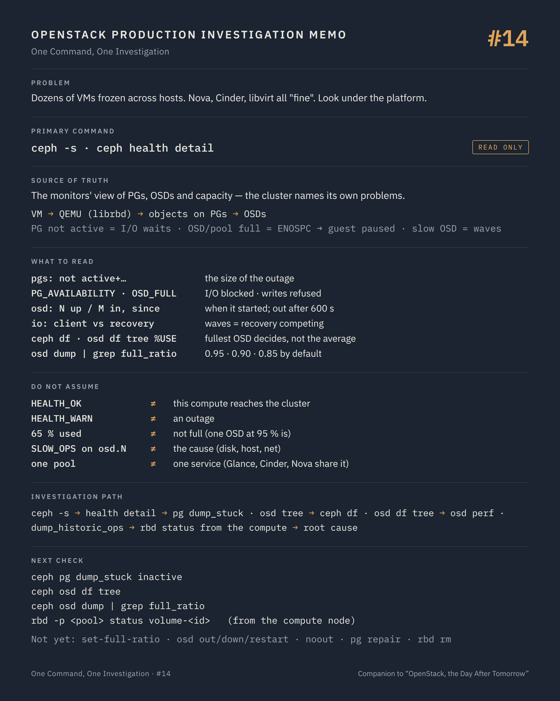

# One Command, One Investigation #14 — When the problem is not in OpenStack

**Command:** `ceph -s`, `ceph health detail`, `ceph df`, `rbd status` · **Safety:** READ ONLY · **Layer:** Ceph cluster behind Cinder, Nova and Glance · **Level:** advanced

> Command → Evidence → Hypothesis → Investigation → Correlation → Decision
>
> The question of every episode: *what can this command actually tell us during a production incident, and what does it NOT tell us?*

---

## 1. Production situation

The tickets stopped being about one VM. In the last twenty minutes, a dozen instances on different hosts have frozen: `paused (I/O error)` in libvirt (#04), `No space left on device` or `Input/output error` in the QEMU logs (#05), guests logging `task blocked for more than 120 seconds` (#06). Nova says `ACTIVE` everywhere. Cinder says `in-use` everywhere. The compute hosts have watchers on their images (#13).

Every OpenStack witness is telling the truth about itself. When every layer of the platform is fine and dozens of VMs stall in waves, the cause is usually below all of them, in the storage cluster that Nova, Cinder and Glance share. On a Ceph platform, one command answers whether that is the case.

## 2. The command

From a node with a Ceph client and a keyring (a controller, a Ceph monitor, or the deployment's Ceph container):

```bash
ceph -s
ceph health detail
ceph df
ceph osd df tree
rbd -p <pool> status volume-<volume-id>
```

**READ ONLY.** `ceph -s` (`ceph status`) and `ceph health detail` query the monitors; `ceph df` and `ceph osd df` read usage; `rbd status` reads watchers. None of them changes cluster state. Access needs a keyring that can read: the `admin` key does far more than read, and an investigation should run with the least capable key that works (`client.cinder` or a dedicated read-only key).

Why the cluster's state shows up as VM symptoms:

```text
VM writes  →  QEMU (librbd)  →  the image's objects on their PGs  →  the OSDs holding those PGs
                                        ↑
   a PG that is not active (peering, down, incomplete)      → the write waits, forever if needed
   an OSD flagged full, or the pool over its quota           → ENOSPC returned to QEMU → guest paused
   an OSD slow (disk, network, recovery load)                → SLOW_OPS, latency in waves
   a monitor quorum lost                                     → clients can still do I/O on healthy PGs,
                                                              but nothing new can be mapped or peered
```

librbd retries and waits rather than failing, which is why the guest sees a stall, not an error, until the wait becomes a timeout inside the guest.

## 3. What the command tells us

### `ceph -s`

```text
  cluster:
    id:     ...
    health: HEALTH_WARN
            1 osds down
            Degraded data redundancy: 21/63 objects degraded (33.333%), 16 pgs degraded
            12 slow ops, oldest one blocked for 132 sec, osd.7 has slow ops

  services:
    mon: 3 daemons, quorum mon1,mon2,mon3 (age 3d)
    mgr: mon1(active, since 3d), standbys: mon2
    osd: 48 osds: 47 up (since 14m), 48 in (since 3d)

  data:
    pools:   6 pools, 1025 pgs
    objects: 2.1M objects, 8.0 TiB
    usage:   24 TiB used, 12 TiB / 36 TiB avail
    pgs:     1009 active+clean
             16   active+undersized+degraded

  io:
    client:   45 MiB/s rd, 120 MiB/s wr, 2.1k op/s rd, 3.4k op/s wr
    recovery: 210 MiB/s, 52 objects/s
```

Read it in the order the VMs feel it:

`pgs`: every PG whose state does not start with `active` is a set of objects that cannot be read or written right now. `active+undersized+degraded` still serves I/O with fewer copies; `peering`, `down`, `incomplete`, `stale`, `inactive` do not. The count of non-active PGs is the size of the outage.

`health` lines: the cluster names its own problems, with the check names from the health documentation (`OSD_DOWN`, `PG_DEGRADED`, `PG_AVAILABILITY`, `SLOW_OPS`, `OSD_NEARFULL`, `OSD_FULL`, `POOL_FULL`). Two of them explain a frozen VM by themselves: `PG_AVAILABILITY` ("one or more Placement Groups are in a state that does not allow I/O requests to be serviced") and `OSD_FULL` ("one or more OSDs have exceeded the full threshold and are preventing the cluster from servicing writes").

`osd: 48 osds: 47 up, 48 in`: `up` is the daemon running; `in` is the OSD holding data. `up` lower than `in` since a given time is the timestamp of the incident. Ceph waits `mon_osd_down_out_interval` (600 seconds by default) before marking a down OSD `out` and starting to rebuild its data elsewhere; the wave of latency that follows is recovery, and it has a schedule.

`io`: `recovery` competing with `client` is where "slow in waves" comes from; `client` at zero on a cluster that should be busy is a cluster that has stopped serving.

`mon: quorum`: no quorum is a different incident altogether, and a platform-wide one.

### `ceph health detail`

The same checks, with the objects behind them: which OSDs are down, which PGs are degraded and on which OSDs, which OSD has slow ops and for how long (`osd.7 has slow ops`, `oldest one blocked for 132 sec`), which pool is full. `SLOW_OPS` on one OSD points at one disk or one host; on many OSDs at once, at the network or at recovery load.

### `ceph df` and `ceph osd df tree`

`ceph df` gives `RAW STORAGE` with `%RAW USED`, and per pool `STORED`, `USED`, `%USED`, `MAX AVAIL`. `MAX AVAIL` is what the pool can still take given replication and the fullest OSD, and it is what a growing volume actually consumes. A pool at `%USED` 96 with `MAX AVAIL` near zero, or a pool with a quota reached (`POOL_FULL`, `ceph df detail` shows quotas), is `ENOSPC` in the QEMU logs and `paused (I/O error)` in libvirt for every VM writing to it.

`ceph osd df tree` shows each OSD's `%USE` and its position in the CRUSH tree. Ceph is full when its fullest OSD reaches `full_ratio`, not when the average does: one OSD at 95 % stops writes for every PG it holds. The thresholds are in `ceph osd dump | grep full_ratio` (`full_ratio 0.95`, `backfillfull_ratio 0.9`, `nearfull_ratio 0.85` by default).

### `rbd status`

From #13, here as the link between a VM and the cluster: the watcher tells you which host has the image open; combined with `rbd info` (which pool, which size, which parent image), you know which pool's health applies to this VM.

## 4. What the command does NOT tell us

A cluster `HEALTH_OK` is not proof that this VM's storage works. The compute host may have lost its route to the OSDs (the storage network, MTU, a firewall rule) while the cluster is perfectly healthy for everyone else; `ceph -s` from a monitor says nothing about the path from one compute. Running a read-only command from the compute itself (`rbd status` needs the cluster; if it hangs there and works on the monitor, the answer is the network in between) is the test.

`HEALTH_WARN` is not an outage. Degraded PGs still serve I/O; a clock skew warning or a mismatched daemon version stalls nobody. The PG states and the `io` line are what decide whether VMs are affected; the health level is a summary.

The cluster sees objects and PGs, not volumes. `ceph -s` cannot say which VMs are on the 16 degraded PGs. `rbd info` for the pool and `ceph pg ls-by-pool <pool>` with the PG states narrow it to a pool; mapping an image's objects to PGs is possible (`rbd info` gives the prefix, `ceph osd map <pool> <object>` a PG) but rarely worth it during an incident.

Slow ops name an OSD, not a cause. The disk under it, the host's memory, the network interface, a scrub, recovery, or the OSD's own log are the next layer, and `ceph daemon osd.N dump_historic_ops` (on the OSD's host) is the read-only way in.

And the cluster does not know it is shared. The same pool serves Nova ephemeral disks, Cinder volumes and Glance images on most platforms; a full pool stops new VMs from booting (Glance clones), running VMs from writing (Nova and Cinder), and snapshots from completing, all at once, with three different OpenStack error messages for one cause.

## 5. What it lets us hypothesise

```text
pgs inactive / peering / down / incomplete        → PG_AVAILABILITY: I/O blocked for the objects on them      → which OSDs, why they are down
OSD_FULL / POOL_FULL, ENOSPC in QEMU logs          → the cluster or the pool is full; every writer pauses     → capacity decision, #04 resumes after
OSD_NEARFULL + growing thin volumes                → full within hours; still time to act                     → capacity
SLOW_OPS on one OSD                                → that disk, that host                                     → OSD host: dmesg, smartctl, #19
SLOW_OPS on many OSDs, recovery running            → recovery load competing with clients                     → recovery throttles (a decision)
osd up < in since T                                → OSD daemons died at T; recovery starts after 600 s       → OSD hosts at T
HEALTH_OK, one compute's VMs stalled               → the compute's path to the cluster, not the cluster       → storage network, #19
mon quorum lost                                    → platform-wide; nothing new can peer or map                → monitors first
```

## 6. Next investigation

Read-only, to narrow from cluster to cause:

```bash
ceph osd tree                              which OSDs are down, on which hosts
ceph pg dump_stuck inactive                the PGs that block I/O, and their acting OSDs
ceph osd dump | grep full_ratio            the thresholds in force
ceph df detail                             pool quotas
ceph daemon osd.<N> dump_historic_ops      on the OSD's host: what the slow ops were waiting for
ceph osd perf                              commit and apply latency per OSD
```

From the compute node, to separate cluster from path:

```bash
rbd -p <pool> status volume-<volume-id>    hangs here, works on the monitor → the network between
ping -M do -s <mtu-28> <osd-host-storage-ip>
```

What we do not do at this stage:

- `ceph osd set-full-ratio 0.97`, `ceph osd set-nearfull-ratio`, raising a pool quota — STATE CHANGING, and the most tempting move on a full cluster. It buys minutes at the cost of the safety margin Ceph needs to recover from the next OSD failure; a cluster driven past `full_ratio` can lose the ability to rebalance at all. It is a decision with a plan to reclaim space behind it, not a troubleshooting step.
- `ceph osd out`, `ceph osd down`, `ceph osd in`, `systemctl restart ceph-osd@N` — POTENTIALLY DISRUPTIVE. Each one changes the CRUSH map or triggers peering and recovery; on a cluster with degraded PGs, a restart can turn `degraded` into `incomplete`.
- `ceph osd set noout` / `norecover` / `nobackfill` — STATE CHANGING. Legitimate during a planned maintenance; during an incident they stop the recovery that is the cluster's own repair.
- `ceph pg repair`, `ceph pg force-recovery`, `rbd lock remove`, `ceph osd lost` — POTENTIALLY DISRUPTIVE, and some of them irreversible. The Ceph documentation itself treats `ceph osd lost` as a last resort with data loss.
- `rbd rm`, `rbd snap purge`, deleting volumes or images to free space — POTENTIALLY DISRUPTIVE. Reclaiming space is the right plan, chosen with the owners of the data, after the cluster has been read.

## 7. Investigation chain

```text
Many VMs frozen, across hosts; OpenStack layers all "fine"
        ↓
ceph -s                                  health, pgs not active, osd up/in, io client vs recovery
        ↓
ceph health detail                       which OSDs, which PGs, which pool, since when
        ↓
  PG_AVAILABILITY ───────────────→ pg dump_stuck, osd tree: the OSDs behind the blocked PGs
  OSD_FULL / POOL_FULL ──────────→ ceph df, osd df tree: which OSD or pool; ENOSPC confirmed in QEMU logs
  SLOW_OPS ─────────────────────→ osd perf, dump_historic_ops on the OSD host           → #19 on that host
  HEALTH_OK ────────────────────→ the compute's path to the cluster                      → #19, storage network
        ↓
rbd status / info                        which VMs, which pool
        ↓
Root cause, then change — capacity, OSD host, network — as a decision with its blast radius written down
```

## 8. Production lesson

When every OpenStack witness is telling the truth and the symptoms arrive in waves, look under the platform. Ceph names its own problems; the investigation is about matching its vocabulary to the one the VMs used, and resisting the one-line change that buys minutes and costs the margin.

---

## Memo



## Version notes

- Health check names and their definitions are from the Ceph health checks documentation (`OSD_DOWN`, `OSD_FULL`, `OSD_NEARFULL`, `OSD_BACKFILLFULL`, `POOL_FULL`, `PG_AVAILABILITY`, `PG_DEGRADED`, `SLOW_OPS`); older releases (before Luminous) print different messages ("requests are blocked > 32 sec").
- Default ratios: `mon_osd_full_ratio` 0.95, `mon_osd_backfillfull_ratio` 0.90, `mon_osd_nearfull_ratio` 0.85; the live values are in `ceph osd dump | grep full_ratio` and changed with `ceph osd set-full-ratio` (not done here).
- `mon_osd_down_out_interval` defaults to 600 seconds: the delay before a down OSD is marked out and recovery starts.
- In containerised deployments (cephadm, Kolla with an external Ceph, ceph-ansible), `ceph` and `rbd` run inside a container (`cephadm shell`, `docker exec ceph-mon-<host> ceph -s`) or on the controllers with a client keyring; the commands and their output are the same.
- `ceph daemon osd.N ...` uses the admin socket and runs on the OSD's own host; `ceph tell osd.N ...` works from any client but sends a command to the daemon: the `dump_historic_ops` form used here is read-only in both.

## Sources

- Ceph, monitoring a cluster (`ceph -s` / `ceph status` sections, `ceph df`, `ceph osd df`, fullness ratios): https://docs.ceph.com/en/latest/rados/operations/monitoring/
- Ceph, health checks (`OSD_DOWN`, `OSD_FULL`, `OSD_NEARFULL`, `OSD_BACKFILLFULL`, `POOL_FULL`, `PG_AVAILABILITY`, `PG_DEGRADED`, `SLOW_OPS`; `ceph osd dump | grep full_ratio`, `ceph osd set-full-ratio`): https://docs.ceph.com/en/latest/rados/operations/health-checks/
- Ceph, placement group states (`active`, `clean`, `peering`, `degraded`, `undersized`, `incomplete`, `down`, `stale`): https://docs.ceph.com/en/latest/rados/operations/pg-states/
- Ceph, troubleshooting PGs and OSDs (`ceph pg dump_stuck`, `ceph osd tree`, `dump_historic_ops`, `ceph osd lost` as last resort): https://docs.ceph.com/en/latest/rados/troubleshooting/troubleshooting-pg/ and https://docs.ceph.com/en/latest/rados/troubleshooting/troubleshooting-osd/
- Ceph, monitor configuration (`mon_osd_full_ratio`, `mon_osd_nearfull_ratio`, `mon_osd_backfillfull_ratio`, `mon_osd_down_out_interval`): https://docs.ceph.com/en/latest/rados/configuration/mon-config-ref/ and https://docs.ceph.com/en/latest/rados/configuration/mon-osd-interaction/
- Ceph, `rbd` manual (`status`, `info`, `lock ls`): https://docs.ceph.com/en/latest/man/8/rbd/
- Ceph, block devices and OpenStack (shared pools for Glance, Cinder, Nova; keyrings `client.glance`, `client.cinder`): https://docs.ceph.com/en/latest/rbd/rbd-openstack/
- QEMU, block device error handling (`werror=enospc` pauses the guest on ENOSPC): https://www.qemu.org/docs/master/system/invocation.html

---

*Part of the series [One Command, One Investigation](README.md), a technical companion to the book [OpenStack, the Day After Tomorrow](https://github.com/soufian-zaouam/openstack-the-day-after-tomorrow).*

Previous: [**#13 — `virsh domblklist`, `multipath -ll`, `rbd status`**](13-os-brick-block-devices.md). Next: [**#15 — `openstack resource provider allocation show`**](15-placement-allocations.md): Part IV begins in the control plane, with the allocations nobody sees.
