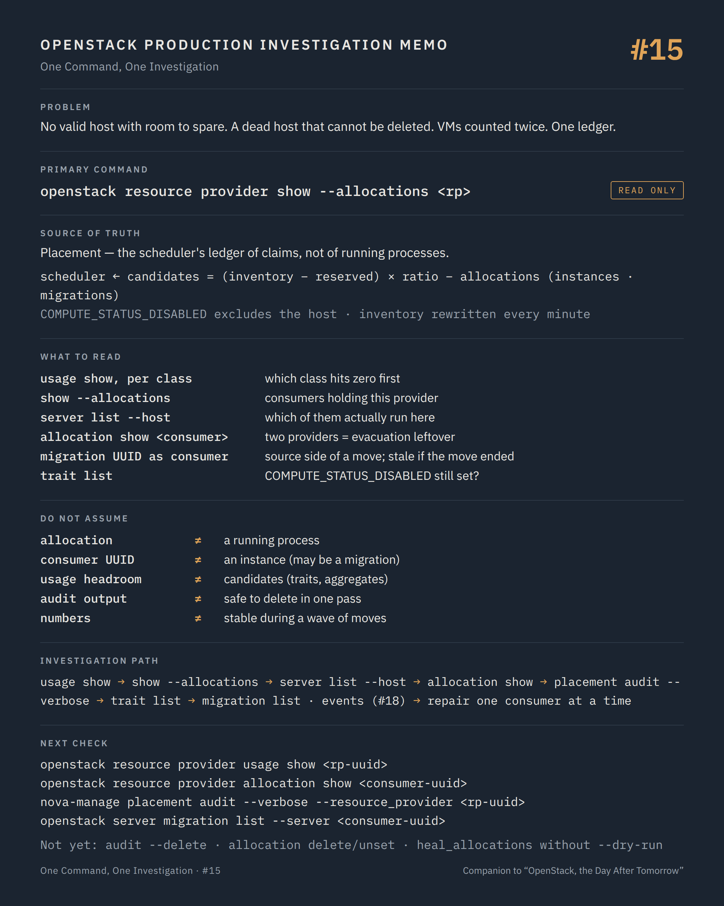

# One Command, One Investigation #15 — The allocations nobody sees

**Command:** `openstack resource provider allocation show`, `resource provider usage show`, `nova-manage placement audit` · **Safety:** READ ONLY (without `--delete`) · **Layer:** Placement, the scheduler's ledger · **Level:** advanced

> Command → Evidence → Hypothesis → Investigation → Correlation → Decision
>
> The question of every episode: *what can this command actually tell us during a production incident, and what does it NOT tell us?*

---

## 1. Production situation

Part IV leaves the VM and enters the control plane, where the incidents of the first three parts were prepared long before anyone noticed them.

The symptom was met in #03: `No valid host was found` on a region that looks half empty. Since then, the team has also noticed that a host evacuated during the incident of #02 cannot be removed from the platform (`openstack compute service delete` fails), and that a handful of VMs that were resized last month still "count twice" in the capacity reports.

Three symptoms, one ledger. Placement keeps, for every resource provider (a compute node, a shared storage pool, a NUMA cell), an inventory and a list of allocations held by consumers. Consumers are instances, and, during a move operation, migrations. When an operation ends badly, the ledger keeps what the operation claimed. Nothing alerts. The scheduler simply sees less room.

## 2. The command

```bash
openstack resource provider allocation show <consumer-uuid>
openstack resource provider usage show <rp-uuid>
openstack resource provider show --allocations <rp-uuid>
nova-manage placement audit --verbose
```

**READ ONLY**, as long as `--delete` is absent from the last one. All need the Placement endpoint and an admin-capable token; `nova-manage` runs on a controller with access to the Nova API database.

```text
nova-scheduler
     │  GET /allocation_candidates?resources=VCPU:2,MEMORY_MB:4096,DISK_GB:20&required=...
     ↓
Placement       resource providers ── inventories (total, reserved, allocation_ratio, max_unit)
                                  ── allocations, per consumer:
                                        instance uuid       (a running or stopped VM)
                                        migration uuid      (the source side of a move, while it lasts)
                                  ── traits (COMPUTE_STATUS_DISABLED, HW_CPU_X86_AVX2, CUSTOM_...)
                                  ── aggregates
     ↑
nova-compute    resource tracker: reports inventory and traits, periodically
nova-conductor  claims and moves allocations during builds, migrations, resizes, evacuations
```

`hypervisor show` in #03 read the resource tracker's own copy. This episode reads the ledger the scheduler actually consults.

## 3. What the command tells us

### The provider's usage

```bash
openstack resource provider list --name <hostname>
openstack resource provider usage show <rp-uuid>
```

```text
resource_class   usage
VCPU             52
MEMORY_MB        98304
DISK_GB          640
```

Against `inventory list` from #03 (`total`, `reserved`, `allocation_ratio`), schedulable capacity per class is `(total - reserved) × allocation_ratio - usage`. The class that reaches zero first is the one the scheduler refuses on, and it is rarely the one the dashboard shows.

### The provider's allocations, by consumer

```bash
openstack resource provider show --allocations <rp-uuid>
```

The `allocations` column lists every consumer holding resources on this provider, with the amounts. Cross it with what runs there:

```bash
openstack server list --host <hostname> --all-projects -c ID -c Name -c Status
```

Every consumer UUID that is not an instance on that host is one of three things: an instance that lives elsewhere now (a failed or half-cleaned move), a migration UUID (a move in progress, or one that ended without releasing its claim), or a deleted instance whose allocation was never removed. The first two are found with `openstack server show <uuid>` and `openstack server migration list` (the migration record's `uuid` and `status`); the third answers with `No server with a name or ID of ...`.

### One consumer's allocations

```bash
openstack resource provider allocation show <instance-uuid>
```

```text
resource_provider                       generation  resources
<rp of compute-17>                      184         {'VCPU': 4, 'MEMORY_MB': 8192, 'DISK_GB': 40}
<rp of compute-23>                      91          {'VCPU': 4, 'MEMORY_MB': 8192, 'DISK_GB': 40}
```

A VM allocating on two providers is the signature of the evacuation case documented by Nova itself: after an evacuation from a down host, the server holds allocations on both the source and the destination until the source comes back and its resource tracker cleans up, which never happens if the source is reinstalled instead. It is also why the compute service of the dead host cannot be deleted: Placement still has allocations against its provider.

During a live migration or a resize, the expected picture is different and legitimate: the instance UUID holds the destination, the migration UUID holds the source. Once the operation confirms, the migration's allocations are released. A migration UUID that still holds resources for an operation whose `status` is `completed`, `error` or `reverted` is the leftover.

### The audit

```bash
nova-manage placement audit --verbose
```

It walks every provider and every allocation, and reports the consumers that correspond to no instance and no in-progress migration. Return code 0: nothing orphaned; 3: orphans found; 4 only with `--delete`. `--resource_provider <uuid>` limits the walk to one host. It is the read-only census of the problem, and its output is the list to reconcile, one consumer at a time, against the events of #18.

### The trait

```bash
openstack resource provider trait list <rp-uuid>
```

`COMPUTE_STATUS_DISABLED` is set by nova-compute on its provider when the compute service is disabled (#02), and it excludes the provider from every allocation candidate request. A provider still carrying the trait after the service was re-enabled (nova-compute was down when the status changed, and never caught up) is a host that no VM will ever be scheduled on, however empty. The scheduling documentation says it plainly: the trait "should mirror the disabled status on the related compute service record".

## 4. What the command does NOT tell us

Placement records claims, not reality. An allocation says that something asked for these resources and was granted them; it does not say that a QEMU process consumes them. That is the whole point of the orphan problem: the ledger is internally consistent and wrong about the world.

The ledger does not know why an allocation is orphaned. A migration that failed at 03:12, an evacuation whose source host was reimaged, a database restore that resurrected a deleted instance's row: the cause is in Nova's instance actions and migration records (#18), not in Placement.

`allocation show` on a UUID tells you nothing about whether the UUID is an instance or a migration; both look the same. The Nova API distinguishes them.

Traits and aggregates explain rejections that usage does not: a flavor requiring `HW_CPU_X86_AVX512F` on hosts that do not report it, an aggregate whose metadata pins a tenant, an image property requesting a trait. `No valid host` with plenty of usage headroom is usually here, and only `allocation candidate list` with the same `--required` and `--member-of` filters the scheduler would use reproduces it.

And the numbers move under you: the resource tracker rewrites inventories every minute, the conductor claims and releases at every operation. A census taken during a wave of migrations is stale before it is read; the audit is meaningful on a quiet platform, or run twice.

## 5. What it lets us hypothesise

```text
consumer on the provider, instance elsewhere         → leftover of a failed or half-cleaned move            → migration list, events (#18)
consumer on the provider, no such server             → deleted instance whose allocation survived           → audit, then reconcile
instance allocating on two providers                 → evacuation from a down host, source never cleaned    → source host status (#02)
migration UUID holding resources, migration ended    → move ended without release                            → migration record, events
usage ≥ capacity on one class only                   → that class is the bottleneck; dashboard shows another → inventory per class
COMPUTE_STATUS_DISABLED on an enabled service        → trait not cleared; host invisible to the scheduler   → nova-compute log, service status
allocation candidates empty with usage headroom      → traits, aggregates, required/forbidden               → candidate list with filters
compute service delete refused                       → allocations remain on the dead host's provider       → audit --resource_provider
```

## 6. Next investigation

Read-only, to turn each orphan into a story:

```bash
openstack server show <consumer-uuid>
openstack server migration list --server <consumer-uuid>
openstack server event list <consumer-uuid>
openstack allocation candidate list --resource VCPU=2 --resource MEMORY_MB=4096 --required <trait> --member-of <aggregate-uuid>
```

For every orphan the audit lists, the events of #18 give the operation that created the claim and the moment it stopped. Only then does a repair have a rationale.

What we do not do at this stage:

- `nova-manage placement audit --delete` — STATE CHANGING. It deletes every allocation the audit considers orphaned, in one pass, on every provider. The audit's own documentation warns that migration-based allocations are lost if deleted during a resize. On a platform with moves in progress, the census and the deletion are not the same command, and the second one runs after the first has been read and dated.
- `openstack resource provider allocation delete <consumer>` / `allocation unset` — STATE CHANGING, per consumer. Legitimate as the repair of a documented orphan; destructive when the consumer is a live migration or a VM that is simply on another host.
- `nova-manage placement heal_allocations` — STATE CHANGING. It creates allocations for instances that have none; run without `--dry-run` during an incident, it can double the claims of instances whose allocations were merely held by a migration UUID. `--dry-run` and `--instance <uuid>` are the investigation-safe forms.
- `openstack resource provider inventory set` / `delete`, or editing `allocation_ratio` and `reserved_host_*` — STATE CHANGING with a region-wide blast radius (#03). The resource tracker will overwrite manual inventory changes at its next report unless the deployment uses provider config files.
- `openstack compute service delete` on the dead host, to make the allocations "go away" — it will fail while allocations exist, and forcing it through the database orphans them for good.

## 7. Investigation chain

```text
No valid host with room · host cannot be deleted · VMs counted twice
        ↓
resource provider usage show           which class is exhausted?
        ↓
resource provider show --allocations   which consumers hold it?
        ↓
server list --host                     which of them actually run here?
        ↓
allocation show <consumer>             instance on two providers? migration UUID still claiming?
        ↓
nova-manage placement audit --verbose  the census, read-only
        ↓
trait list                             COMPUTE_STATUS_DISABLED stuck?
        ↓
server migration list / event list     the operation behind each orphan, and when it stopped   → #18
        ↓
Repair: per consumer, with its story written down — never in one pass
```

## 8. Production lesson

Placement is a ledger, and a ledger is only as honest as the last transaction that completed. Every failed move leaves a claim behind, silently, and the scheduler believes it. The investigation is an audit; the repair is bookkeeping, one entry at a time, with the receipt attached.

---

## Memo



## Version notes

- Consumers in Placement are instance UUIDs and, during move operations (live migration, cold migration, resize, evacuation), migration UUIDs holding the source-side allocations; the Nova troubleshooting guide on orphaned allocations documents the evacuation double-allocation case and the migration-based allocations.
- `COMPUTE_STATUS_DISABLED` is managed by nova-compute since the Train release (Nova 20.0.0) and used by a mandatory scheduler pre-filter; it mirrors the compute service's `disabled` status.
- `nova-manage placement audit` exists since Ussuri; return codes: 0 no orphans, 1 unexpected error, 3 orphans found, 4 orphans deleted (with `--delete`), 127 invalid input. `heal_allocations` accepts `--dry-run`, `--instance`, `--cell`, `--max-count`, `--skip-port-allocations`.
- `openstack resource provider allocation unset` requires osc-placement 1.8.0 or newer; `resource provider show --allocations` and `trait list` need the corresponding Placement API microversions, negotiated by the client.
- Nested providers (NUMA cells with `[compute] ...`, vGPU, PCI in Placement) make one host several providers; `resource provider list --in-tree <root>` (Placement API 1.14+) lists a host's tree, and healing has documented limits with nested allocations.
- Provider config files (`[compute] provider_config_location`, Ussuri+) are the supported way to customise inventories and traits without being overwritten by the resource tracker.

## Sources

- Nova, troubleshooting orphaned resource allocations (evacuation double allocations, migration-based allocations, `allocation show/unset/delete`, `heal_allocations`, `placement audit`): https://docs.openstack.org/nova/latest/admin/troubleshooting/orphaned-allocations.html
- Nova, `nova-manage placement audit` and `heal_allocations` (options, return codes): https://docs.openstack.org/nova/latest/cli/nova-manage.html
- Nova, scheduling and the `COMPUTE_STATUS_DISABLED` pre-filter ("The trait is managed by the nova-compute service and should mirror the disabled status on the related compute service record"): https://docs.openstack.org/nova/latest/admin/scheduling.html
- osc-placement CLI (`resource provider list/show/usage show/inventory list/trait list`, `resource provider allocation show/unset/delete`, `allocation candidate list --required --member-of`): https://docs.openstack.org/osc-placement/latest/cli/index.html
- Placement API reference (allocations, allocation candidates, consumers, generations): https://docs.openstack.org/api-ref/placement/
- Placement, usage and concepts (resource providers, inventories, allocation ratios, traits, aggregates): https://docs.openstack.org/placement/latest/user/index.html
- Nova, provider configuration files: https://docs.openstack.org/nova/latest/admin/managing-resource-providers.html
- python-openstackclient, `server migration list`, `server event list`: https://docs.openstack.org/python-openstackclient/latest/cli/command-objects/server.html

---

*Part of the series [One Command, One Investigation](README.md), a technical companion to the book [OpenStack, the Day After Tomorrow](https://github.com/soufian-zaouam/openstack-the-day-after-tomorrow).*

Previous: [**#14 — `ceph -s`**](14-ceph-status.md). Next: [**#16 — `rabbitmqctl cluster_status`**](16-rabbitmq-cluster-status.md): the bus every service trusts, and what it looks like when it stops being trustworthy.
