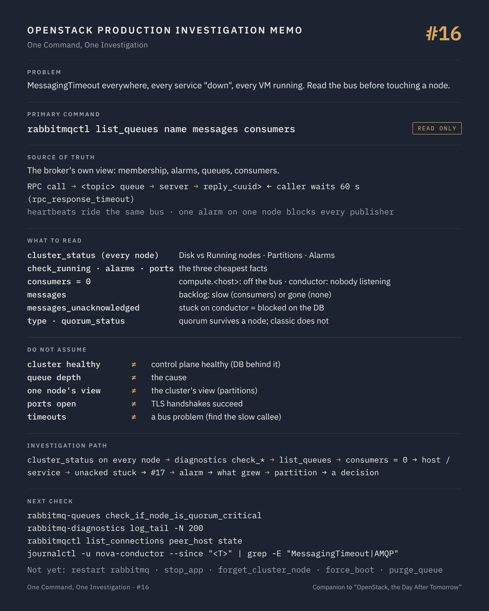

# One Command, One Investigation #16 — The bus every service trusts

**Command:** `rabbitmqctl cluster_status`, `rabbitmqctl list_queues`, `rabbitmq-diagnostics check_*`, `rabbitmq-queues quorum_status` · **Safety:** READ ONLY · **Layer:** RabbitMQ, oslo.messaging RPC and notifications · **Level:** advanced

> Command → Evidence → Hypothesis → Investigation → Correlation → Decision
>
> The question of every episode: *what can this command actually tell us during a production incident, and what does it NOT tell us?*

---

## 1. Production situation

Several episodes have pointed here. In #02, every compute service went `down` at once while every VM kept running. In #08, every Neutron agent went `XXX` together. In #01, a `task_state` stuck for twenty minutes. Users report that creating a VM "hangs" and then fails; the API logs show `MessagingTimeout: Timed out waiting for a reply to message ID ...`; nova-compute logs on several hosts show `AMQP server on ... is unreachable` and then reconnections.

The pattern is the one the book's control-plane incident began with: the data plane is untouched, and every service that needs to talk to another one is failing to. Between them there is one thing, the message bus, and the first question is what state it is in, not what to restart.

## 2. The command

On a RabbitMQ node (or inside its container):

```bash
rabbitmqctl cluster_status
rabbitmq-diagnostics check_running && rabbitmq-diagnostics check_local_alarms && rabbitmq-diagnostics check_port_connectivity
rabbitmqctl list_queues -p / name messages messages_unacknowledged consumers type state
rabbitmq-queues check_if_node_is_quorum_critical
```

**READ ONLY.** They query the local node and the cluster metadata; none of them changes queues, policies or membership. `rabbitmqctl` needs the Erlang cookie (root on the node, or the container's user).

What travels on the bus, so that the queue names make sense:

```text
oslo.messaging RPC (every OpenStack service)
  call   client → exchange <service> → queue <topic>            e.g. compute.<host>, conductor, scheduler, q-plugin
         reply  server → reply_<uuid> queue owned by the caller     ← the queue that MessagingTimeout waits on
  cast   client → topic queue, no reply
  fanout client → <topic>_fanout_<uuid> queues, one per consumer  ← the queues that pile up when consumers vanish
notifications
  notifications.info / .error / .sample ... consumed by Ceilometer, Aodh, Searchlight, or nobody
                                                                 ← the queues that grow forever when nobody consumes

rpc_response_timeout = 60 s (default): the caller gives up, the server may still be working
heartbeat_timeout_threshold = 60 s, heartbeat_rate = 3: how long a service tolerates a silent broker
```

A service "up" in #02 is a service whose heartbeat cast reached the conductor's queue and was consumed. A `MessagingTimeout` is a call whose reply never arrived on `reply_<uuid>`. A control plane that "hangs" is a set of calls waiting on replies that will never come.

## 3. What the command tells us

### `rabbitmqctl cluster_status`

```text
Cluster name: rabbit@ctl1
Disk Nodes:    rabbit@ctl1  rabbit@ctl2  rabbit@ctl3
Running Nodes: rabbit@ctl1  rabbit@ctl3
Versions:      ...
Alarms:        (none)
Network Partitions: (none)
Listeners:     ...
```

`Disk Nodes` is membership; `Running Nodes` is who is present now. A member missing from the running list is a node down or unreachable from the node you asked. `Network Partitions` lists nodes that this node considers partitioned from it; on classic (Mnesia) clusters this is the partition itself, and the recovery depends on `cluster_partition_handling`. `Alarms` are resource alarms: memory or disk on any node. An alarm on one node blocks publishers cluster-wide until it clears, which is a control plane that stalls without a single error in OpenStack's own logs.

Run it on every node. A partition is a disagreement, and each side prints its own view.

### `rabbitmq-diagnostics check_*`

Each check exits non-zero on failure, with a one-line reason: `check_running` (the RabbitMQ application is running on this node), `check_local_alarms` (no memory or disk alarm here), `check_port_connectivity` (the listeners accept TCP connections; 5672 for AMQP, 5671 for AMQPS, 25672 for inter-node). They are the cheapest facts on the node and the right first three, before any queue listing.

### `rabbitmqctl list_queues`

```text
name                                    messages  messages_unacknowledged  consumers  type     state
compute.compute-17                      0         0                        1          quorum   running
compute.compute-23                      847       0                        0          quorum   running
conductor                               3         3                        24         quorum   running
reply_8f1c...                           1         0                        0          classic  running
notifications.info                      2418765   0                        0          classic  running
q-agent-notifier-port-update_fanout_... 15412     0                        0          classic  running
```

Three columns carry the investigation.

`consumers` is who is listening. A `compute.<host>` queue with zero consumers is a nova-compute that is not connected to the bus, whatever `compute service list` said a minute ago (#02: the heartbeat is one more message on this same bus). A `conductor` or `scheduler` queue with zero consumers is a control plane with nobody at the desk: every call to it will time out.

`messages` is the backlog. Messages accumulating on a topic queue with consumers present is a service that cannot keep up; accumulating with zero consumers is a service that left. A `notifications.*` queue in the millions is a queue nobody consumes, which is an old and well-known way to exhaust a broker's memory and disk and raise the alarm that stalls everything else.

`messages_unacknowledged` is work delivered and not finished. A conductor queue with unacked messages equal to its prefetch, for minutes, is a conductor blocked on something else, usually the database (#17).

`type` and `state`: `quorum` queues (oslo.messaging `rabbit_quorum_queue = true`) replicate over Raft and survive a node; `classic` queues live on one node unless a policy mirrors them, and they die with it. Knowing which is which decides whether losing a node loses queues.

### `rabbitmq-queues quorum_status <queue>` and `check_if_node_is_quorum_critical`

For a quorum queue: the leader, the members, which are online. `check_if_node_is_quorum_critical` fails when queues on this node are at their minimum online quorum, which means stopping this node would make them unavailable. It is the check that must pass before any node is restarted, and the one everybody skips.

`rabbitmqctl list_connections peer_host state` and `list_consumers` complete the picture: which hosts are connected, and which queue each connection consumes.

## 4. What the command does NOT tell us

A healthy cluster status is not a healthy control plane. The broker can be perfect and the conductor blocked on Galera (#17); the calls then time out on a bus that delivered every message. `messages_unacknowledged` is the hint, the conductor's log is the proof.

Queue depth is a symptom, not a cause. A backlog on `compute.<host>` says the host's consumer is slow or absent; whether nova-compute is hung on libvirt (#04), swapping (#19) or simply disconnected is a host question.

`cluster_status` shows the cluster from one node. During a partition each side believes it is the cluster; only running the command on every node shows the split, and only the logs (`rabbitmq-diagnostics log_tail`) show when it happened and why (`node rabbit@ctl2 down: net_tick_timeout`).

The bus does not know about timeouts. `rpc_response_timeout` lives in every service's configuration; a reply that arrives at 61 seconds is discarded by a caller that has already raised `MessagingTimeout` and possibly retried, and that is how one slow operation becomes two.

TLS on the bus (`rabbit_use_ssl`, port 5671) fails in ways the broker does not see as failures: handshakes rejected by certificate validation appear as connections that never complete, on the client side only. `check_port_connectivity` passes; the client log says `SSL handshake failed`.

And nothing here says which OpenStack operation is waiting. The reply queue names are UUIDs; the request that owns them is in the service log with its request ID (#18).

## 5. What it lets us hypothesise

```text
Running Nodes < Disk Nodes                          → a node down or partitioned                            → that node, network between nodes
Network Partitions non-empty on some nodes          → split brain in progress or unresolved                  → partition handling mode, logs
Alarms: memory or disk on any node                  → publishers blocked cluster-wide                        → what grew: notifications queues, disk
compute.<host> consumers = 0                         → that nova-compute is not on the bus                    → #02, host journal
conductor / scheduler consumers = 0                  → control plane with nobody listening                   → those services, their hosts
conductor messages_unacknowledged stuck             → conductor blocked, usually on the database             → #17
notifications.* in the millions                     → nobody consumes; memory and disk on the way            → consumer missing, policy
reply_* queues piling up                             → callers that timed out and left; nothing to fix here   → find the slow callee
fanout queues growing, consumers = 0                 → agents that vanished without unbinding                 → #08, agent hosts
check_if_node_is_quorum_critical fails               → this node cannot be restarted safely                  → wait, or restore the missing member
client logs: SSL handshake failed, broker fine       → TLS: certificates, CA, SNI on the client side          → certificates
```

## 6. Next investigation

Read-only, from the bus outward:

```bash
rabbitmq-diagnostics log_tail -N 200
rabbitmqctl list_connections peer_host peer_port state channels
rabbitmqctl list_consumers -p /
rabbitmq-diagnostics memory_breakdown
```

And from the services inward, at the timestamps the bus gives:

```bash
journalctl -u nova-conductor --since "<T>" | grep -E "MessagingTimeout|AMQP|Reconnected"
journalctl -u nova-compute --since "<T>" | grep -E "AMQP server|unreachable|Reconnected"
```

If the conductor is the one not acknowledging, episode #17 is next.

What we do not do at this stage:

- `rabbitmqctl stop_app` / `start_app`, `systemctl restart rabbitmq-server` — POTENTIALLY DISRUPTIVE. On a node that `check_if_node_is_quorum_critical` flags, it takes queues offline; on a partitioned cluster it can pick the wrong side; on any cluster it disconnects every consumer, and every service reconnects at once. The book's incident was resolved with a deliberate restart, after the APIs were stopped and the decision was written down, which is not this stage.
- `rabbitmqctl forget_cluster_node`, `force_boot`, `force_reset`, `reset` — POTENTIALLY DISRUPTIVE and, for `force_reset`, destructive: they change membership or wipe the node's data. They are recovery decisions for a documented partition, never diagnostics.
- `rabbitmqctl purge_queue` — STATE CHANGING. Purging `notifications.info` to clear an alarm is a legitimate decision when nothing consumes it; purging an RPC topic queue drops in-flight requests whose callers will time out and retry, or not.
- `rabbitmqctl set_policy`, changing `cluster_partition_handling`, enabling or disabling quorum queues in oslo.messaging — STATE CHANGING with a platform-wide blast radius; oslo.messaging's own option text for HA queues says that changing it requires wiping the RabbitMQ database.
- Raising `rpc_response_timeout` everywhere to "stop the timeouts" — it hides the slow callee and doubles the time each stuck operation holds its locks and its allocations (#15).

## 7. Investigation chain

```text
Timeouts everywhere, every service "down", every VM running
        ↓
rabbitmqctl cluster_status (on every node)    membership vs running, partitions, alarms
        ↓
rabbitmq-diagnostics check_running / check_local_alarms / check_port_connectivity
        ↓
list_queues name messages unacked consumers   who is missing? what is piling up? who is stuck?
        ↓
  consumers = 0 on compute.<host> ─────→ the host is off the bus                       → #02, #19
  consumers = 0 on conductor/scheduler ─→ the service is off the bus                   → controllers
  unacked stuck on conductor ──────────→ the database                                  → #17
  alarm ───────────────────────────────→ what grew (notifications, disk)               → policy decision
  partition ───────────────────────────→ logs: when, which side; a recovery decision   → stop APIs first
        ↓
log_tail · list_connections · service logs at T                                          → #18
```

## 8. Production lesson

A message bus fails quietly: no VM stops, no API returns an error, the platform simply stops keeping its promises. Read membership, alarms, consumers and backlog before touching a node, because every restart on the bus is a platform-wide event, and the one you make in a hurry is the one you will be explaining.

---

## Memo



## Version notes

- oslo.messaging defaults: `rpc_response_timeout = 60`, `[oslo_messaging_rabbit] heartbeat_timeout_threshold = 60`, `heartbeat_rate = 3`, `rabbit_quorum_queue = False`, `rabbit_transient_quorum_queue = False`, `rabbit_stream_fanout = False`, `rabbit_ha_queues = False` ("If you change this option, you must wipe the RabbitMQ database"), `rabbit_qos_prefetch_count = 0`. Deployment tools increasingly enable quorum queues; the `type` column tells you what is in force.
- Classic mirrored queues (`ha-mode` policies) are deprecated and removed in RabbitMQ 4.x; quorum queues and streams replace them. On RabbitMQ 4.x with Khepri as the metadata store, `cluster_partition_handling` no longer applies and partitions are handled by Raft; on Mnesia-based clusters (3.x), the mode (`ignore`, `autoheal`, `pause_minority`) decides what happens after a partition. Check the version in `cluster_status` before interpreting `Network Partitions`.
- `leader`, `members` and `online` are not `list_queues` columns; use `rabbitmq-queues quorum_status <queue>` for quorum queue membership.
- `rabbitmq-diagnostics check_if_node_is_quorum_critical` is an alias of the `rabbitmq-queues` command of the same name; `check_if_node_is_mirror_sync_critical` concerns classic mirrored queues only.
- oslo.messaging reply queues are named `reply_<uuid>`; fanout queues `<topic>_fanout_<uuid>`; with `use_queue_manager = True` (recent releases) queue names become consistent instead of random.
- Container names (Kolla Ansible): `rabbitmq`; commands run as `docker exec rabbitmq rabbitmqctl ...`.

## Sources

- RabbitMQ, `rabbitmqctl` manual (`cluster_status`, `list_queues` and its `queueinfoitem`s: `messages`, `messages_ready`, `messages_unacknowledged`, `consumers`, `state`, `type`; `list_connections`, `list_consumers`, `list_unresponsive_queues`, `purge_queue`, `forget_cluster_node`, `force_boot`): https://www.rabbitmq.com/docs/man/rabbitmqctl.8
- RabbitMQ, `rabbitmq-diagnostics` manual (`check_running`, `check_local_alarms`, `check_port_connectivity`, `alarms`, `listeners`, `memory_breakdown`, `log_tail`): https://www.rabbitmq.com/docs/man/rabbitmq-diagnostics.8
- RabbitMQ, `rabbitmq-queues` manual (`quorum_status`, `check_if_node_is_quorum_critical`, `rebalance`): https://www.rabbitmq.com/docs/man/rabbitmq-queues.8
- RabbitMQ, clustering and partitions (`cluster_partition_handling`, Khepri): https://www.rabbitmq.com/docs/partitions and https://www.rabbitmq.com/docs/clustering
- RabbitMQ, memory and disk alarms: https://www.rabbitmq.com/docs/alarms
- RabbitMQ, quorum queues: https://www.rabbitmq.com/docs/quorum-queues
- oslo.messaging, configuration options (`rpc_response_timeout`, `heartbeat_timeout_threshold`, `heartbeat_rate`, `rabbit_quorum_queue`, `rabbit_transient_quorum_queue`, `rabbit_stream_fanout`, `rabbit_ha_queues`, `rabbit_qos_prefetch_count`, `use_queue_manager`): https://docs.openstack.org/oslo.messaging/latest/configuration/opts.html
- oslo.messaging, RabbitMQ driver and RPC concepts (call, cast, fanout, reply queues): https://docs.openstack.org/oslo.messaging/latest/admin/rabbit.html
- OpenStack operations guide, RabbitMQ troubleshooting (large-scale): https://docs.openstack.org/large-scale/journey/configure/rabbitmq.html

---

*Part of the series [One Command, One Investigation](README.md), a technical companion to the book [OpenStack, the Day After Tomorrow](https://github.com/soufian-zaouam/openstack-the-day-after-tomorrow).*

Previous: [**#15 — Placement allocations**](15-placement-allocations.md). Next: [**#17 — `SHOW STATUS LIKE 'wsrep_%'`**](17-galera-wsrep-status.md): the database that three nodes must agree on.
