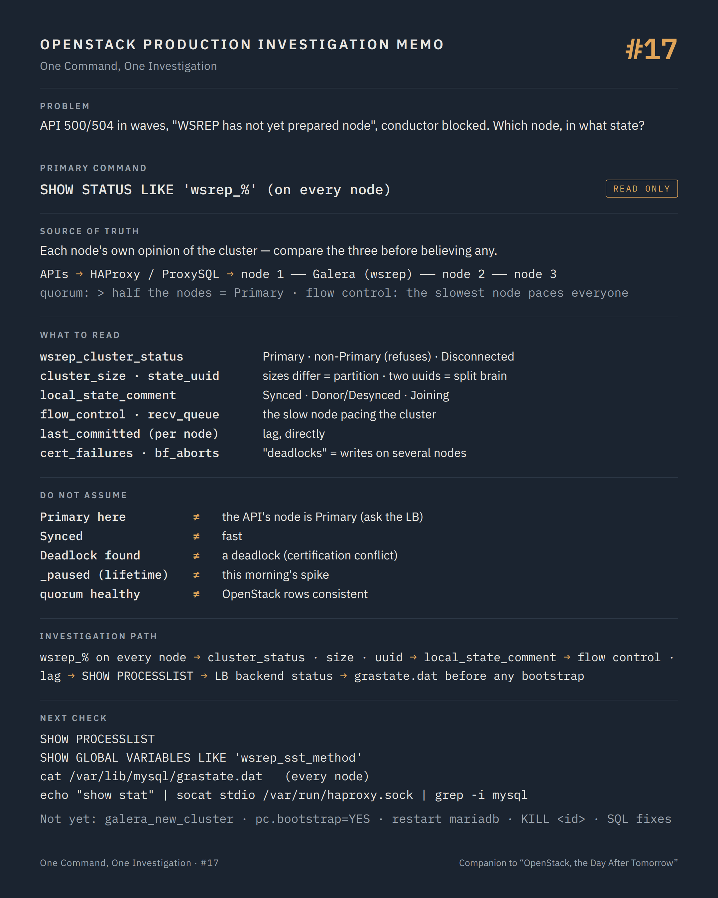

# One Command, One Investigation #17 — Three nodes that must agree

**Command:** `SHOW STATUS LIKE 'wsrep_%'`, `SHOW PROCESSLIST` · **Safety:** READ ONLY · **Layer:** MariaDB Galera cluster behind every OpenStack API · **Level:** advanced

> Command → Evidence → Hypothesis → Investigation → Correlation → Decision
>
> The question of every episode: *what can this command actually tell us during a production incident, and what does it NOT tell us?*

---

## 1. Production situation

Episode #16 ended with a conductor queue full of unacknowledged messages: the conductor took the work and did not finish it. The API logs now show intermittent `500` and `504` responses, `openstack server list` answers in nine seconds then in one, and one controller's nova-api log carries a line that experienced operators recognise before they finish reading it:

```text
DBError: (pymysql.err.OperationalError) (1047, 'WSREP has not yet prepared node for application use')
```

Every OpenStack service keeps its state in a MariaDB Galera cluster: three nodes, synchronous replication, and a rule that only a partition holding a quorum of nodes may accept writes. The API that answers you is behind a load balancer; which node it talks to, and what state that node is in, is the question.

## 2. The command

On each database node, with a client that can read status (a monitoring account is enough):

```bash
mysql -e "SHOW STATUS LIKE 'wsrep_%'"
mysql -e "SHOW PROCESSLIST"
```

**READ ONLY.** `SHOW STATUS` reads counters; `SHOW PROCESSLIST` lists connections and what they are doing. Neither takes a lock or writes anything. Run on every node, not through the load balancer: the point is to compare the nodes' opinions of each other.

```text
nova-api / neutron-server / cinder-api / keystone ...
     ↓  SQLAlchemy, connection pool
HAProxy / ProxySQL         one writer node (or all, in multi-master), health check on 9200 or 3306
     ↓
MariaDB node 1 ── Galera (wsrep) ── node 2 ── node 3
     synchronous certification: a transaction commits on all nodes or on none
     quorum: a component with more than half the nodes is Primary and accepts writes
     flow control: a node that cannot keep up pauses the whole cluster's replication
```

Three properties follow, and each has a symptom: a node outside the Primary component refuses queries (`WSREP has not yet prepared node`); a node that lags applies flow control and every write on every node waits; two transactions that conflict on different nodes end with one of them rolled back (`Deadlock found when trying to get lock`), even though there is no deadlock.

## 3. What the command tells us

### Membership and quorum

```text
wsrep_cluster_status        Primary | non-Primary | Disconnected
wsrep_cluster_size          3
wsrep_cluster_state_uuid    the identity of the cluster this node belongs to
wsrep_incoming_addresses    the members this node sees
wsrep_connected             ON
wsrep_ready                 ON
```

`wsrep_cluster_status` is the first field, on every node. `Primary` means this node is in the component that holds quorum and may serve writes. `non-Primary` means the node is alive, connected to some members, and refusing every query; Galera's own documentation of `wsrep_ready` says that with it `OFF` "almost all of the queries will fail with: ERROR 1047 (08S01) Unknown Command", which is the error the API logged. `Disconnected` means the node is not part of any component and keeps trying.

`wsrep_cluster_size` from each node, compared: three nodes that each report `3` agree; two reporting `2` and one reporting `1` is a partition, and `wsrep_cluster_status` says which side kept quorum. Two nodes reporting `Primary` with different `wsrep_cluster_state_uuid` is the split brain: two clusters, each accepting writes, each with a history the other does not have. That is the incident nobody wants to find and the one worth finding early.

### State and readiness

```text
wsrep_local_state_comment   Synced | Donor/Desynced | Joined | Joining | Initialized
```

`Synced` is a node serving traffic. `Donor/Desynced` is a node feeding a state transfer (SST) to a joining node: it is in the cluster, it may be slow, and with a blocking SST method it does not serve reads. `Joining` and `Joined` are a node catching up; it must not receive application traffic yet. A load balancer that sends writes to a `Donor` or a `Joining` node produces exactly the intermittent errors the API logged, and the `wsrep_local_state_comment` on each node tells the balancer's health check what it should have known.

### Throughput and flow control

```text
wsrep_flow_control_paused       fraction of time paused since the last FLUSH STATUS
wsrep_flow_control_sent         how many times this node asked the cluster to pause
wsrep_local_recv_queue_avg      writesets waiting to be applied on this node
wsrep_local_send_queue_avg      writesets waiting to be sent from this node
wsrep_cert_deps_distance        how much parallel apply is possible
wsrep_last_committed            the last applied sequence number (compare across nodes)
```

`wsrep_flow_control_paused` near 1.0 is a cluster that spends its time waiting for one node. The node with the highest `wsrep_flow_control_sent` and `wsrep_local_recv_queue_avg` is the one that cannot keep up; Galera's documentation says of the receive queue that values "considerably larger than 0.0 mean that the node cannot apply write-sets as fast as they are received and will generate a lot of replication throttling". One slow disk on one node slows every write on the platform.

`wsrep_last_committed` compared across nodes shows lag directly: a node several thousand sequence numbers behind is applying, not serving.

### Conflicts

```text
wsrep_local_cert_failures     transactions this node rolled back at certification
wsrep_local_bf_aborts         local transactions aborted by replicated ones
```

Both counters growing on a platform where several nodes accept writes are the multi-master conflicts: two API workers on two nodes updating the same row. OpenStack services expect one writer; `Deadlock found` in service logs with these counters moving is a balancer sending writes to more than one node.

### `SHOW PROCESSLIST`

Connections and their current statement, `Time` and `State`. What matters: how many connections each service holds against `max_connections`; queries in `State: wsrep: in pre-commit stage` or `wsrep applier committed` for seconds (waiting on certification or flow control); long-running `SELECT ... FOR UPDATE` or `ALTER TABLE` (a migration, a maintenance script) that block everyone behind them; `system user` threads that are the appliers. A `PROCESSLIST` full of the same query from nova-conductor for ten seconds is the conductor's unacknowledged messages from #16, seen from the other side.

## 4. What the command does NOT tell us

`Primary` on the node you asked says nothing about the node the API is using. The load balancer decides; its backend status (`echo "show stat" | socat stdio /var/run/haproxy.sock` on HAProxy, the ProxySQL admin tables) is where the API's real target is, and a health check that still passes on a `Donor` or a `non-Primary` node is the cause of half the intermittent errors.

`Synced` is a replication state, not a performance guarantee. A `Synced` node on a full disk, a swapping host, or a saturated network applies slowly, applies flow control, and slows everyone (#19).

Galera reports conflicts as deadlocks. `Deadlock found when trying to get lock` from a Galera node with `wsrep_local_cert_failures` moving is a certification failure across nodes, not a lock cycle inside one; InnoDB's `SHOW ENGINE INNODB STATUS` will show nothing, and the fix is in the writer topology, not in the query.

The status variables count since the last `FLUSH STATUS`, which nobody runs; `wsrep_flow_control_paused` is a lifetime average on a node that has been up for months, and a spike this morning is invisible in it. `FLUSH STATUS` resets the counters and is itself a (harmless) write; read the `_sent` and queue values twice, a minute apart, instead.

A quorum can be healthy and the data still inconsistent with what OpenStack believes: the stuck `task_state` from #01, the orphaned attachments of #12 and the allocations of #15 are rows that Galera replicated perfectly. Consistency of the database is not consistency of the platform.

And `grastate.dat` (`seqno`, `safe_to_bootstrap`) on each node's data directory, which decides which node may bootstrap a fully stopped cluster, is not a status variable; it is a file, read with `cat`, and it is the single most important thing to read before anyone types `galera_new_cluster`.

## 5. What it lets us hypothesise

```text
one node non-Primary, two Primary                     → that node left the quorum; it refuses queries; is the LB still sending to it?   → LB status, node logs
cluster_size differs across nodes                     → partition in progress                                                         → network between nodes
two Primary with different state uuid                 → split brain: two histories                                                     → stop writes, a decision
Donor/Desynced on one node                            → an SST in progress; that node is serving a joiner, not the API                 → who is joining, why
flow_control_paused high, one node's recv queue high  → that node's disk or host is the bottleneck of the whole platform               → #19 on that node
last_committed lagging on one node                    → applying, not serving; the LB must not use it                                   → LB health check
cert_failures / bf_aborts growing                     → writes hitting more than one node                                               → balancer topology
PROCESSLIST: long ALTER / FOR UPDATE                  → a migration or script blocking everyone                                         → who ran it, when
PROCESSLIST near max_connections                      → a service leaking or a pool too large; new connections refused                 → service configuration
API 1047 errors on one controller only                → that controller's balancer path or local node                                  → HAProxy on that controller
```

## 6. Next investigation

Read-only, on each database node:

```bash
mysql -e "SHOW STATUS WHERE Variable_name IN ('wsrep_cluster_status','wsrep_cluster_size','wsrep_local_state_comment','wsrep_ready','wsrep_last_committed','wsrep_flow_control_sent','wsrep_local_recv_queue_avg')"
mysql -e "SHOW GLOBAL VARIABLES LIKE 'wsrep_%'" | grep -E "sst_method|provider_options|cluster_address"
cat /var/lib/mysql/grastate.dat
journalctl -u mariadb --since "<T>" | grep -iE "wsrep|galera|primary|state transfer|flow"
```

And the load balancer, which decides whom the APIs talk to:

```bash
echo "show stat" | socat stdio /var/run/haproxy.sock | grep -i mysql   # or the deployment's equivalent
```

What we do not do at this stage:

- `galera_new_cluster`, `mysqld --wsrep-new-cluster`, editing `safe_to_bootstrap` — POTENTIALLY DISRUPTIVE and irreversible in the wrong hands: bootstrapping from the wrong node discards the transactions the other nodes had. It is the recovery of a fully stopped cluster, done from the node with the highest `seqno`, after the three `grastate.dat` files have been read and compared, and written down.
- `SET GLOBAL wsrep_provider_options='pc.bootstrap=YES'` — STATE CHANGING: it promotes a `non-Primary` component to `Primary` by force. Done on both sides of a partition, it creates the split brain you were trying to avoid.
- Restarting `mariadb` on a node — STATE CHANGING. The node leaves the cluster, rejoins with an IST or an SST, and during an SST another node becomes `Donor` and may stop serving. On a three-node cluster with one node already out, it is the loss of quorum.
- `SET GLOBAL wsrep_desync=ON`, changing `wsrep_slave_threads` or flow control limits during an incident — STATE CHANGING; tuning while the cause is unknown.
- `KILL <id>` on the long query in `PROCESSLIST` — STATE CHANGING. Sometimes right, once the query, its owner and what it blocks are known; never as the first reflex, because a killed migration or maintenance script leaves its own inconsistency behind.
- Writing SQL to "fix" OpenStack rows — POTENTIALLY DISRUPTIVE, and outside this episode; the book treats it as a repair with a procedure, a backup and a rollback, not as troubleshooting.

## 7. Investigation chain

```text
API 500/504, 1047 errors, conductor not acknowledging
        ↓
SHOW STATUS LIKE 'wsrep_%' on every node    cluster_status · cluster_size · state uuid · local_state_comment
        ↓
  non-Primary / sizes differ ───────→ partition; which side has quorum?          → network, logs
  two Primary, two uuids ──────────→ split brain; stop writes; a decision
  Donor / Joining ─────────────────→ SST in progress; keep the LB away from it
  all Primary, all Synced ─────────→ flow control and lag: recv queue, last_committed  → the slow node, #19
        ↓
SHOW PROCESSLIST                             blockers, connection counts, wsrep waits
        ↓
Load balancer backend status                  whom are the APIs actually talking to?
        ↓
grastate.dat on every node                    before any bootstrap word is spoken
        ↓
Root cause, then change — one node at a time, quorum preserved
```

## 8. Production lesson

A Galera cluster is three opinions that must agree, and the API only ever hears one of them. Read all three before believing any, and treat every bootstrap command as a decision that chooses which history survives.

---

## Memo



## Version notes

- Status variable names and semantics are from the Galera Cluster documentation; MariaDB Galera exposes them under the same names. `wsrep_cluster_status` values are `Primary`, `non-Primary`, `Disconnected`; `wsrep_local_state_comment` values include `Joining`, `Donor/Desynced`, `Joined`, `Synced`.
- Error 1047 `WSREP has not yet prepared node for application use` (`wsrep_ready = OFF`) appears in service logs through SQLAlchemy as `DBError`/`OperationalError`; oslo.db retries some of them, which is why symptoms are intermittent rather than total.
- SST methods (`mariabackup`, `rsync`, `xtrabackup-v2` on older stacks) differ in whether the donor keeps serving; `wsrep_sst_method` is in `SHOW GLOBAL VARIABLES`.
- `grastate.dat` lives in the MariaDB data directory (`/var/lib/mysql` by default, inside the container's volume for Kolla Ansible, container `mariadb`); `safe_to_bootstrap: 1` marks the last node to leave a cleanly shut-down cluster.
- OpenStack deployments typically route all writes to a single Galera node through HAProxy (`stick` or a single active backend) or ProxySQL, precisely to avoid certification conflicts; the health check (`clustercheck` on port 9200, or an HAProxy `mysql-check`) is what excludes `Donor` and `non-Primary` nodes, when it is configured to.
- `FLUSH STATUS` resets the `_avg` and `_paused` counters; they are lifetime values otherwise.

## Sources

- Galera Cluster, status variables (`wsrep_cluster_status`, `wsrep_cluster_size`, `wsrep_local_state_comment`, `wsrep_ready`, `wsrep_connected`, `wsrep_flow_control_paused`, `wsrep_local_recv_queue_avg`, `wsrep_local_send_queue_avg`, `wsrep_cert_deps_distance`, `wsrep_last_committed`, `wsrep_local_cert_failures`, `wsrep_incoming_addresses`, `wsrep_cluster_state_uuid`): https://galeracluster.com/library/documentation/galera-status-variables.html
- Galera Cluster, monitoring the cluster (cluster integrity, node status, replication health): https://galeracluster.com/library/documentation/monitoring-cluster.html
- Galera Cluster, node states and flow control: https://galeracluster.com/library/documentation/node-states.html and https://galeracluster.com/library/documentation/flow-control.html
- Galera Cluster, quorum, primary component and recovering a cluster (`pc.bootstrap`, `safe_to_bootstrap`, `grastate.dat`): https://galeracluster.com/library/documentation/weighted-quorum.html and https://galeracluster.com/library/documentation/crash-recovery.html
- Galera Cluster, state snapshot transfers (SST) and donor behaviour: https://galeracluster.com/library/documentation/sst.html
- MariaDB, Galera Cluster status variables and `galera_new_cluster`: https://mariadb.com/kb/en/galera-cluster-status-variables/ and https://mariadb.com/kb/en/getting-started-with-mariadb-galera-cluster/
- MariaDB, `SHOW PROCESSLIST`: https://mariadb.com/kb/en/show-processlist/
- OpenStack, High Availability guide, stateful control plane services (Galera behind HAProxy, single writer): https://docs.openstack.org/ha-guide/control-plane-stateful.html
- oslo.db, connection handling and retries: https://docs.openstack.org/oslo.db/latest/

---

*Part of the series [One Command, One Investigation](README.md), a technical companion to the book [OpenStack, the Day After Tomorrow](https://github.com/soufian-zaouam/openstack-the-day-after-tomorrow).*

Previous: [**#16 — RabbitMQ**](16-rabbitmq-cluster-status.md). Next: [**#18 — `journalctl` and the request ID**](18-request-id-log-correlation.md): reconstructing what one request did across six services.
