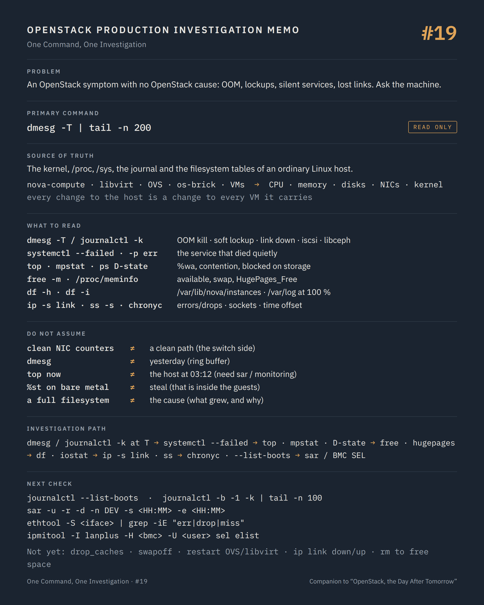

# One Command, One Investigation #19 — The compute node as a machine

**Command:** `dmesg -T`, `journalctl -k`, `systemctl --failed`, `top`, `free`, `df`, `ss -s`, `ip -s link` · **Safety:** READ ONLY · **Layer:** the Linux host under nova-compute, libvirt, OVS and os-brick · **Level:** intermediate

> Command → Evidence → Hypothesis → Investigation → Correlation → Decision
>
> The question of every episode: *what can this command actually tell us during a production incident, and what does it NOT tell us?*

---

## 1. Production situation

Several threads end here. A QEMU process killed by the OOM killer (#05). A soft lockup inside a guest (#06). A Galera node that applies write-sets too slowly (#17). A nova-compute that went silent at 03:12 with no error in its own log (#02). A tunnel that drops packets between two chassis (#09, #10). An event list with nothing at the time the domain was destroyed (#18).

Each of those has an OpenStack-shaped symptom and a cause that OpenStack cannot see, because it lives in the kernel, the memory, the disks or the network interfaces of an ordinary Linux machine. This episode is that machine, read the way the previous eighteen read the platform: what it can tell us, what it cannot, and what to check next.

## 2. The command

On the host:

```bash
dmesg -T | tail -n 200
journalctl -k --since "<T - 30 min>"
systemctl --failed
top -b -n 1 | head -n 20
free -m
df -h / /var/lib/nova /var/lib/libvirt /var/log
ss -s
ip -s link
```

**READ ONLY.** All of them read kernel buffers, `/proc` and `/sys`, the journal and the filesystem tables. Root is needed for `dmesg` on hardened kernels (`kernel.dmesg_restrict = 1`) and for the full journal.

```text
VMs                       QEMU processes, one per domain (#05)
nova-compute, libvirtd, ovs-vswitchd, neutron agents, multipathd, iscsid    processes (#02, #04, #08, #13)
        ↓ all of them depend on
CPU scheduling            run queue, steal, pinned cores shared by mistake
memory                    free, cache, hugepages, swap, the OOM killer
disks and filesystems     /var/lib/nova/instances (ephemeral disks, console logs), /var/log, inode counts
network interfaces        errors, drops, MTU, bonds, the storage and tunnel VLANs
kernel                    panics, lockups, NIC and HBA driver errors, time
```

The platform's services are processes; the host is what they run on. When the platform's own witnesses have nothing to say, this is the layer that was not asked.

## 3. What the command tells us

### The kernel's account: `dmesg -T`, `journalctl -k`

The kernel log is the only witness for several of the incidents met so far:

```text
Out of memory: Killed process 31337 (qemu-kvm) total-vm:..., anon-rss:..., ...
                                        → the OOM killer chose a VM (#05); why the host ran out is the question
kernel: NMI watchdog: BUG: soft lockup - CPU#12 stuck for 23s! [qemu-kvm:31337]
                                        → a host CPU did not schedule for 23 s: contention, a driver, a firmware issue
kernel: bnx2x ... NIC Link is Down / Link is Up
kernel: bond0: link status definitely down for interface eno2
                                        → a flapping link: the tunnel drops of #09/#10, the lost iSCSI session of #13
kernel: connection1:0: detected conn error (1020)
kernel: session1: session recovery timed out after 120 secs
                                        → the iSCSI session loss, with its time (#13)
kernel: sd 7:0:0:3: [sdc] tag#... FAILED Result: hostbyte=DID_TRANSPORT_DISRUPTED
kernel: device-mapper: multipath: Failing path 8:32
                                        → the failed multipath path (#13), dated
kernel: libceph: osd.7 ... socket closed / osd.7 down
                                        → the compute's own view of the Ceph cluster (#14)
kernel: EXT4-fs (dm-0): ... No space left on device / errors on filesystem
                                        → a full or damaged host filesystem
kernel: clocksource: ... / time jumped
                                        → the timeline problems of #18
```

`dmesg -T` prints wall-clock timestamps; `journalctl -k --since` gives the same messages with the journal's retention across reboots (`--list-boots` shows how many boots the journal remembers, which is itself a finding: a boot at 03:11 that nobody announced is the uptime surprise of #03).

### The services: `systemctl --failed`, `journalctl -p err`

`systemctl --failed` lists units in the `failed` state: a `multipathd` or `iscsid` that did not start after a reboot, an `openvswitch` unit that failed, a `chronyd` that is not running (and #18's timeline with it). `journalctl -p err --since "<T>"` is every error from every unit, which is where a service that stopped without logging in its own file left its trace (segfaults, `Main process exited, code=killed, status=9/KILL`).

### CPU: `top`, `mpstat -P ALL`

The header lines of `top` carry three numbers that matter: load average against the core count, `%st` (steal, meaningful only when the host is itself a VM), and `%wa` (I/O wait: the CPU waiting for disks, which is the storage stall of #13 seen from the CPU). Then the process list sorted by CPU: a `qemu-kvm` at 400 % is a 4-vCPU guest working; ten of them on a host whose `vcpupin` maps them to the same four cores is the pinning conflict of #05, and `mpstat -P ALL 1` shows those four cores at 100 % while the others idle.

`ps -eo pid,stat,wchan:32,comm | grep " D"` lists processes in uninterruptible sleep, with what they wait on: `qemu-kvm` in `D` on a storage call is #13, `nova-compute` in `D` on an NFS mount is a nova-compute that cannot heartbeat (#02) without a single line in its log.

### Memory: `free -m`, `/proc/meminfo`, hugepages

`free -m`: `available` (not `free`) is what the host can still give; `swap` in use on a compute node is a host where guests' memory is being paged, which is the soft lockups of #06 arriving. `/proc/meminfo` adds `HugePages_Total`, `HugePages_Free`, `HugePages_Rsvd`: a guest that asks for hugepages boots only if `HugePages_Free` covers it, and `Unable to map backing store for guest RAM` in the QEMU log (#05) is this number at zero. `cat /sys/kernel/mm/transparent_hugepage/enabled` and `numastat -m` complete the picture on NUMA hosts; the resource tracker's `reserved_host_memory_mb` (#03) is supposed to keep the host itself out of this situation.

### Disks: `df -h`, `df -i`, `iostat -x`

`/var/lib/nova/instances` holds ephemeral disks (qcow2 that grow), console logs (#06), and downloaded images: at 100 % every guest with a local disk pauses on ENOSPC with the same `paused (I/O error)` as a full Ceph pool (#04). `/var/log` full stops every service from logging, which is the incident with no logs. `df -i` catches the inode exhaustion that `df -h` hides. `iostat -x 1` gives per-device `%util` and `await`: a local SSD at 100 % utilisation with 200 ms waits is a Galera node applying slowly (#17) or a host whose ephemeral disks are contending.

### Network: `ss -s`, `ip -s link`, `ethtool -S`

`ip -s link` prints per-interface RX/TX packets, errors and drops; errors and drops that grow while you watch are a bad cable, a bad SFP, a bad driver, or an MTU mismatch, and they explain the one-way traffic of #09 and the lost tunnel of #10 without a single OpenStack command. `ethtool -S <iface>` gives the NIC's own counters (`rx_missed_errors`, `rx_crc_errors`, `tx_timeout`). `ss -s` summarises sockets: TCP `orphaned` and `timewait` counts exploding on a controller is a service leaking connections (#17's `max_connections`). `ss -tnp state established '( dport = :5672 )'` is nova-compute's bus connection (#02, #16) as the kernel sees it, and `ip route get <remote-tunnel-ip>` is the route a Geneve or VXLAN packet takes, source address included.

### Time: `chronyc tracking`, `timedatectl`

`chronyc tracking` gives the offset from the reference and whether the host is synchronised. It closes #18: any timeline built across hosts assumes this number is small everywhere.

## 4. What the command does NOT tell us

The host sees its own resources. A NIC with no errors and a switch port that drops frames on the other side are the same symptom from two views; the host's counters show a clean interface, and the packets still vanish. The switch, the SAN and the Ceph OSD hosts are other machines, with their own `dmesg`.

`dmesg` is a ring buffer. On a busy host it holds minutes; `journalctl -k` holds what the journal's retention allows. An incident from yesterday may be gone from both, and the only trace is in the platform's databases (#18) or in central logging.

Load average, memory and I/O numbers are snapshots. A `top` at 10:00 says nothing about 03:12; historical data (`sar` from sysstat, node exporter in Prometheus, the deployment's monitoring) is what turns a host reading into a timeline. Without it, the investigation reads the aftermath: the OOM message, the failed unit, the full filesystem.

The kernel does not know which VM a process is. `qemu-kvm` pid 31337 is a domain only after `virsh list` (#04) or the `-name guest=` argument (#05) says which one; the kill line names a process, and the mapping to a tenant's VM is yours to make, and to record.

`%st` on a bare-metal compute is zero and meaningless; steal time is what the guests measure (#06's `soft lockup` inside the VM) when the host is overcommitted or pinning collides. The host-side counterpart is run-queue length per core, not steal.

And nothing here knows about intent. A full `/var/log` is a fact; whether a debug flag was left on, a log rotation failed, or a service loops on an error is the next investigation, in the file that grew.

## 5. What it lets us hypothesise

```text
OOM killed qemu-kvm at T                          → host memory exhausted: overcommit, hugepages, no reservation   → #03 reserved_host_memory_mb, capacity
soft lockup on host CPUs                          → contention or driver/firmware; guests report the same          → mpstat, pinning (#05)
link down / bond member flapping at T             → the tunnel, iSCSI or Ceph losses at T                          → cable, SFP, switch port
iscsi conn error / multipath failing path at T    → the storage path event, dated                                  → #13, SAN side
libceph osd.N down messages                       → this compute's view of the cluster                             → #14, storage network
/var/lib/nova/instances at 100 %                  → local-disk guests paused on ENOSPC                             → what grew (images, qcow2, console logs)
/var/log at 100 %                                 → services stop logging; the silent incident                     → rotation, debug flags
swap in use, available low                        → guests paged out; lockups and latency                          → capacity, evacuation decision
D-state qemu-kvm / nova-compute                   → blocked on storage or NFS                                      → wchan, #13
ss: orphaned / timewait exploding                 → a service leaking connections                                  → that service, its pool
chronyc offset in seconds                         → every cross-host timeline is suspect                           → NTP first, then #18 again
--list-boots shows a reboot nobody announced      → a crash or an automated reboot                                 → previous boot's journal (-b -1)
```

## 6. Next investigation

Read-only, to turn a snapshot into a timeline:

```bash
journalctl --list-boots
journalctl -b -1 -k | tail -n 100                 # the previous boot's last kernel lines, after an unexplained reboot
sar -u -r -d -n DEV -s <HH:MM> -e <HH:MM>          # if sysstat collects on this host
iostat -x 1 5
mpstat -P ALL 1 5
ethtool -S <iface> | grep -iE "err|drop|miss"
cat /proc/pressure/cpu /proc/pressure/memory /proc/pressure/io    # PSI, on kernels that expose it
```

And the out-of-band side, which is the only witness of a host that is not answering at all: the BMC's system event log (`ipmitool -I lanplus -H <bmc> -U <user> sel elist`, read-only), which records power events, ECC errors, thermal trips and fan failures that the kernel never got to log.

What we do not do at this stage:

- `echo 3 > /proc/sys/vm/drop_caches`, `sysctl` changes, `swapoff` — STATE CHANGING. Dropping caches on a compute node stalls every guest doing I/O; `swapoff` on a host that is swapping is an OOM by hand.
- `systemctl restart` of `openvswitch`, `libvirtd`, `multipathd`, `iscsid`, the network service, or a reboot — POTENTIALLY DISRUPTIVE for every VM on the host. Each of them was covered in its own episode; here, the host-wide version of the same rule: a restart is a decision with an evacuation plan or a maintenance window behind it, not a diagnostic.
- `ip link set <iface> down/up`, `ethtool` settings changes, MTU changes — POTENTIALLY DISRUPTIVE; a bond member bounced by hand takes the tunnels and the storage sessions with it.
- `kill -9` of a `D`-state process — it will not die (that is what `D` means) and the attempt teaches nothing.
- Deleting files under `/var/lib/nova/instances` or `/var/log` to free space — POTENTIALLY DISRUPTIVE and destructive: a "stale" disk file may belong to a shelved or migrating instance, and a log being read is evidence. Identify what grew, decide with the owners, then act.

## 7. Investigation chain

```text
An OpenStack symptom with no OpenStack cause
        ↓
dmesg -T / journalctl -k               did the kernel kill, lose, or fail something at T?
        ↓
systemctl --failed / journalctl -p err   which service died quietly?
        ↓
top · mpstat · ps D-state               CPU contention, I/O wait, blocked processes
        ↓
free · /proc/meminfo                     memory, swap, hugepages
        ↓
df -h · df -i · iostat                   full filesystems, slow disks
        ↓
ip -s link · ethtool -S · ss -s          errors, drops, leaking sockets, the bus connection
        ↓
chronyc tracking · --list-boots          time and reboots nobody announced
        ↓
  something at T ───────────→ the dated cause, back to the episode that saw the symptom
  nothing at all ───────────→ historical data (sar, monitoring), or the BMC's event log
        ↓
Root cause, then change — the host's changes are the platform's largest blast radius
```

## 8. Production lesson

Under every OpenStack service there is a Linux machine that does not know it is part of a cloud. When the platform's witnesses have nothing to say, ask the machine, and remember that every change you make to it is made to every VM it carries.

---

## Memo



## Version notes

- `dmesg -T` (human-readable timestamps) is util-linux; `kernel.dmesg_restrict = 1` restricts it to root. `journalctl -k` reads kernel messages from the journal; `--list-boots` and `-b -1` require persistent journal storage (`Storage=persistent` in `journald.conf`).
- `systemctl --failed` is equivalent to `systemctl list-units --state=failed`; `journalctl -p err` selects priority `err` and above.
- `top` header fields: `%st` is steal time reported by the hypervisor to a guest; on bare metal it is zero. `%wa` is I/O wait. `mpstat`, `iostat` and `sar` come from the `sysstat` package; `sar` needs the collector enabled to have history.
- `free -m`: the `available` column (procps-ng ≥ 3.3.10) estimates memory usable without swapping; `/proc/meminfo` exposes `HugePages_*` and `MemAvailable`.
- PSI (`/proc/pressure/{cpu,memory,io}`) exists on kernels 4.20 and later when enabled.
- `ss -s` and `ss -tnp` are iproute2; `ethtool -S` counters are driver-specific, and their names differ between NIC vendors.
- Kolla Ansible and other containerised deployments keep services in containers but the kernel, the interfaces, the filesystems and the journal are the host's; `docker ps` and `docker logs` complement `systemctl`.

## Sources

- util-linux, `dmesg` manual (`-T`): https://man7.org/linux/man-pages/man1/dmesg.1.html
- systemd, `journalctl` manual (`-k`, `-b`, `--list-boots`, `-p`, `--since`): https://man7.org/linux/man-pages/man1/journalctl.1.html
- systemd, `systemctl` manual (`--failed`, `list-units --state`): https://man7.org/linux/man-pages/man1/systemctl.1.html
- procps-ng, `top` (`%st`, `%wa`, load average) and `free` (`available`): https://man7.org/linux/man-pages/man1/top.1.html and https://man7.org/linux/man-pages/man1/free.1.html
- Linux kernel, `/proc/meminfo` and hugepages (`HugePages_Total`, `HugePages_Free`): https://www.kernel.org/doc/html/latest/filesystems/proc.html and https://www.kernel.org/doc/html/latest/admin-guide/mm/hugetlbpage.html
- Linux kernel, PSI (pressure stall information): https://www.kernel.org/doc/html/latest/accounting/psi.html
- Linux kernel, OOM killer (`Out of memory: Killed process`) and `vm.overcommit_memory`: https://www.kernel.org/doc/html/latest/admin-guide/sysctl/vm.html
- sysstat, `sar`, `iostat`, `mpstat`: https://sysstat.github.io/
- iproute2, `ip-link` (`-s` statistics) and `ss`: https://man7.org/linux/man-pages/man8/ip-link.8.html and https://man7.org/linux/man-pages/man8/ss.8.html
- `ethtool` manual (`-S`): https://man7.org/linux/man-pages/man8/ethtool.8.html
- chrony, `chronyc tracking`: https://chrony-project.org/doc/4.5/chronyc.html
- ipmitool manual (`sel elist`, `power status`): https://manpages.debian.org/testing/ipmitool/ipmitool.1.en.html
- Nova configuration, `reserved_host_memory_mb`, `reserved_host_cpus`, `instances_path`: https://docs.openstack.org/nova/latest/configuration/config.html

---

*Part of the series [One Command, One Investigation](README.md), a technical companion to the book [OpenStack, the Day After Tomorrow](https://github.com/soufian-zaouam/openstack-the-day-after-tomorrow).*

Previous: [**#18 — request IDs**](18-request-id-log-correlation.md). Next: [**#20 — Complete investigation**](20-complete-investigation.md): one VM, from the alert to the root cause, with everything the series built.
