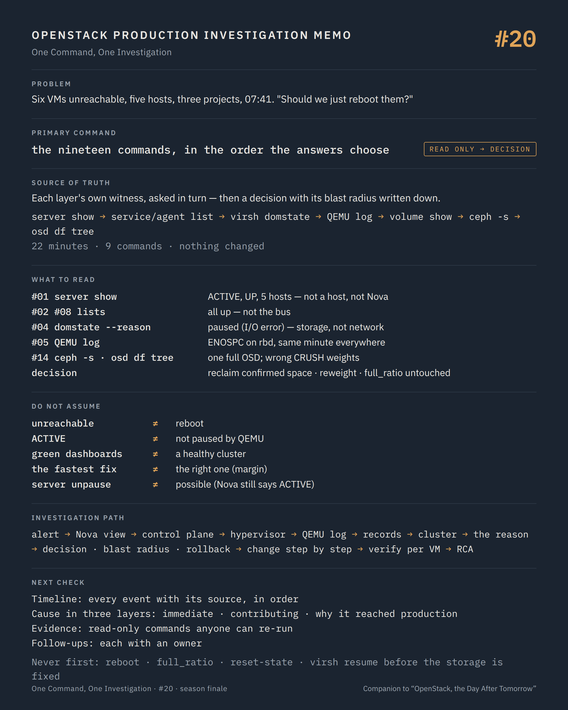

# One Command, One Investigation #20 — From the alert to the root cause

**Command:** all of them, in order · **Safety:** READ ONLY until the decision, then one change with its rationale written down · **Layer:** the whole platform · **Level:** advanced

> Command → Evidence → Hypothesis → Investigation → Correlation → Decision
>
> The question of every episode: *what can this command actually tell us during a production incident, and what does it NOT tell us?*

---

## 1. Production situation

This last episode runs one incident end to end, with the nineteen commands of the series used as they were meant to be: as questions, asked in an order, each one chosen by the answer to the previous one.

The incident is a composite. Its parts are real patterns from production platforms, generalised so that no platform, customer or team can be recognised; the numbers, names and timestamps are illustrative. What is not invented is the shape of the reasoning, and the point where the reasoning had to stop and become a decision.

**07:41.** Monitoring reports four VMs of one project unreachable. Three minutes later, the on-call channel has two more, from two other projects. The VMs are spread over five compute hosts. No change was announced. The first message in the channel asks whether "we should just reboot them".

## 2. The investigation, command by command

What follows is the sequence as it was run, with what each step established and what it ruled out. Every command is read-only until section 3.

### 07:44 — `openstack server show` (#01), on two of the six VMs

Both `ACTIVE`, `power_state Running`, `task_state None`, `host_status UP`, on different hosts, `updated` untouched since the previous day. Six VMs on five hosts with a healthy `host_status` each: this is not a dead host, and it is not one host at all.

Established: Nova has no opinion that anything is wrong. Ruled out: a control-plane operation in flight, a host Nova has lost. The common factor is not the host.

### 07:46 — `openstack compute service list` (#02) and `openstack network agent list` (#08), unfiltered

Every service `up`, every agent alive, no `forced_down`, no recent `started_at`. The bus and the heartbeat path are fine, which also rules out the RabbitMQ and Galera episodes (#16, #17) as the cause: a control plane that reports everything correctly is not the one that is broken.

### 07:49 — `virsh list --all` and `virsh domstate --reason` (#04), on one host

```text
instance-0000a3f1   paused
paused (I/O error)
```

The same on the second host checked. The VMs are not unreachable because of the network; they are paused, by QEMU, on a write that failed. Nova still says `ACTIVE`, because the sync (#01) logs `PAUSED` and does nothing.

Established: the failure is a write error at the storage layer, on several hosts at once. Ruled out: the guest, the port, the bridge (#06, #07, #09): a paused guest does not answer, whatever the network does.

### 07:52 — the QEMU log (#05)

```text
2026-09-18 07:38:12.402+0000: qemu-kvm: ... rbd: ... : No space left on device
```

`ENOSPC`, on RBD, at 07:38. Same line, same minute, on the other host. Six VMs on five hosts paused within the same minute on the same error from the same backend.

Established: the common factor is the Ceph cluster, or one of its pools. The domain XML confirms all six VMs have their root disk on the same pool.

### 07:54 — `openstack volume show` (#12), for one of the boot volumes

`in-use`, attachments correct, `os-vol-host-attr:host` naming the RBD backend. Nothing to reconcile: Nova, Cinder and the host agree, and the disk exists. The databases are right; the storage is not.

### 07:56 — `ceph -s`, `ceph health detail`, `ceph df` (#14)

```text
health: HEALTH_ERR
        1 full osd(s)
        3 nearfull osd(s)
        ... pool 'vms' is full (no space)
osd: 48 osds: 48 up, 48 in
pgs: 1025 active+clean
```

`ceph osd df tree`: OSD 31 at 95.1 %, three others above 85 %, the cluster average at 71 %. `ceph osd dump | grep full_ratio`: `full_ratio 0.95`. One OSD crossed the full ratio at 07:38 and the cluster refused writes to every PG it holds; the `vms` pool has PGs on it; the six VMs happened to write to those PGs first. There will be more.

Established: root cause of the symptom. Not yet: why one OSD is at 95 % when the average is 71 %.

### 08:03 — the "why": `ceph osd df tree` read against the CRUSH tree, and the Ceph event history

The full OSD and the three nearfull ones are on the same host, added to the cluster three weeks ago with disks half the size of the others, with a CRUSH weight set by hand to the same value as the larger disks. Data was placed as if they were as large as the rest. The imbalance had been growing for three weeks; the `OSD_NEARFULL` warning had been in `ceph -s` for six days, on a cluster whose health page nobody opened because the OpenStack dashboards were green.

At this point the investigation had a symptom, a cause, and a reason. It had used nine of the series' commands and changed nothing.

## 3. The decision

Two things were on the table, and the channel wanted the first one.

**Raise `full_ratio` to 0.97.** One command, immediate effect, every paused VM can be resumed within minutes. And a cluster with one OSD at 97 % that has lost its safety margin: the next OSD failure on that host triggers recovery onto the remaining disks, which cannot take it, and the outage becomes data at risk instead of VMs paused. The book calls this the change that buys minutes and costs the margin. It was not taken.

**Reweight the four small OSDs to their real size, so that Ceph moves data off them.** Correct, and slow: the backfill would take hours on this cluster, and the VMs would stay paused until the full OSD dropped below the ratio. Also not enough on its own.

**What was decided.** Reclaim space on the `vms` pool immediately, from what could be deleted with certainty: `rbd du` on the pool showed a set of snapshots from a backup job that had failed to clean up for two weeks, owned by the platform team and not by any tenant, and a group of volumes in Cinder `error_deleting` for a month whose owners had already given up on them. The deletions were listed, sized, confirmed with their owners in the channel, and executed one at a time, watching `ceph osd df tree` for OSD 31. At 08:31 it dropped below 95 %; the cluster accepted writes again. The four OSDs were then reweighted to their real capacity, with `osd_max_backfills` left at its default so that recovery did not compete with clients (#14), and the backfill ran through the day.

**The blast radius, written before acting.** Deleting the snapshots and the abandoned volumes touched no running VM. Reweighting four OSDs started a backfill that would raise latency on the cluster for hours; the consuming teams were told. Rollback: the reweight is reversible (`ceph osd crush reweight` back), the deletions are not, which is why they were the ones confirmed with owners.

**Resuming the VMs.** Only once writes were accepted again, and not through the API: Nova had never moved the instances to `PAUSED` (its sync ignores that state, #01), so `openstack server unpause` was refused with a 409. The domains were resumed with `virsh resume` on each host (#04), one at a time; libvirt's lifecycle event let nova-compute bring `power_state` back to `Running` within seconds. Because the resumes did not go through Nova, they do not appear in the event list (#18); they were logged by hand in the incident record, with host, domain and time. Each VM was then checked with its console log (#06): the guests had been paused, not crashed; their filesystems came back clean, because QEMU had stopped them on the first failed write rather than letting the errors through. Six VMs; six console logs read; six tickets closed with the same sentence.

## 4. The root cause analysis

The RCA that was written afterwards had five parts, and the series has already produced the material for each.

**Timeline**, from #18: every event with its source. 07:38:12 first `ENOSPC` in a QEMU log; 07:41 first alert; 07:49 `paused (I/O error)` confirmed; 07:56 `HEALTH_ERR`, OSD 31 full; 08:03 cause identified; 08:31 writes accepted; 08:40 last VM resumed; 15:10 backfill complete, cluster `HEALTH_OK`.

**Cause**, in three layers: the immediate cause (one OSD crossed `full_ratio` and the cluster refused writes to its PGs), the contributing cause (four OSDs added with a CRUSH weight that did not match their capacity), and the reason it reached production (the `OSD_NEARFULL` warning had been present for six days and was not on any dashboard the team looked at).

**Evidence**, with the read-only commands that produced it, and the fact that every one of them could be re-run by someone else to reach the same conclusion. An RCA whose findings cannot be reproduced is an opinion.

**What was decided and what was not**, with the reasons: `full_ratio` untouched, and why; deletions confirmed with owners, and which; the reweight, its expected duration and its rollback.

**Follow-ups**, each with an owner: the Ceph health status on the platform dashboard, with `OSD_NEARFULL` as a paging alert; a check of CRUSH weights against disk sizes added to the procedure for adding OSDs; the backup job's snapshot cleanup fixed; the `error_deleting` volumes' cleanup made routine; and a note in the runbook that `paused (I/O error)` on several hosts at once means storage, and that the first command is `ceph -s`, not a reboot.

## 5. What the method changed

Set the sequence against the first message in the channel, "should we just reboot them".

A hard reboot of the six VMs at 07:42 would have destroyed the paused guests' state (#05), written a new QEMU log over the one that carried `ENOSPC` (#05), brought the VMs back to a cluster that still refused writes, and paused them again within seconds, on a platform where nothing had been learned. The next message would have proposed rebooting the hosts.

The investigation took 22 minutes from the first alert to the root cause and 50 to the first resumed VM. Every minute of it was read-only. The change that resolved the incident was chosen against a faster one because the faster one spent the margin the cluster needed for its next failure, and that argument was made with `ceph osd df tree` on the screen, not from memory.

None of that required a command the series has not covered. It required asking them in an order in which each answer narrowed the next question, and stopping to decide when the questions ran out.

## 6. The investigation chain, complete

```text
07:41  alert: 6 VMs unreachable, 5 hosts, 3 projects
        ↓
#01  server show               ACTIVE, Running, host_status UP, 5 different hosts → not a host, not Nova
        ↓
#02 #08  service / agent list  everything up → not the bus, not the control plane
        ↓
#04  virsh domstate --reason   paused (I/O error) → storage write failure, several hosts
        ↓
#05  QEMU log                  ENOSPC on rbd at 07:38, same minute everywhere → the cluster
        ↓
#12  volume show               records agree; nothing to reconcile → not Cinder
        ↓
#14  ceph -s / health detail   HEALTH_ERR, 1 full OSD, pool full → root cause of the symptom
        ↓
#14  osd df tree · CRUSH       4 small OSDs, wrong weight, 3 weeks of imbalance, 6 days of NEARFULL → the reason
        ↓
DECISION   reclaim confirmed space (owners in the loop) · reweight (rollback known) · full_ratio untouched
        ↓
CHANGE     deletions one at a time, watching OSD 31 · reweight with rollback known
        ↓
VERIFY     writes accepted · virsh resume per domain, logged by hand · console log per VM (#06)
        ↓
RCA        timeline · three-layer cause · reproducible evidence · decisions and rejections · owned follow-ups
```

## 7. Production lesson

OpenStack troubleshooting is not about knowing more commands. It is about asking better questions, in an order where each answer chooses the next, and knowing the moment when the questions stop and a decision has to be made, with its blast radius and its rollback written down before the first change.

That was the sentence this series was built to earn. Twenty episodes, one investigation.

---

## Memo



## Notes on the composite incident

- The incident is a composite of patterns that recur on Ceph-backed OpenStack platforms: a full OSD pausing guests (QEMU's `werror=enospc` default, #04, #14), CRUSH weights not matching heterogeneous disks, `NEARFULL` warnings unnoticed because platform dashboards do not surface Ceph health, backup jobs leaving snapshots, and `error_deleting` volumes accumulating. No element identifies a platform, an organisation or a person; timestamps, counts and percentages are illustrative.
- The decision to leave `full_ratio` alone follows the Ceph documentation's own framing of the ratios as safety margins; the alternative was described honestly because it is the one most teams reach for first.
- A QEMU-initiated pause (`paused (I/O error)`) is one of the few cases where the resume must happen outside Nova: the API's `unpause` requires `vm_state PAUSED` (`nova/compute/api.py`, `check_instance_state(vm_state=[vm_states.PAUSED])`), and Nova's power-state sync deliberately leaves an `ACTIVE` instance found `PAUSED` untouched (#01). `virsh resume` after the storage path is repaired is therefore the documented path in this series, with the manual record it implies (#04, #18).
- `rbd du` on a large pool is slow and read-heavy; on a cluster already in trouble it is run on one pool, with the object-map feature enabled on the images, or replaced by Cinder's own inventory of snapshots and volumes.

## Sources

Every command in this episode is documented in the episode where it was introduced: #01, #02, #04, #05, #06, #08, #12, #14, #18. Additional references for the decision:

- Ceph, health checks (`OSD_FULL`, `OSD_NEARFULL`, `POOL_FULL`; `full_ratio` as a safety threshold): https://docs.ceph.com/en/latest/rados/operations/health-checks/
- Ceph, CRUSH maps and OSD weights (`ceph osd crush reweight`, weight and device size): https://docs.ceph.com/en/latest/rados/operations/crush-map/
- Ceph, `rbd du`, `rbd snap ls`: https://docs.ceph.com/en/latest/man/8/rbd/
- Ceph, recovery and backfill throttling (`osd_max_backfills`, `osd_recovery_max_active`): https://docs.ceph.com/en/latest/rados/configuration/osd-config-ref/
- Nova, server states (`PAUSED`) and the `unpause` action's state requirement (`nova/compute/api.py`): https://docs.openstack.org/api-guide/compute/server_concepts.html and https://opendev.org/openstack/nova/src/branch/master/nova/compute/api.py
- QEMU, `werror=enospc` default: https://www.qemu.org/docs/master/system/invocation.html
- The book, *OpenStack, the Day After Tomorrow* (the control-loop, the decision to stop, blast radius and rollback, the RCA structure): https://github.com/soufian-zaouam/openstack-the-day-after-tomorrow

---

*Part of the series [One Command, One Investigation](README.md), a technical companion to the book [OpenStack, the Day After Tomorrow](https://github.com/soufian-zaouam/openstack-the-day-after-tomorrow).*

Previous: [**#19 — the compute node as a machine**](19-compute-host-as-a-machine.md). This is the last episode of the first season. The series continues with the reserve subjects listed in the README, one command, one investigation at a time.
